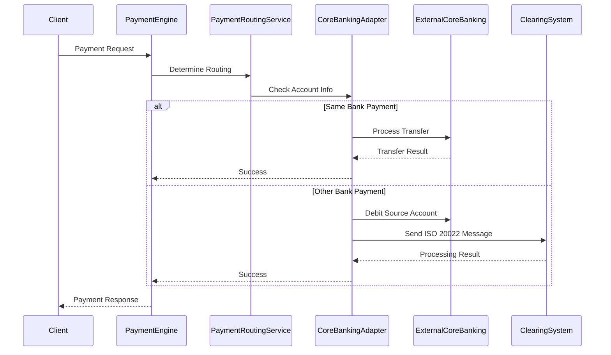
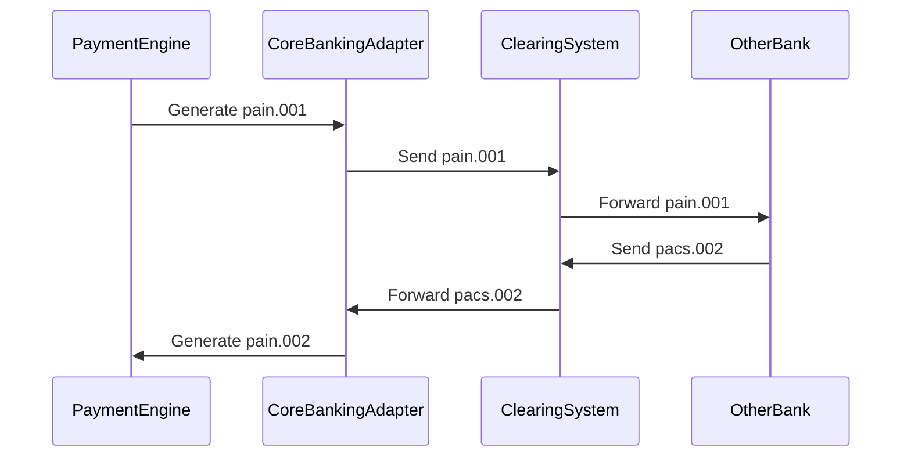

# Core Banking Isolation Implementation

## Overview

This document describes the implementation of core banking isolation in the ISO 20022 Payment Engine, enabling the system to integrate with external core banking systems via REST API or gRPC using ISO 20022 standards. The implementation supports:

- **Same bank to same bank payments** (direct processing)
- **Same bank to other bank payments** via selected clearing systems
- **Other bank to same bank payments** via clearing systems
- **Configurable routing** based on tenant, payment type, and local instrumentation code

## Architecture

### Core Components

1. **Core Banking Adapter Interface** - Abstract interface for core banking integration
2. **REST API Adapter** - Implementation for REST-based core banking systems
3. **gRPC Adapter** - Implementation for gRPC-based core banking systems
4. **Payment Routing Service** - Handles payment routing decisions
5. **Configuration Management** - Manages core banking and clearing system configurations
6. **Frontend Configuration UI** - React-based configuration interface

### Payment Flow Types

#### 1. Same Bank to Same Bank Payments
```
Client → Payment Engine → Core Banking Adapter → Same Bank Processing
```

#### 2. Same Bank to Other Bank Payments
```
Client → Payment Engine → Core Banking Adapter → Debit Source Account
     → ISO 20022 Message Generation → Clearing System → Other Bank
```

#### 3. Other Bank to Same Bank Payments
```
Other Bank → Clearing System → ISO 20022 Message → Payment Engine
         → Core Banking Adapter → Credit Destination Account
         → ISO 20022 Response Generation
```

## Implementation Details

### 1. Core Banking Adapter Interface

**File**: `services/payment-processing/src/main/java/com/paymentengine/payment-processing/service/CoreBankingAdapter.java`

The adapter interface provides:
- Account management and validation
- Balance inquiries and updates
- Transaction processing (debit, credit, transfer)
- Payment routing decisions
- ISO 20022 message integration
- Batch processing capabilities
- Reconciliation support

### 2. REST API Adapter

**File**: `services/payment-processing/src/main/java/com/paymentengine/payment-processing/service/impl/RestCoreBankingAdapter.java`

Features:
- HTTP-based communication with external core banking systems
- Retry mechanism with configurable attempts
- Health check capabilities
- Support for various authentication methods (API Key, Basic Auth, OAuth2)
- JSON/XML message format support
- Timeout configuration

### 3. gRPC Adapter

**File**: `services/payment-processing/src/main/java/com/paymentengine/payment-processing/service/impl/GrpcCoreBankingAdapter.java`

Features:
- gRPC-based communication with external core banking systems
- Connection pooling and management
- Health check via gRPC
- Support for various authentication methods
- Binary protocol efficiency
- Streaming support for batch operations

### 4. Payment Routing Service

**File**: `services/payment-processing/src/main/java/com/paymentengine/payment-processing/service/PaymentRoutingService.java`

Responsibilities:
- Determines payment routing based on account analysis
- Processes same bank payments directly
- Handles other bank payments via clearing systems
- Manages incoming clearing payments
- Generates and validates ISO 20022 messages
- Handles rollback scenarios

### 5. Configuration Entities

#### Core Banking Configuration
**File**: `services/payment-processing/src/main/java/com/paymentengine/payment-processing/entity/CoreBankingConfiguration.java`

Stores per-tenant configuration:
- Adapter type (REST/gRPC/INTERNAL)
- Connection details (URL, host, port)
- Authentication configuration
- Processing mode (SYNC/ASYNC/BATCH)
- Message format (JSON/XML)
- Timeout and retry settings
- Bank identification

#### Clearing System Configuration
**File**: `services/payment-processing/src/main/java/com/paymentengine/payment-processing/entity/ClearingSystemConfiguration.java`

Stores clearing system configuration:
- Clearing system identification
- Endpoint configuration
- Authentication details
- Supported payment types and currencies
- Local instrumentation codes
- Processing preferences

### 6. Database Schema

**File**: `database/migrations/004-add-core-banking-configuration.sql`

Creates tables:
- `core_banking_configurations` - Core banking system configurations
- `clearing_system_configurations` - Clearing system configurations
- `payment_routing_rules` - Payment routing rules

### 7. Frontend Configuration

**File**: `frontend/src/components/CoreBankingConfiguration.tsx`

React component providing:
- Core banking configuration management
- Clearing system configuration
- Payment routing rules management
- Connection testing capabilities
- Form validation and error handling

## Configuration Examples

### REST API Core Banking Configuration

```json
{
  "tenantId": "tenant1",
  "adapterType": "REST",
  "baseUrl": "https://core-banking.example.com/api/v1",
  "authenticationMethod": "API_KEY",
  "apiKey": "your-api-key",
  "processingMode": "SYNC",
  "messageFormat": "JSON",
  "timeoutMs": 30000,
  "retryAttempts": 3,
  "bankCode": "BANK001",
  "bankName": "Sample Bank"
}
```

### gRPC Core Banking Configuration

```json
{
  "tenantId": "tenant2",
  "adapterType": "GRPC",
  "grpcHost": "core-banking.example.com",
  "grpcPort": 9090,
  "authenticationMethod": "CERTIFICATE",
  "certificatePath": "/path/to/certificate.pem",
  "processingMode": "ASYNC",
  "messageFormat": "JSON",
  "timeoutMs": 30000,
  "retryAttempts": 3,
  "bankCode": "BANK002",
  "bankName": "Sample Bank 2"
}
```

### Clearing System Configuration

```json
{
  "clearingSystemCode": "CLEARING_001",
  "clearingSystemName": "Sample Clearing System",
  "tenantId": "tenant1",
  "endpointUrl": "https://clearing.example.com/api",
  "authenticationMethod": "API_KEY",
  "processingMode": "ASYNC",
  "messageFormat": "XML",
  "supportedPaymentTypes": ["TRANSFER", "PAYMENT"],
  "supportedCurrencies": ["USD", "EUR"],
  "localInstrumentationCodes": ["LOCAL_INSTR_001", "LOCAL_INSTR_002"]
}
```

### Payment Routing Rule

```json
{
  "tenantId": "tenant1",
  "paymentType": "TRANSFER",
  "localInstrumentationCode": "LOCAL_INSTR_001",
  "routingType": "SAME_BANK",
  "processingMode": "SYNC",
  "messageFormat": "JSON",
  "priority": 1,
  "isActive": true
}
```

## Payment Processing Flow

### 1. Payment Request Processing



### 2. ISO 20022 Message Flow



## Security Considerations

1. **Authentication**: Support for multiple authentication methods (API Key, Basic Auth, OAuth2, Certificate)
2. **Encryption**: TLS/SSL for all external communications
3. **Secrets Management**: Integration with Azure Key Vault for sensitive data
4. **Audit Logging**: Comprehensive logging of all core banking interactions
5. **Access Control**: Role-based access control for configuration management

## Monitoring and Observability

1. **Health Checks**: Regular health checks for core banking adapters
2. **Metrics**: Performance metrics for core banking operations
3. **Tracing**: Distributed tracing for payment flows
4. **Alerting**: Alerts for connection failures and processing errors
5. **Dashboards**: Real-time monitoring dashboards

## Testing

### Unit Tests
- Core banking adapter implementations
- Payment routing logic
- Configuration validation
- ISO 20022 message processing

### Integration Tests
- End-to-end payment flows
- Core banking adapter connectivity
- Clearing system integration
- Error handling scenarios

### Load Tests
- High-volume payment processing
- Concurrent connection handling
- Performance under stress

## Deployment

### Configuration
1. Deploy core banking configurations via database migrations
2. Configure external core banking system endpoints
3. Set up authentication credentials in Azure Key Vault
4. Configure clearing system integrations

### Environment Setup
1. **Development**: Local core banking simulators
2. **Staging**: Sandbox core banking systems
3. **Production**: Live core banking systems with proper security

## Benefits

1. **Flexibility**: Support for multiple core banking systems and protocols
2. **Scalability**: Horizontal scaling of payment processing
3. **Reliability**: Retry mechanisms and circuit breakers
4. **Maintainability**: Clean separation of concerns
5. **Configurability**: Runtime configuration without code changes
6. **Standards Compliance**: Full ISO 20022 message support
7. **Multi-tenancy**: Tenant-specific configurations and routing

## Future Enhancements

1. **Additional Protocols**: Support for additional communication protocols
2. **Advanced Routing**: AI-based routing decisions
3. **Real-time Analytics**: Real-time payment analytics and insights
4. **Blockchain Integration**: Support for blockchain-based payments
5. **API Gateway**: Centralized API management for core banking integrations
6. **Event Sourcing**: Event-driven architecture for payment processing
7. **Microservices**: Further decomposition into specialized microservices

## Conclusion

The core banking isolation implementation provides a robust, flexible, and scalable foundation for integrating with external core banking systems. It supports multiple communication protocols, comprehensive configuration management, and full ISO 20022 compliance, making it suitable for enterprise-grade payment processing requirements.

The implementation follows microservices architecture principles, provides comprehensive monitoring and observability, and includes a user-friendly configuration interface. It supports the full spectrum of payment scenarios from same-bank transfers to complex cross-border payments via clearing systems.