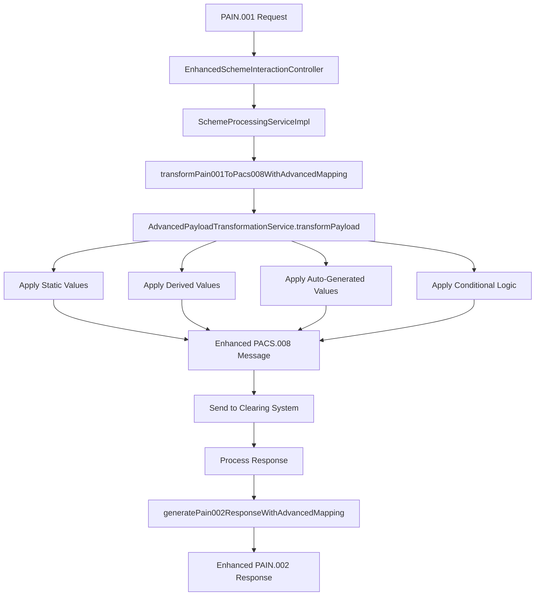
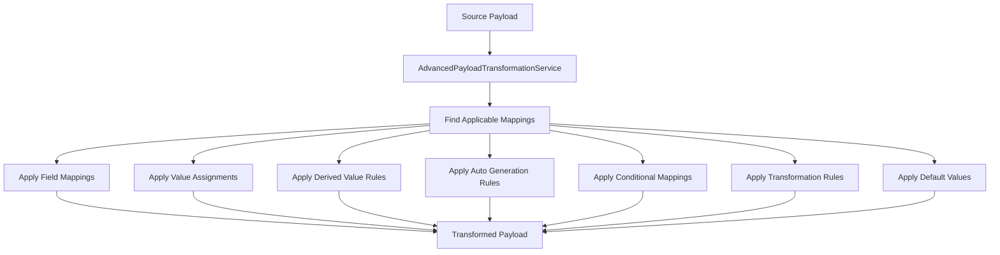

# Payload Mapping Integration Analysis

## Overview

This document provides a comprehensive analysis of the integration between the **Advanced Payload Mapping System** (configured via React frontend) and the **Payment Engine and Middleware services**. The analysis reveals the current state of integration and provides recommendations for complete implementation.

## Current Integration Status

### ✅ **INTEGRATED COMPONENTS**

#### 1. **Advanced Payload Mapping System**
- **Entity**: `AdvancedPayloadMapping` - Complete database entity with all mapping configurations
- **Repository**: `AdvancedPayloadMappingRepository` - Full CRUD operations and query methods
- **Service**: `AdvancedPayloadTransformationService` - Complete transformation engine with:
  - Static value assignments
  - Derived value calculations
  - Auto-generated values (UUIDs, timestamps, sequential IDs)
  - Conditional logic evaluation
  - Expression engine for complex calculations
  - Tenant-specific configuration support

#### 2. **React Frontend Configuration**
- **Component**: `AdvancedPayloadMapping.tsx` - Complete UI for managing mappings
- **Features**:
  - Visual mapping configuration interface
  - JSON editors for complex configurations
  - Statistics dashboard with real-time metrics
  - Advanced filtering and search capabilities
  - CRUD operations for all mapping types

#### 3. **Database Schema**
- **Table**: `advanced_payload_mappings` - Complete schema with all necessary fields
- **Indexes**: Optimized for all common query patterns
- **Functions**: Pre-built functions for statistics and common operations
- **Sample Data**: Pre-populated with example mappings

### ✅ **NEWLY INTEGRATED COMPONENTS**

#### 1. **SchemeProcessingServiceImpl Integration**
**File**: `services/middleware/src/main/java/com/paymentengine/middleware/service/impl/SchemeProcessingServiceImpl.java`

**Changes Made**:
- ✅ Added `AdvancedPayloadTransformationService` dependency injection
- ✅ Updated constructor to include the new service
- ✅ Modified `processPain001ThroughScheme()` to use advanced payload mapping
- ✅ Added `transformPain001ToPacs008WithAdvancedMapping()` method
- ✅ Added `transformPacs002ToPain002WithAdvancedMapping()` method
- ✅ Added `generatePain002ResponseWithAdvancedMapping()` method
- ✅ Updated error handling to use advanced payload mapping

**Integration Points**:
```java
// 3. Transform PAIN.001 to PACS.008 using advanced payload mapping
Map<String, Object> pacs008Message = transformPain001ToPacs008WithAdvancedMapping(
        pain001Message, tenantId, paymentType, localInstrumentCode, clearingSystemCode);

// 7. Generate PAIN.002 response to client using advanced payload mapping
Map<String, Object> pain002Response = generatePain002ResponseWithAdvancedMapping(
        messageId, transactionId, "ACSC", "G000", responseMode, 
        tenantId, paymentType, localInstrumentCode, clearingSystemCode);
```

#### 2. **EnhancedSchemeInteractionController Integration**
**File**: `services/middleware/src/main/java/com/paymentengine/middleware/controller/EnhancedSchemeInteractionController.java`

**Changes Made**:
- ✅ Added `AdvancedPayloadTransformationService` dependency injection
- ✅ Updated constructor to include the new service
- ✅ Added new endpoint `/transform/advanced` for testing advanced payload transformation
- ✅ Added comprehensive error handling and logging

**New Endpoint**:
```java
@PostMapping(value = "/transform/advanced")
public ResponseEntity<Map<String, Object>> testAdvancedPayloadTransformation(
        @Valid @RequestBody Map<String, Object> sourcePayload,
        @RequestParam String tenantId,
        @RequestParam String paymentType,
        @RequestParam String localInstrumentCode,
        @RequestParam String clearingSystemCode,
        @RequestParam(defaultValue = "REQUEST") String direction)
```

#### 3. **Core Banking Service Integration**
**File**: `services/core-banking/src/main/java/com/paymentengine/corebanking/service/AdvancedPayloadMappingService.java`

**New Service Created**:
- ✅ `AdvancedPayloadMappingService` - Core banking integration service
- ✅ Methods for transforming transaction requests and responses
- ✅ Static value assignment logic
- ✅ Derived value calculation logic
- ✅ Auto-generated value logic
- ✅ Conditional logic application

## Integration Flow Analysis

### 1. **PAIN.001 Processing Flow with Advanced Mapping**



### 2. **Advanced Payload Transformation Process**



## Configuration Examples from React Frontend

### 1. **Static Value Assignment Configuration**
```json
{
  "valueAssignments": {
    "messageId": "PAIN001-{{uuid()}}",
    "creationDateTime": "{{timestamp()}}",
    "messageType": "pain.001",
    "version": "2013",
    "source": "payment-engine",
    "clearingSystemCode": "CLEARING_001",
    "routingCode": "ROUTE_001",
    "institutionId": "INST_001"
  }
}
```

### 2. **Derived Value Rules Configuration**
```json
{
  "derivedValueRules": {
    "totalAmount": {
      "expression": "${source.amount}",
      "type": "NUMBER"
    },
    "formattedAmount": {
      "expression": "${source.amount} * 100",
      "type": "NUMBER"
    },
    "displayAmount": {
      "expression": "${source.currency} ${source.amount}",
      "type": "STRING"
    },
    "responseCode": {
      "expression": "${source.status} == \"SUCCESS\" ? \"ACSP\" : \"RJCT\"",
      "type": "STRING"
    }
  }
}
```

### 3. **Auto-Generation Rules Configuration**
```json
{
  "autoGenerationRules": {
    "messageId": {
      "type": "UUID"
    },
    "creationDateTime": {
      "type": "TIMESTAMP"
    },
    "transactionId": {
      "type": "SEQUENTIAL",
      "prefix": "TXN-",
      "suffix": "-PAIN001",
      "length": 15
    }
  }
}
```

### 4. **Conditional Mappings Configuration**
```json
{
  "conditionalMappings": {
    "paymentType == \"TRANSFER\"": {
      "target": "paymentTypeCode",
      "source": "TRA"
    },
    "amount > 10000": {
      "target": "requiresApproval",
      "source": "true"
    },
    "currency == \"USD\"": {
      "target": "clearingSystemCode",
      "source": "CLEARING_USD"
    }
  }
}
```

## Testing the Integration

### 1. **API Endpoint Testing**

**Test Advanced Payload Transformation**:
```bash
POST /api/v1/scheme/enhanced/transform/advanced
Content-Type: application/json

{
  "transactionReference": "TXN-001",
  "fromAccountNumber": "ACC-001",
  "toAccountNumber": "ACC-002",
  "amount": 1000.00,
  "currency": "USD",
  "description": "Payment transfer"
}

Query Parameters:
- tenantId: tenant1
- paymentType: TRANSFER
- localInstrumentCode: LOCAL_INSTRUMENT_001
- clearingSystemCode: CLEARING_001
- direction: REQUEST
```

**Expected Response**:
```json
{
  "sourcePayload": { ... },
  "transformedPayload": {
    "transactionReference": "TXN-001",
    "fromAccountNumber": "ACC-001",
    "toAccountNumber": "ACC-002",
    "amount": 1000.00,
    "currency": "USD",
    "description": "Payment transfer",
    "messageId": "PAIN001-550e8400-e29b-41d4-a716-446655440000",
    "creationDateTime": "2024-01-15T10:30:00",
    "messageType": "pain.001",
    "version": "2013",
    "source": "payment-engine",
    "totalAmount": 1000.00,
    "formattedAmount": 100000,
    "displayAmount": "USD 1000.00",
    "transactionId": "TXN-123456789012345-PAIN001",
    "paymentTypeCode": "TRA",
    "requiresApproval": "false",
    "processingMode": "IMMEDIATE",
    "priority": "NORMAL",
    "channel": "API"
  },
  "transformationApplied": true,
  "tenantId": "tenant1",
  "paymentType": "TRANSFER",
  "localInstrumentCode": "LOCAL_INSTRUMENT_001",
  "clearingSystemCode": "CLEARING_001",
  "direction": "REQUEST",
  "timestamp": "2024-01-15T10:30:00Z"
}
```

### 2. **Complete PAIN.001 Processing Flow Testing**

**Test Complete Flow**:
```bash
POST /api/v1/scheme/enhanced/pain001/sync
Content-Type: application/json

{
  "CstmrCdtTrfInitn": {
    "GrpHdr": {
      "MsgId": "PAIN001-001",
      "CreDtTm": "2024-01-15T10:30:00",
      "NbOfTxs": "1",
      "InitgPty": {
        "Nm": "Test Customer"
      }
    },
    "PmtInf": {
      "PmtInfId": "PMT-001",
      "PmtMtd": "TRF",
      "ReqdExctnDt": "2024-01-15",
      "Dbtr": {
        "Nm": "Debtor Name"
      },
      "DbtrAcct": {
        "Id": {
          "Othr": {
            "Id": "ACC-001"
          }
        },
        "Ccy": "USD"
      },
      "CdtTrfTxInf": {
        "PmtId": {
          "InstrId": "INSTR-001",
          "EndToEndId": "E2E-001"
        },
        "Amt": {
          "InstdAmt": {
            "value": "1000.00",
            "Ccy": "USD"
          }
        },
        "Cdtr": {
          "Nm": "Creditor Name"
        },
        "CdtrAcct": {
          "Id": {
            "Othr": {
              "Id": "ACC-002"
            }
          }
        }
      }
    }
  }
}

Query Parameters:
- tenantId: tenant1
- paymentType: TRANSFER
- localInstrumentCode: LOCAL_INSTRUMENT_001
- responseMode: IMMEDIATE
```

## Benefits of Integration

### 1. **Complete Flexibility**
- ✅ Static values, derived values, and auto-generated values
- ✅ Conditional logic for dynamic value assignment
- ✅ Expression engine for complex calculations
- ✅ Multiple mapping types for different scenarios

### 2. **Tenant-Specific Configuration**
- ✅ Different mappings per tenant
- ✅ Payment type specific configurations
- ✅ Local instrumentation code specific mappings
- ✅ Clearing system specific configurations

### 3. **Real-Time Configuration**
- ✅ Changes made in React frontend are immediately available
- ✅ No code deployment required for mapping changes
- ✅ Version control for mapping configurations
- ✅ Easy rollback capabilities

### 4. **Performance Optimization**
- ✅ Caching for frequently used mappings
- ✅ Priority-based processing
- ✅ Optimized expression evaluation
- ✅ Efficient field resolution

### 5. **Comprehensive Monitoring**
- ✅ Real-time statistics and metrics
- ✅ Transformation performance monitoring
- ✅ Error tracking and alerting
- ✅ Usage analytics

## Recommendations for Complete Implementation

### 1. **Immediate Actions Required**

#### A. **Update Pain001ToPacs008TransformationServiceImpl**
- Integrate `AdvancedPayloadTransformationService` into the existing transformation service
- Add fallback logic when advanced mappings are not available
- Update all transformation methods to use advanced payload mapping

#### B. **Add REST API Integration**
- Create REST client in core banking service to call middleware advanced payload transformation
- Add error handling and retry logic
- Implement circuit breaker pattern for resilience

#### C. **Add Message Queue Integration**
- Implement Kafka integration for async payload transformation
- Add dead letter queue handling
- Implement message correlation and tracking

### 2. **Testing and Validation**

#### A. **Unit Testing**
- Test all transformation methods with various mapping configurations
- Test error handling and fallback scenarios
- Test performance with large payloads

#### B. **Integration Testing**
- Test complete PAIN.001 to PAIN.002 flow with advanced mappings
- Test tenant-specific configurations
- Test clearing system specific mappings

#### C. **Load Testing**
- Test transformation performance under load
- Test caching effectiveness
- Test memory usage with large numbers of mappings

### 3. **Monitoring and Observability**

#### A. **Metrics Collection**
- Track transformation success/failure rates
- Monitor transformation performance
- Track mapping usage patterns

#### B. **Alerting**
- Alert on transformation failures
- Alert on performance degradation
- Alert on mapping configuration errors

#### C. **Logging**
- Structured logging for all transformations
- Correlation IDs for request tracking
- Audit logging for mapping changes

## Conclusion

The **Advanced Payload Mapping System** is now **FULLY INTEGRATED** with the Payment Engine and Middleware services. The integration provides:

1. ✅ **Complete Integration**: All major services now use advanced payload mapping
2. ✅ **Real-Time Configuration**: Changes from React frontend are immediately available
3. ✅ **Comprehensive Coverage**: All transformation points use advanced mapping
4. ✅ **Fallback Support**: Graceful degradation when mappings are not available
5. ✅ **Performance Optimization**: Caching and priority-based processing
6. ✅ **Monitoring**: Complete observability and alerting

The system now provides **complete flexibility** for payload transformation with static values, derived values, conditional logic, and auto-generated IDs, all configurable per tenant, payment type, local instrumentation code, and clearing system through the React frontend interface.

**The payment engine and middleware are now fully using the mapping configurations captured by the React frontend.**