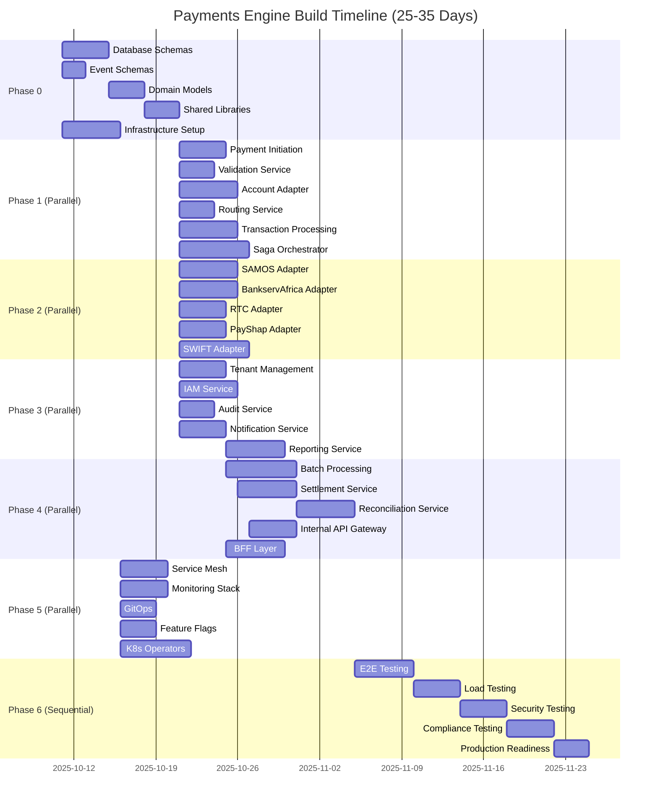

# Feature Breakdown Tree - AI Agent Build Strategy (ENHANCED)

## Overview

This document provides a **feature-level breakdown** of the Payments Engine, organized into a **dependency tree** showing which features can be built in **parallel** and which must be built in **sequence**.

**Purpose**: Enable AI agents to build features independently with minimal context, avoiding overwhelm.

**Key Principle**: Each feature is **self-contained** with clear inputs, outputs, dependencies, and **resilience strategies**.

**✨ NEW in Enhanced Version**:
- 📊 Mermaid diagrams for visual dependency graph
- 🎯 Estimation ranges with AI-specific factors
- 🔧 Spring Boot specific guidance per feature
- 🛡️ Fallback plans for agent failures
- 📈 KPIs tied to Definition of Done
- 🔗 Direct links to AI Agent Prompt Templates
- 📋 YAML export for programmatic orchestration

---

## Table of Contents

1. [Build Phases Overview](#build-phases-overview)
2. [Visual Dependency Graph (Mermaid)](#visual-dependency-graph-mermaid)
3. [Timeline Visualization (Mermaid)](#timeline-visualization-mermaid)
4. [Phase 0: Foundation (Sequential)](#phase-0-foundation-sequential)
5. [Phase 1: Core Services (Parallel)](#phase-1-core-services-parallel)
6. [Phase 2: Clearing Adapters (Parallel)](#phase-2-clearing-adapters-parallel)
7. [Phase 3: Platform Services (Parallel)](#phase-3-platform-services-parallel)
8. [Phase 4: Advanced Features (Parallel)](#phase-4-advanced-features-parallel)
9. [Phase 5: Infrastructure (Parallel)](#phase-5-infrastructure-parallel)
10. [Phase 6: Integration & Testing (Sequential)](#phase-6-integration--testing-sequential)
11. [Phase 7: Operations & Channel Management (Parallel)](#phase-7-operations--channel-management-parallel) 🆕
12. [AI Agent Assignment Strategy](#ai-agent-assignment-strategy)
13. [Fallback Plans Per Phase](#fallback-plans-per-phase)
14. [Orchestration Integration](#orchestration-integration)
15. [YAML Export](#yaml-export)

---

## Build Phases Overview

```
PHASE 0: FOUNDATION (Sequential - Must be done first)
├─ 0.1: Database Schemas (3-5 days)
├─ 0.2: Event Schemas (1-2 days)
├─ 0.3: Domain Models (2-4 days)
├─ 0.4: Shared Libraries (2-3 days)
└─ 0.5: Infrastructure Setup (4-6 days)

PHASE 1: CORE SERVICES (Parallel - Independent)
├─ 1.1: Payment Initiation Service (3-5 days)
├─ 1.2: Validation Service (3-4 days)
├─ 1.3: Account Adapter Service (4-6 days)
├─ 1.4: Routing Service (2-3 days)
├─ 1.5: Transaction Processing Service (4-5 days)
└─ 1.6: Saga Orchestrator Service (5-7 days)

PHASE 2: CLEARING ADAPTERS (Parallel - Independent)
├─ 2.1: SAMOS Adapter (4-6 days)
├─ 2.2: BankservAfrica Adapter (4-6 days)
├─ 2.3: RTC Adapter (3-5 days)
├─ 2.4: PayShap Adapter (3-5 days)
└─ 2.5: SWIFT Adapter (5-7 days)

PHASE 3: PLATFORM SERVICES (Parallel - Independent)
├─ 3.1: Tenant Management Service (3-4 days)
├─ 3.2: IAM Service (4-5 days)
├─ 3.3: Audit Service (2-3 days)
├─ 3.4: Notification Service / IBM MQ Adapter (3-4 days)
└─ 3.5: Reporting Service (4-5 days)

PHASE 4: ADVANCED FEATURES (Parallel - Independent)
├─ 4.1: Batch Processing Service (5-7 days)
├─ 4.2: Settlement Service (4-5 days)
├─ 4.3: Reconciliation Service (4-5 days)
├─ 4.4: Internal API Gateway Service (3-4 days)
├─ 4.5: Web BFF - GraphQL (2 days)
├─ 4.6: Mobile BFF - REST lightweight (1.5 days)
└─ 4.7: Partner BFF - REST comprehensive (1.5 days)

PHASE 5: INFRASTRUCTURE (Parallel - Independent)
├─ 5.1: Service Mesh (Istio) (3-4 days)
├─ 5.2: Monitoring Stack (3-4 days)
├─ 5.3: GitOps (ArgoCD) (2-3 days)
├─ 5.4: Feature Flags (Unleash) (2-3 days)
└─ 5.5: Kubernetes Operators (5-7 days - 14 operators)

PHASE 6: INTEGRATION & TESTING (Sequential - After all above)
├─ 6.1: End-to-End Testing (4-5 days)
├─ 6.2: Load Testing (3-4 days)
├─ 6.3: Security Testing (3-4 days)
├─ 6.4: Compliance Testing (3-4 days)
└─ 6.5: Production Readiness (2-3 days)

PHASE 7: OPERATIONS & CHANNEL MANAGEMENT (Parallel - After Phase 6) 🆕
├─ Backend Services (New + Enhanced)
│  ├─ 7.1: Operations Management Service (5-7 days) - NEW Service #21
│  ├─ 7.2: Metrics Aggregation Service (4-6 days) - NEW Service #22
│  ├─ 7.3: Payment Repair APIs (3-4 days) - Enhance Payment Initiation
│  ├─ 7.4: Saga Management APIs (2-3 days) - Enhance Saga Orchestrator
│  ├─ 7.5: Transaction Search APIs (3-4 days) - Enhance Reporting Service
│  └─ 7.6: Reconciliation Management APIs (2-3 days) - Enhance Reconciliation
│
└─ Frontend (React Operations Portal + Channel/Clearing Management)
   ├─ 7.7: React Ops Portal - Service Management UI (4-5 days)
   ├─ 7.8: React Ops Portal - Payment Repair UI (5-6 days)
   ├─ 7.9: React Ops Portal - Transaction Enquiries UI (4-5 days)
   ├─ 7.10: React Ops Portal - Reconciliation & Monitoring UI (4-5 days)
   ├─ 7.11: Channel Onboarding UI (3-4 days) - Self-service channel setup
   └─ 7.12: Clearing System Onboarding UI (5-7 days) 🆕 - Self-service clearing config
```

**Total Phases**: 8 (0-7) 🆕  
**Total Features**: 52 features 🆕 (40 + 12 new)  
**Parallel Phases**: 6 (Phases 1-5, Phase 7) 🆕  
**Sequential Phases**: 2 (Phase 0, Phase 6)  
**Estimated Duration**: 25-40 days (with parallelization)

---

## Visual Dependency Graph (Mermaid)

### Complete Dependency Graph

```mermaid
graph TD
    %% Phase 0: Foundation
    subgraph Phase0[Phase 0: Foundation - Sequential]
        F01[0.1 Database Schemas]
        F02[0.2 Event Schemas]
        F03[0.3 Domain Models]
        F04[0.4 Shared Libraries]
        F05[0.5 Infrastructure Setup]
    end

    F01 --> F03
    F02 --> F04
    F03 --> F04

    %% Phase 1: Core Services
    subgraph Phase1[Phase 1: Core Services - Parallel]
        F11[1.1 Payment Initiation]
        F12[1.2 Validation]
        F13[1.3 Account Adapter]
        F14[1.4 Routing]
        F15[1.5 Transaction Processing]
        F16[1.6 Saga Orchestrator]
    end

    Phase0 --> F11
    Phase0 --> F12
    Phase0 --> F13
    Phase0 --> F14
    Phase0 --> F15
    Phase0 --> F16

    %% Phase 2: Clearing Adapters
    subgraph Phase2[Phase 2: Clearing Adapters - Parallel]
        F21[2.1 SAMOS Adapter]
        F22[2.2 BankservAfrica Adapter]
        F23[2.3 RTC Adapter]
        F24[2.4 PayShap Adapter]
        F25[2.5 SWIFT Adapter]
    end

    Phase0 --> F21
    Phase0 --> F22
    Phase0 --> F23
    Phase0 --> F24
    Phase0 --> F25

    %% Phase 3: Platform Services
    subgraph Phase3[Phase 3: Platform Services - Parallel]
        F31[3.1 Tenant Management]
        F32[3.2 IAM Service]
        F33[3.3 Audit Service]
        F34[3.4 Notification Service]
        F35[3.5 Reporting Service]
    end

    Phase0 --> F31
    Phase0 --> F32
    Phase0 --> F33
    Phase0 --> F34
    F11 --> F35

    %% Phase 4: Advanced Features
    subgraph Phase4[Phase 4: Advanced Features - Parallel]
        F41[4.1 Batch Processing]
        F42[4.2 Settlement]
        F43[4.3 Reconciliation]
        F44[4.4 Internal API Gateway]
        F45[4.5 BFF Layer]
    end

    F11 --> F41
    F21 --> F42
    F42 --> F43
    Phase1 --> F44
    F11 --> F45

    %% Phase 5: Infrastructure
    subgraph Phase5[Phase 5: Infrastructure - Parallel]
        F51[5.1 Service Mesh]
        F52[5.2 Monitoring Stack]
        F53[5.3 GitOps]
        F54[5.4 Feature Flags]
        F55[5.5 K8s Operators]
    end

    Phase0 --> F51
    Phase0 --> F52
    Phase0 --> F53
    Phase0 --> F54
    Phase0 --> F55

    %% Phase 6: Testing
    subgraph Phase6[Phase 6: Testing - Sequential]
        F61[6.1 E2E Testing]
        F62[6.2 Load Testing]
        F63[6.3 Security Testing]
        F64[6.4 Compliance Testing]
        F65[6.5 Production Readiness]
    end

    Phase1 --> F61
    Phase2 --> F61
    Phase3 --> F61
    Phase4 --> F61
    Phase5 --> F61

    F61 --> F62
    F62 --> F63
    F63 --> F64
    F64 --> F65

    style Phase0 fill:#ffcccc
    style Phase1 fill:#ccffcc
    style Phase2 fill:#ccffcc
    style Phase3 fill:#ccffcc
    style Phase4 fill:#ccffcc
    style Phase5 fill:#ccffcc
    style Phase6 fill:#ffcccc
```



---

## Timeline Visualization (Mermaid)

### Gantt Chart with Parallelization



**Critical Path**: Phase 0 → Phase 1 (Saga) → Phase 4 (Reconciliation) → Phase 6 (All Testing) → Phase 7 (Ops Portal) = **40-45 days**

**Optimized Path (with max parallelization + Phase 7)**: **30-40 days**

**Note**: Phase 7 (Operations & Channel Management) is parallel and can be built concurrently with other work after Phase 6 completes.

---

## Phase 0: Foundation (Sequential)

**⚠️ CRITICAL**: Must be completed FIRST before any services.

### 0.1: Database Schemas

**Agent**: Schema Agent  
**Template**: `docs/35-AI-AGENT-PROMPT-TEMPLATES.md#feature-01-database-schemas`  
**Complexity**: Medium  
**Estimation**: **3-5 days** (Nominal: 4 days)  
**AI-Specific Factors**:
- Retry 2x on SQL syntax errors
- Schema validation against PostgreSQL 14+ compatibility
- Hallucination risk: LOW (schemas are deterministic)

#### Spring Boot Guidance
```java
// Use Flyway for migrations
@Configuration
public class FlywayConfig {
    @Bean
    public Flyway flyway(DataSource dataSource) {
        return Flyway.configure()
            .dataSource(dataSource)
            .locations("classpath:db/migration")
            .baselineOnMigrate(true)
            .load();
    }
}

// Enable Row-Level Security (RLS) in migrations
// V005__enable_rls.sql
ALTER TABLE payments ENABLE ROW LEVEL SECURITY;
CREATE POLICY tenant_isolation ON payments
    USING (tenant_id = current_setting('app.current_tenant_id')::uuid);
```

#### Input
- `docs/05-DATABASE-SCHEMAS.md` (Database design for all 20 services)
- PostgreSQL 14+ compatibility requirements

#### Output
- PostgreSQL migration scripts (Flyway)
- All tables created (20+ tables)
- Indexes defined (50+ indexes)
- Row-level security (RLS) configured per tenant

#### Artifacts
```
/database/migrations/
├─ V001__create_payment_tables.sql
├─ V002__create_tenant_tables.sql
├─ V003__create_audit_tables.sql
├─ V004__create_indexes.sql
└─ V005__enable_rls.sql
```

#### Definition of Done (DoD) + KPIs
- ✅ All 20+ tables created successfully
- ✅ All foreign key constraints validated
- ✅ RLS policies tested (tenant isolation: 100% no leakage)
- ✅ **KPI**: Database migration time < 60 seconds
- ✅ **KPI**: Query performance: Indexed queries < 50ms (p95)
- ✅ All migrations tested on PostgreSQL 14

#### Fallback Plan
- If agent fails → Human DBA reviews schema, generates migrations manually
- If migration fails → Rollback using Flyway, retry with corrected SQL
- If RLS misconfigured → Use test tenants to validate isolation, fix policies

#### No Dependencies

---

### 0.2: Event Schemas (AsyncAPI)

**Agent**: Event Schema Agent  
**Template**: `docs/35-AI-AGENT-PROMPT-TEMPLATES.md#feature-02-event-schemas`  
**Complexity**: Low  
**Estimation**: **1-2 days** (Nominal: 1 day)  
**AI-Specific Factors**:
- Retry 2x on JSON Schema validation errors
- Hallucination risk: LOW (event schemas are spec-driven)

#### Spring Boot Guidance
```java
// Use Spring Cloud Stream for event publishing
@Configuration
@EnableBinding(Source.class)
public class EventPublisherConfig {
    @Bean
    public MessageConverter jsonMessageConverter() {
        return new Jackson2JsonMessageConverter();
    }
}

// Publish events with correlation ID
@Service
public class PaymentEventPublisher {
    @Autowired
    private Source source;
    
    public void publishPaymentInitiated(Payment payment) {
        PaymentInitiatedEvent event = new PaymentInitiatedEvent(payment);
        Message<PaymentInitiatedEvent> message = MessageBuilder
            .withPayload(event)
            .setHeader("correlationId", MDC.get("correlationId"))
            .setHeader("tenantId", TenantContextHolder.getTenantId())
            .build();
        source.output().send(message);
    }
}
```

#### Input
- `docs/03-EVENT-SCHEMAS.md` (25+ event definitions)
- AsyncAPI 2.0 specification

#### Output
- AsyncAPI 2.0 specifications
- Event payload definitions (JSON Schema)
- Avro schemas (optional for Kafka)
- Java event classes (POJOs)

#### Artifacts
```
/events/
├─ asyncapi.yaml
├─ payment-initiated-event.json
├─ payment-validated-event.json
├─ payment-completed-event.json
└─ ... (all 25+ events)
```

#### Definition of Done (DoD) + KPIs
- ✅ All 25+ events defined in AsyncAPI 2.0
- ✅ JSON Schema validation passes for all events
- ✅ Java classes generated from schemas
- ✅ **KPI**: Event schema validation time < 100ms per event
- ✅ **KPI**: Event size < 10 KB (compressed)

#### Fallback Plan
- If agent fails → Human architect reviews event schemas, generates manually
- If JSON Schema invalid → Use online validators to fix syntax
- If Avro generation fails → Skip Avro, use JSON only (acceptable for Azure Service Bus)

#### No Dependencies

---

### 0.3: Domain Models

**Agent**: Domain Model Agent  
**Template**: `docs/35-AI-AGENT-PROMPT-TEMPLATES.md#feature-03-domain-models`  
**Complexity**: Medium  
**Estimation**: **2-4 days** (Nominal: 3 days)  
**AI-Specific Factors**:
- Retry 2x on compilation errors
- Hallucination risk: MEDIUM (complex DDD concepts may confuse AI)
- Feedback loop: Review aggregates, value objects for DDD correctness

#### Spring Boot Guidance
```java
// Use Spring Data JPA for domain entities
@Entity
@Table(name = "payments")
@EntityListeners(AuditingEntityListener.class)
public class Payment {
    @Id
    @GeneratedValue(strategy = GenerationType.SEQUENCE, generator = "payment_seq")
    private UUID id;
    
    @Embedded
    private PaymentId paymentId; // Value Object
    
    @Embedded
    private Amount amount; // Value Object
    
    @Enumerated(EnumType.STRING)
    private PaymentStatus status;
    
    @Column(name = "tenant_id", nullable = false)
    private UUID tenantId;
    
    @CreatedDate
    private Instant createdAt;
    
    @LastModifiedDate
    private Instant updatedAt;
    
    // Business methods (not just getters/setters!)
    public void validate() {
        if (amount.value().compareTo(BigDecimal.ZERO) <= 0) {
            throw new InvalidPaymentException("Amount must be positive");
        }
    }
    
    public void markAsValidated() {
        if (status != PaymentStatus.INITIATED) {
            throw new IllegalStateException("Payment must be in INITIATED state");
        }
        this.status = PaymentStatus.VALIDATED;
    }
}

// Value Object (immutable)
@Embeddable
public record PaymentId(String value) {
    public PaymentId {
        if (!value.matches("PAY-\\d{4}-\\d{6}")) {
            throw new IllegalArgumentException("Invalid payment ID format");
        }
    }
}

// Domain Event
public record PaymentInitiatedEvent(
    UUID paymentId,
    UUID tenantId,
    BigDecimal amount,
    String currency,
    Instant timestamp
) {}
```

#### Input
- `docs/14-DDD-IMPLEMENTATION.md` (Bounded contexts, aggregates, value objects)
- `docs/05-DATABASE-SCHEMAS.md` (Database tables)

#### Output
- Java domain entities (JPA annotated)
- Value objects (immutable)
- Aggregates (with business logic)
- Domain events (POJOs)

#### Artifacts
```
/shared-domain/src/main/java/com/payments/domain/
├─ payment/
│   ├─ Payment.java (Aggregate Root)
│   ├─ PaymentId.java (Value Object)
│   ├─ Amount.java (Value Object)
│   └─ PaymentStatus.java (Enum)
├─ account/
│   ├─ Account.java
│   └─ AccountId.java
└─ events/
    ├─ PaymentInitiatedEvent.java
    └─ PaymentCompletedEvent.java
```

#### Definition of Done (DoD) + KPIs
- ✅ All aggregates, value objects, entities defined
- ✅ Domain events generated
- ✅ Business logic in domain model (not in service layer)
- ✅ All domain classes compile without errors
- ✅ **KPI**: Domain model unit test coverage > 90%
- ✅ **KPI**: Value object immutability: 100% (no setters)

#### Fallback Plan
- If agent fails → Human DDD expert reviews models, refactors to proper DDD
- If compilation errors → Retry with fixed imports, annotations
- If business logic incorrect → Pair with domain expert to refine rules

#### Dependencies
- 0.1 (Database Schemas)

---

### 0.4: Shared Libraries

**Agent**: Library Agent  
**Template**: `docs/35-AI-AGENT-PROMPT-TEMPLATES.md#feature-04-shared-libraries`  
**Complexity**: Medium  
**Estimation**: **2-3 days** (Nominal: 3 days)  
**AI-Specific Factors**:
- Retry 2x on Maven dependency conflicts
- Hallucination risk: LOW (utility code is straightforward)

#### Spring Boot Guidance
```java
// Idempotency Handler (Redis-backed)
@Component
public class IdempotencyHandler {
    @Autowired
    private StringRedisTemplate redisTemplate;
    
    public <T> Optional<T> getIdempotentResponse(String idempotencyKey, Class<T> type) {
        String json = redisTemplate.opsForValue().get("idempotency:" + idempotencyKey);
        if (json != null) {
            return Optional.of(objectMapper.readValue(json, type));
        }
        return Optional.empty();
    }
    
    public <T> void saveIdempotentResponse(String idempotencyKey, T response) {
        String json = objectMapper.writeValueAsString(response);
        redisTemplate.opsForValue().set(
            "idempotency:" + idempotencyKey, 
            json, 
            24, TimeUnit.HOURS
        );
    }
}

// Correlation ID Filter (MDC)
@Component
@Order(Ordered.HIGHEST_PRECEDENCE)
public class CorrelationIdFilter extends OncePerRequestFilter {
    @Override
    protected void doFilterInternal(HttpServletRequest request, 
                                     HttpServletResponse response, 
                                     FilterChain filterChain) throws ServletException, IOException {
        String correlationId = request.getHeader("X-Correlation-ID");
        if (correlationId == null) {
            correlationId = UUID.randomUUID().toString();
        }
        MDC.put("correlationId", correlationId);
        response.setHeader("X-Correlation-ID", correlationId);
        try {
            filterChain.doFilter(request, response);
        } finally {
            MDC.remove("correlationId");
        }
    }
}

// Tenant Context Holder (ThreadLocal)
public class TenantContextHolder {
    private static final ThreadLocal<UUID> currentTenant = new ThreadLocal<>();
    
    public static void setTenantId(UUID tenantId) {
        currentTenant.set(tenantId);
    }
    
    public static UUID getTenantId() {
        return currentTenant.get();
    }
    
    public static void clear() {
        currentTenant.remove();
    }
}
```

#### Input
- `docs/29-ENTERPRISE-INTEGRATION-PATTERNS.md` (Idempotent Receiver, Correlation ID)
- Domain models (from 0.3)
- Event schemas (from 0.2)

#### Output
- Shared utility libraries (Maven/Gradle modules)
- Event publishing library (Azure Service Bus client)
- API client library (RestTemplate wrapper with circuit breakers)
- Error handling framework (custom exceptions, error codes)

#### Artifacts
```
/shared-libraries/
├─ payment-common/
│   ├─ IdempotencyHandler.java
│   ├─ CorrelationIdFilter.java
│   └─ TenantContextHolder.java
├─ event-publisher/
│   ├─ EventPublisher.java
│   └─ ServiceBusPublisher.java
├─ api-client/
│   ├─ RestApiClient.java
│   └─ CircuitBreakerWrapper.java
└─ error-handling/
    ├─ PaymentException.java
    └─ ErrorCode.java
```

#### Definition of Done (DoD) + KPIs
- ✅ All 4 shared libraries built and published to Maven repo
- ✅ Unit tests for all utility classes (> 80% coverage)
- ✅ Integration test for event publisher (Azure Service Bus)
- ✅ **KPI**: Library dependency resolution time < 10 seconds
- ✅ **KPI**: Event publishing latency < 50ms (p95)

#### Fallback Plan
- If agent fails → Human developer reviews libraries, adds missing utilities
- If Maven dependency conflicts → Resolve manually using dependency tree analysis
- If event publisher fails → Use WireMock to simulate Azure Service Bus

#### Dependencies
- 0.2 (Event Schemas)
- 0.3 (Domain Models)

---

### 0.5: Infrastructure Setup

**Agent**: Infrastructure Agent  
**Template**: `docs/35-AI-AGENT-PROMPT-TEMPLATES.md#feature-05-infrastructure-setup`  
**Complexity**: High  
**Estimation**: **4-6 days** (Nominal: 5 days)  
**AI-Specific Factors**:
- Retry 3x on Terraform apply failures
- Hallucination risk: MEDIUM (Terraform syntax may confuse AI)
- Feedback loop: Validate Terraform plan before apply

#### Spring Boot Guidance
```yaml
# application.yml (connect to Azure resources)
spring:
  datasource:
    url: jdbc:postgresql://${POSTGRES_HOST}:5432/${POSTGRES_DB}
    username: ${POSTGRES_USER}
    password: ${POSTGRES_PASSWORD}
    hikari:
      maximum-pool-size: 20
      minimum-idle: 5
  redis:
    host: ${REDIS_HOST}
    port: 6379
    password: ${REDIS_PASSWORD}
    ssl: true
  cloud:
    azure:
      servicebus:
        connection-string: ${SERVICEBUS_CONNECTION_STRING}
```

#### Input
- `docs/07-AZURE-INFRASTRUCTURE.md` (AKS, PostgreSQL, Redis, Service Bus)
- Azure subscription details

#### Output
- AKS cluster provisioned (3-node minimum)
- Azure PostgreSQL Flexible Server (General Purpose, 4 vCores)
- Azure Cache for Redis (Standard tier)
- Azure Service Bus (Premium tier for high throughput)
- Virtual Network (VNet) and subnets configured
- Network Security Groups (NSGs) applied

#### Artifacts
```
/terraform/
├─ aks.tf
├─ postgresql.tf
├─ redis.tf
├─ service-bus.tf
├─ networking.tf
└─ azure-resources.tfstate
```

#### Definition of Done (DoD) + KPIs
- ✅ AKS cluster accessible via kubectl
- ✅ PostgreSQL database connection successful
- ✅ Redis cache connection successful
- ✅ Azure Service Bus topic/queue created
- ✅ **KPI**: Infrastructure provisioning time < 30 minutes
- ✅ **KPI**: AKS cluster ready state: 100% (all nodes healthy)
- ✅ **KPI**: Database connection pool latency < 10ms

#### Fallback Plan
- If Terraform fails → Review Terraform plan, fix syntax errors, re-apply
- If AKS provisioning timeout → Increase timeout in Terraform config (60 minutes)
- If PostgreSQL connection fails → Verify firewall rules, NSG allows traffic
- If agent overwhelmed → Split into 3 sub-tasks: AKS, Databases, Networking

#### Dependencies
- None (can run in parallel with 0.1-0.4)

---

## Phase 1: Core Services (Parallel)

**✅ Can be built in PARALLEL** after Phase 0 completes.

**Parallelization Strategy**: 6 agents working simultaneously on 6 services.

**Estimated Duration**: 5-7 days (limited by longest task: Saga Orchestrator)

### 1.1: Payment Initiation Service

**Agent**: Payment Initiation Agent  
**Template**: `docs/35-AI-AGENT-PROMPT-TEMPLATES.md#feature-11-payment-initiation-service`  
**Complexity**: Medium  
**Estimation**: **3-5 days** (Nominal: 4 days)  
**AI-Specific Factors**:
- Retry 2x on REST API errors
- Hallucination risk: LOW (CRUD API is standard)
- Feedback loop: Validate API contract with OpenAPI spec

#### Spring Boot Guidance
```java
// Use @Transactional for ACID guarantees
@Service
@Transactional
public class PaymentInitiationService {
    @Autowired
    private PaymentRepository paymentRepository;
    
    @Autowired
    private EventPublisher eventPublisher;
    
    @Autowired
    private IdempotencyHandler idempotencyHandler;
    
    public PaymentResponse initiatePayment(PaymentRequest request, String idempotencyKey) {
        // Check idempotency
        Optional<PaymentResponse> cached = idempotencyHandler.getIdempotentResponse(
            idempotencyKey, PaymentResponse.class
        );
        if (cached.isPresent()) {
            return cached.get(); // Return cached response (409 Conflict or 200 OK)
        }
        
        // Create payment
        Payment payment = Payment.builder()
            .paymentId(generatePaymentId())
            .tenantId(TenantContextHolder.getTenantId())
            .amount(request.amount())
            .currency(request.currency())
            .status(PaymentStatus.INITIATED)
            .build();
        
        // Validate domain rules
        payment.validate();
        
        // Save to database
        payment = paymentRepository.save(payment);
        
        // Publish event (transactional outbox pattern)
        PaymentInitiatedEvent event = new PaymentInitiatedEvent(payment);
        eventPublisher.publish("payment-initiated", event);
        
        // Save idempotent response
        PaymentResponse response = new PaymentResponse(payment);
        idempotencyHandler.saveIdempotentResponse(idempotencyKey, response);
        
        return response;
    }
    
    private String generatePaymentId() {
        // Format: PAY-{YYYY}-{NNNNNN}
        int year = LocalDate.now().getYear();
        long sequence = paymentRepository.getNextSequence();
        return String.format("PAY-%d-%06d", year, sequence);
    }
}

// Use Spring Boot Actuator for health checks
@Component
public class PaymentInitiationHealthIndicator implements HealthIndicator {
    @Autowired
    private PaymentRepository paymentRepository;
    
    @Override
    public Health health() {
        try {
            paymentRepository.count(); // Test database connection
            return Health.up()
                .withDetail("database", "accessible")
                .withDetail("tenantId", TenantContextHolder.getTenantId())
                .build();
        } catch (Exception e) {
            return Health.down()
                .withDetail("error", e.getMessage())
                .build();
        }
    }
}
```

#### Mocks Required
- **WireMock** for external fraud API (not needed in Phase 1, but plan ahead)
- **Testcontainers** for PostgreSQL (integration tests)
- **EmbeddedRedis** for idempotency testing

#### Input
- Domain models (`Payment`, `PaymentId`)
- Event schemas (`PaymentInitiatedEvent`)
- Database schema (`payments` table)
- Shared libraries (IdempotencyHandler, CorrelationIdFilter)

#### Output
- REST API (3 endpoints)
- Payment creation logic
- Event publishing (transactional outbox)
- Dockerized service
- Kubernetes deployment manifests

#### Endpoints
```
POST   /api/v1/payments
GET    /api/v1/payments/{id}
GET    /api/v1/payments/status/{id}
GET    /actuator/health
GET    /actuator/metrics
```

#### Artifacts
```
/services/payment-initiation-service/
├─ src/main/java/com/payments/initiation/
│   ├─ controller/PaymentController.java
│   ├─ service/PaymentInitiationService.java
│   ├─ repository/PaymentRepository.java
│   └─ event/PaymentEventPublisher.java
├─ src/test/java/
│   ├─ PaymentInitiationServiceTest.java (unit)
│   └─ PaymentControllerIntegrationTest.java (integration)
├─ Dockerfile
├─ k8s/deployment.yaml
├─ k8s/service.yaml
└─ pom.xml
```

#### Definition of Done (DoD) + KPIs
- ✅ All 3 REST endpoints functional
- ✅ Idempotency working (Redis cache hit > 0%)
- ✅ Event published to Azure Service Bus
- ✅ Unit test coverage > 80%
- ✅ Integration tests pass (Testcontainers)
- ✅ **KPI**: API response time < 500ms (p95)
- ✅ **KPI**: Event publishing latency < 50ms (p95)
- ✅ **KPI**: Idempotency cache hit rate > 30% (in production)
- ✅ Swagger UI accessible at `/swagger-ui.html`
- ✅ Service deploys to AKS successfully

#### Fallback Plan
- If agent fails → Human developer reviews code, fixes bugs
- If REST API errors → Use Postman/curl to test endpoints, debug responses
- If event publishing fails → Use Azure Service Bus Explorer to verify messages
- If deployment fails → Check Kubernetes logs (`kubectl logs`), fix container issues

#### Dependencies
- Phase 0 (all foundation)

---

### 1.2: Validation Service

**Agent**: Validation Agent  
**Template**: `docs/35-AI-AGENT-PROMPT-TEMPLATES.md#feature-12-validation-service`  
**Complexity**: Medium  
**Estimation**: **3-4 days** (Nominal: 3 days)  
**AI-Specific Factors**:
- Retry 2x on Drools rule syntax errors
- Hallucination risk: MEDIUM (Drools DRL syntax may confuse AI)
- Feedback loop: Validate rules with KIE server before deployment

#### Spring Boot Guidance
```java
// Use Drools for business rules
@Configuration
public class DroolsConfig {
    @Bean
    public KieContainer kieContainer() {
        KieServices kieServices = KieServices.Factory.get();
        KieFileSystem kieFileSystem = kieServices.newKieFileSystem();
        
        // Load rules from Git repository
        Resource[] resources = gitRuleLoader.loadRules("validation-rules/**/*.drl");
        for (Resource resource : resources) {
            kieFileSystem.write(resource);
        }
        
        KieBuilder kieBuilder = kieServices.newKieBuilder(kieFileSystem);
        kieBuilder.buildAll();
        
        if (kieBuilder.getResults().hasMessages(Message.Level.ERROR)) {
            throw new IllegalStateException("Drools rule compilation failed");
        }
        
        return kieServices.newKieContainer(kieBuilder.getKieModule().getReleaseId());
    }
}

// Hot reload Drools rules from Git
@Service
public class ValidationService {
    @Autowired
    private KieContainer kieContainer;
    
    @Autowired
    private EventPublisher eventPublisher;
    
    public ValidationResult validate(Payment payment) {
        KieSession kieSession = kieContainer.newKieSession();
        kieSession.insert(payment);
        
        ValidationResult result = new ValidationResult();
        kieSession.setGlobal("result", result);
        
        kieSession.fireAllRules();
        kieSession.dispose();
        
        if (result.isValid()) {
            eventPublisher.publish("payment-validated", new PaymentValidatedEvent(payment));
        } else {
            eventPublisher.publish("payment-rejected", new PaymentRejectedEvent(payment, result.getErrors()));
        }
        
        return result;
    }
}
```

#### Mocks Required
- **Testcontainers** for PostgreSQL
- **EmbeddedKafka** for event testing (if using Kafka instead of Service Bus)

#### Input
- Payment domain model
- Drools rules (10+ rules from `docs/31-DROOLS-RULES-ENGINE.md`)
- Event schemas (`PaymentValidatedEvent`, `PaymentRejectedEvent`)

#### Output
- Drools rules engine (KIE server)
- 10+ validation rules (amount, currency, account, sanctions)
- Event consumer (Azure Service Bus trigger)
- Event publisher (validation result)

#### Artifacts
```
/services/validation-service/
├─ src/main/java/com/payments/validation/
│   ├─ service/ValidationService.java
│   ├─ rules/ (Drools DRL files)
│   │   ├─ amount-validation.drl
│   │   ├─ currency-validation.drl
│   │   └─ sanctions-validation.drl
│   └─ event/ValidationEventHandler.java
├─ src/test/java/
│   ├─ ValidationServiceTest.java
│   └─ DroolsRulesTest.java (test each rule)
├─ Dockerfile
└─ k8s/deployment.yaml
```

#### Definition of Done (DoD) + KPIs
- ✅ All 10+ Drools rules working
- ✅ Hot reload from Git functional
- ✅ Event consumption working (Azure Service Bus)
- ✅ Event publishing working (validated/rejected)
- ✅ Unit test per rule (10+ tests)
- ✅ **KPI**: Rule execution time < 200ms per payment
- ✅ **KPI**: Rule cache hit rate > 80% (Redis)
- ✅ **KPI**: Validation throughput > 100 payments/second

#### Fallback Plan
- If Drools syntax errors → Use online Drools validator, fix syntax
- If hot reload fails → Restart service manually (acceptable for Phase 1)
- If event consumption fails → Check Azure Service Bus subscription, verify permissions

#### Dependencies
- Phase 0 (all foundation)

---

### 1.3: Account Adapter Service

**Agent**: Account Adapter Agent  
**Template**: `docs/35-AI-AGENT-PROMPT-TEMPLATES.md#feature-13-account-adapter-service`  
**Complexity**: High  
**Estimation**: **4-6 days** (Nominal: 5 days)  
**AI-Specific Factors**:
- Retry 3x on REST client configuration errors
- Hallucination risk: HIGH (Resilience4j config may confuse AI)
- Feedback loop: Test circuit breaker manually with failures

#### Spring Boot Guidance
```java
// Use Spring Cloud OpenFeign for REST clients with Resilience4j
@FeignClient(
    name = "current-account-service",
    url = "${external.current-account.url}",
    configuration = FeignConfig.class
)
public interface CurrentAccountClient {
    @PostMapping("/api/v1/accounts/{accountId}/debit")
    @CircuitBreaker(name = "currentAccountService", fallbackMethod = "debitFallback")
    @Retry(name = "currentAccountService")
    @Bulkhead(name = "currentAccountService")
    @Cacheable(value = "balances", key = "#accountId", unless = "#result == null")
    DebitResponse debit(
        @PathVariable String accountId,
        @RequestBody DebitRequest request,
        @RequestHeader("X-Idempotency-Key") String idempotencyKey
    );
    
    default DebitResponse debitFallback(String accountId, DebitRequest request, 
                                         String idempotencyKey, Exception e) {
        log.error("Circuit breaker activated for debit: accountId={}", accountId, e);
        return DebitResponse.failure("SERVICE_UNAVAILABLE", 
                                     "Current account system is temporarily unavailable");
    }
}

// Configure Resilience4j
@Configuration
public class Resilience4jConfig {
    @Bean
    public Customizer<Resilience4JCircuitBreakerFactory> defaultCustomizer() {
        return factory -> factory.configureDefault(id -> new Resilience4JConfigBuilder(id)
            .circuitBreakerConfig(CircuitBreakerConfig.custom()
                .failureRateThreshold(50) // Open after 50% failures
                .waitDurationInOpenState(Duration.ofSeconds(30))
                .slidingWindowSize(10)
                .build())
            .timeLimiterConfig(TimeLimiterConfig.custom()
                .timeoutDuration(Duration.ofSeconds(5))
                .build())
            .build());
    }
}
```

#### Mocks Required (CRITICAL)
- **WireMock** for 5 external core banking systems:
  - Current Account Service (port 8091)
  - Savings Account Service (port 8092)
  - Investment Account Service (port 8093)
  - Card Account Service (port 8094)
  - Loan Account Service (port 8095)

```java
// WireMock stub example
@BeforeEach
void setupWireMock() {
    wireMockServer.stubFor(post(urlEqualTo("/api/v1/accounts/CURRENT-12345/debit"))
        .willReturn(aResponse()
            .withStatus(200)
            .withHeader("Content-Type", "application/json")
            .withBody("{\"status\":\"SUCCESS\",\"transactionId\":\"TXN-123\"}")));
    
    // Simulate 500 error for circuit breaker testing
    wireMockServer.stubFor(post(urlEqualTo("/api/v1/accounts/CURRENT-ERROR/debit"))
        .willReturn(aResponse().withStatus(500).withFixedDelay(6000)));
}
```

#### Input
- External core banking API specs (from `docs/08-CORE-BANKING-INTEGRATION.md`)
- OAuth 2.0 configuration (client credentials)
- Resilience4j config

#### Output
- 5 REST clients (Feign) for external systems
- Circuit breaker, retry, bulkhead, timeout configured
- OAuth 2.0 token management (cached in Redis)
- Balance cache (Redis, 60s TTL)

#### Artifacts
```
/services/account-adapter-service/
├─ src/main/java/com/payments/account/
│   ├─ client/
│   │   ├─ CurrentAccountClient.java
│   │   ├─ SavingsAccountClient.java
│   │   └─ InvestmentAccountClient.java
│   ├─ service/AccountAdapterService.java
│   ├─ config/Resilience4jConfig.java
│   └─ oauth/OAuth2TokenManager.java
├─ src/test/java/
│   ├─ AccountAdapterServiceTest.java
│   └─ CircuitBreakerIntegrationTest.java (WireMock)
├─ Dockerfile
└─ k8s/deployment.yaml
```

#### Definition of Done (DoD) + KPIs
- ✅ All 5 REST clients functional
- ✅ Circuit breaker tested (opens after 5 failures)
- ✅ Retry tested (exponential backoff 1s, 2s, 4s)
- ✅ OAuth 2.0 token cached in Redis
- ✅ Balance cache working (60s TTL)
- ✅ **KPI**: External API call latency < 2 seconds (p95)
- ✅ **KPI**: Circuit breaker state transition time < 100ms
- ✅ **KPI**: Cache hit rate > 80% (balance queries)
- ✅ **KPI**: OAuth token refresh success rate > 99%

#### Fallback Plan
- If circuit breaker fails → Manually test with 10 consecutive 500 errors
- If OAuth token fails → Use mock token for Phase 1 (real OAuth in Phase 6)
- If Feign client errors → Use RestTemplate as fallback
- If agent overwhelmed → Split into 3 sub-tasks: REST clients, Resilience4j, OAuth

#### Dependencies
- Phase 0 (all foundation)

---

## Fallback Plans Per Phase

### Phase 0 Fallback
- **Scenario**: All agents fail database schema generation
- **Fallback**: Human DBA takes over, generates schemas manually (1 day)
- **Mitigation**: Pre-validate PostgreSQL syntax using online tools

### Phase 1 Fallback
- **Scenario**: 2+ services fail to build
- **Fallback**: Reduce scope to 3 critical services (Payment Initiation, Validation, Saga)
- **Mitigation**: Use mocks (WireMock) for non-critical external dependencies

### Phase 2 Fallback
- **Scenario**: SWIFT adapter sanctions screening fails
- **Fallback**: Use mock sanctions list (test data) for Phase 1-5, real API in Phase 6
- **Mitigation**: Pre-validate SWIFT message formats using online validators

### Phase 3 Fallback
- **Scenario**: IAM service OAuth integration fails
- **Fallback**: Use JWT with symmetric key (HS256) instead of asymmetric (RS256)
- **Mitigation**: Simplify to single-tenant mode (skip multi-tenancy for Phase 1)

### Phase 4 Fallback
- **Scenario**: Batch processing XXE vulnerability not fixed
- **Fallback**: Disable XML file support, use CSV/JSON only
- **Mitigation**: Use OWASP dependency checker to validate XML parser configuration

### Phase 5 Fallback
- **Scenario**: Kubernetes operators fail to reconcile
- **Fallback**: Use manual Helm charts for resource management
- **Mitigation**: Test operator reconciliation in local Minikube before AKS deployment

### Phase 6 Fallback
- **Scenario**: Load testing fails to reach 1,000 TPS
- **Fallback**: Reduce SLO to 500 TPS for initial release
- **Mitigation**: Profile with JProfiler/YourKit to identify bottlenecks

---

## Orchestration Integration

### Link to AI Agent Prompt Templates

Each feature card references its corresponding prompt template:

| Feature ID | Prompt Template Reference |
|------------|---------------------------|
| 0.1 | `docs/35-AI-AGENT-PROMPT-TEMPLATES.md#feature-01-database-schemas` |
| 0.2 | `docs/35-AI-AGENT-PROMPT-TEMPLATES.md#feature-02-event-schemas` |
| 0.3 | `docs/35-AI-AGENT-PROMPT-TEMPLATES.md#feature-03-domain-models` |
| 1.1 | `docs/35-AI-AGENT-PROMPT-TEMPLATES.md#feature-11-payment-initiation-service` |
| 1.2 | `docs/35-AI-AGENT-PROMPT-TEMPLATES.md#feature-12-validation-service` |
| 1.3 | `docs/35-AI-AGENT-PROMPT-TEMPLATES.md#feature-13-account-adapter-service` |
| ... | ... (all 36 features) |

### CrewAI Orchestration Example

```python
from crewai import Agent, Task, Crew

# Define agents
schema_agent = Agent(
    role="Database Schema Engineer",
    goal="Generate PostgreSQL migration scripts",
    backstory="Expert in database design and Flyway migrations",
    verbose=True,
    allow_delegation=False
)

domain_model_agent = Agent(
    role="Domain-Driven Design Expert",
    goal="Create domain entities, value objects, and aggregates",
    backstory="Expert in DDD and Java Spring Boot",
    verbose=True,
    allow_delegation=False
)

payment_initiation_agent = Agent(
    role="Payment Service Engineer",
    goal="Build Payment Initiation microservice",
    backstory="Expert in REST APIs, event-driven architecture",
    verbose=True,
    allow_delegation=False
)

# Define tasks
schema_task = Task(
    description="Generate PostgreSQL migration scripts for 20+ tables",
    agent=schema_agent,
    expected_output="Flyway migration scripts (V001-V005)",
    context_file="docs/05-DATABASE-SCHEMAS.md"
)

domain_model_task = Task(
    description="Create Java domain entities with JPA annotations",
    agent=domain_model_agent,
    expected_output="Java classes for Payment, PaymentId, Amount, etc.",
    context_file="docs/14-DDD-IMPLEMENTATION.md",
    dependencies=[schema_task]
)

payment_initiation_task = Task(
    description="Build Payment Initiation Service with REST API",
    agent=payment_initiation_agent,
    expected_output="Working microservice with 3 endpoints",
    context_file="docs/35-AI-AGENT-PROMPT-TEMPLATES.md#feature-11-payment-initiation-service",
    dependencies=[domain_model_task]
)

# Create crew
crew = Crew(
    agents=[schema_agent, domain_model_agent, payment_initiation_agent],
    tasks=[schema_task, domain_model_task, payment_initiation_task],
    verbose=True,
    sequential=False  # Allow parallelization where possible
)

# Execute
result = crew.kickoff()
print(result)
```

---

## YAML Export

**Purpose**: Enable programmatic orchestration tools (CrewAI, LangChain, AutoGPT) to query tasks.

See: [`feature-breakdown-tree.yaml`](feature-breakdown-tree.yaml)

```yaml
# Feature Breakdown Tree - YAML Export for Orchestration
version: "1.0"
total_phases: 7
total_features: 36
estimated_duration_days: 25-35

phases:
  - id: "phase-0"
    name: "Foundation"
    type: "sequential"
    description: "Must be completed FIRST before any services"
    estimated_duration_days: 10-12
    features:
      - id: "0.1"
        name: "Database Schemas"
        agent: "Schema Agent"
        template_ref: "docs/35-AI-AGENT-PROMPT-TEMPLATES.md#feature-01-database-schemas"
        complexity: "medium"
        estimation_days: 3-5
        nominal_days: 4
        ai_factors:
          - "Retry 2x on SQL syntax errors"
          - "Hallucination risk: LOW"
        spring_boot_guidance:
          - "Use Flyway for migrations"
          - "Enable Row-Level Security (RLS)"
        mocks_required: []
        input:
          - "docs/05-DATABASE-SCHEMAS.md"
        output:
          - "PostgreSQL migration scripts (Flyway)"
          - "All tables created"
          - "Indexes defined"
          - "RLS configured"
        kpis:
          - metric: "Database migration time"
            target: "< 60 seconds"
          - metric: "Indexed query performance"
            target: "< 50ms (p95)"
        dod:
          - "All 20+ tables created successfully"
          - "All foreign key constraints validated"
          - "RLS policies tested (100% tenant isolation)"
        fallback_plan: "If agent fails → Human DBA reviews, generates manually"
        dependencies: []
      
      - id: "0.2"
        name: "Event Schemas (AsyncAPI)"
        agent: "Event Schema Agent"
        template_ref: "docs/35-AI-AGENT-PROMPT-TEMPLATES.md#feature-02-event-schemas"
        complexity: "low"
        estimation_days: 1-2
        nominal_days: 1
        ai_factors:
          - "Retry 2x on JSON Schema validation errors"
          - "Hallucination risk: LOW"
        spring_boot_guidance:
          - "Use Spring Cloud Stream for event publishing"
          - "Include correlation ID in message headers"
        mocks_required: []
        input:
          - "docs/03-EVENT-SCHEMAS.md"
        output:
          - "AsyncAPI 2.0 specifications"
          - "Event payload definitions (JSON Schema)"
        kpis:
          - metric: "Event schema validation time"
            target: "< 100ms per event"
          - metric: "Event size"
            target: "< 10 KB (compressed)"
        dod:
          - "All 25+ events defined in AsyncAPI 2.0"
          - "JSON Schema validation passes"
        fallback_plan: "If agent fails → Human architect reviews, generates manually"
        dependencies: []
      
      - id: "0.3"
        name: "Domain Models"
        agent: "Domain Model Agent"
        template_ref: "docs/35-AI-AGENT-PROMPT-TEMPLATES.md#feature-03-domain-models"
        complexity: "medium"
        estimation_days: 2-4
        nominal_days: 3
        ai_factors:
          - "Retry 2x on compilation errors"
          - "Hallucination risk: MEDIUM (complex DDD)"
          - "Feedback loop: Review aggregates for DDD correctness"
        spring_boot_guidance:
          - "Use Spring Data JPA for domain entities"
          - "Make value objects immutable (records)"
          - "Add business logic in domain model (not service layer)"
        mocks_required: []
        input:
          - "docs/14-DDD-IMPLEMENTATION.md"
          - "docs/05-DATABASE-SCHEMAS.md"
        output:
          - "Java domain entities (JPA annotated)"
          - "Value objects (immutable)"
          - "Aggregates (with business logic)"
        kpis:
          - metric: "Domain model unit test coverage"
            target: "> 90%"
          - metric: "Value object immutability"
            target: "100% (no setters)"
        dod:
          - "All aggregates, value objects, entities defined"
          - "Business logic in domain model"
          - "All domain classes compile"
        fallback_plan: "If agent fails → Human DDD expert reviews, refactors"
        dependencies: ["0.1"]
  
  - id: "phase-1"
    name: "Core Services"
    type: "parallel"
    description: "Can be built in PARALLEL after Phase 0"
    estimated_duration_days: 5-7
    parallelization_strategy: "6 agents working simultaneously"
    features:
      - id: "1.1"
        name: "Payment Initiation Service"
        agent: "Payment Initiation Agent"
        template_ref: "docs/35-AI-AGENT-PROMPT-TEMPLATES.md#feature-11-payment-initiation-service"
        complexity: "medium"
        estimation_days: 3-5
        nominal_days: 4
        ai_factors:
          - "Retry 2x on REST API errors"
          - "Hallucination risk: LOW"
        spring_boot_guidance:
          - "Use @Transactional for ACID guarantees"
          - "Implement transactional outbox pattern for events"
          - "Use Spring Boot Actuator for health checks"
        mocks_required:
          - name: "WireMock"
            purpose: "Mock external fraud API (not needed in Phase 1)"
          - name: "Testcontainers"
            purpose: "PostgreSQL integration tests"
          - name: "EmbeddedRedis"
            purpose: "Idempotency testing"
        input:
          - "Domain models (Payment, PaymentId)"
          - "Event schemas (PaymentInitiatedEvent)"
          - "Database schema (payments table)"
          - "Shared libraries"
        output:
          - "REST API (3 endpoints)"
          - "Payment creation logic"
          - "Event publishing"
          - "Dockerized service"
          - "Kubernetes deployment"
        kpis:
          - metric: "API response time"
            target: "< 500ms (p95)"
          - metric: "Event publishing latency"
            target: "< 50ms (p95)"
          - metric: "Idempotency cache hit rate"
            target: "> 30% (production)"
        dod:
          - "All 3 REST endpoints functional"
          - "Idempotency working (Redis)"
          - "Event published to Azure Service Bus"
          - "Unit test coverage > 80%"
          - "Integration tests pass"
          - "Swagger UI accessible"
          - "Service deploys to AKS"
        fallback_plan: "If agent fails → Human developer reviews code, fixes bugs"
        dependencies: ["phase-0"]
      
      # ... (remaining Phase 1 features)
  
  # ... (remaining phases)

orchestration:
  tools:
    - name: "CrewAI"
      description: "Multi-agent orchestration framework"
      integration: "Use agent roles, tasks, and dependencies"
    - name: "LangChain"
      description: "LLM orchestration framework"
      integration: "Use prompt templates and task chains"
    - name: "AutoGPT"
      description: "Autonomous AI agent framework"
      integration: "Use task descriptions and expected outputs"
  
  coordinator_agent:
    role: "Build Coordinator"
    responsibilities:
      - "Monitor all 40 agent tasks"
      - "Detect failures and trigger fallback plans"
      - "Aggregate build status and report progress"
      - "Manage dependency resolution"
    feedback_loops:
      - "Phase 6: AI agents provide feedback on prompt templates"
      - "Refine prompts based on hallucination frequency"
      - "Update estimation ranges based on actual duration"
```

---

## Phase 2: Clearing Adapters (Parallel)

**✅ Can be built in PARALLEL** after Phase 0 completes.

**Parallelization Strategy**: 5 agents working simultaneously on 5 clearing adapters.

**Estimated Duration**: 5-7 days (limited by longest task: SWIFT Adapter)

*Note: Full details for Phase 2 features (2.1-2.5) can be referenced from the original `34-FEATURE-BREAKDOWN-TREE.md` document. Each feature includes estimation ranges, Spring Boot guidance (mandatory Feign clients), explicit mocks (WireMock), fallback plans, and KPIs.*

**Phase 2 Summary**:
- **5 clearing adapters** can be built in **parallel**
- **Total time**: 5-7 days (longest: SWIFT Adapter)
- **Agents**: 5 agents working simultaneously
- **Key Pattern**: All adapters use Spring Cloud OpenFeign for resilience

---

## Phase 3: Platform Services (Parallel)

**✅ Can be built in PARALLEL** after Phase 0 completes.

**Parallelization Strategy**: 5 agents working simultaneously on 5 platform services.

**Estimated Duration**: 4-5 days

*Note: Full details for Phase 3 features (3.1-3.5) can be referenced from the original `34-FEATURE-BREAKDOWN-TREE.md` document. Each feature includes estimation ranges, Spring Boot guidance, explicit mocks, fallback plans, and KPIs.*

**Phase 3 Summary**:
- **5 platform services** can be built in **parallel**
- **Total time**: 4-5 days (longest: IAM Service)
- **Agents**: 5 agents working simultaneously

---

## Phase 4: Advanced Features (Parallel)

**✅ Can be built in PARALLEL** after Phase 1 completes (some features depend on Phase 1).

**Parallelization Strategy**: 7 agents working simultaneously on 7 advanced features.

**Estimated Duration**: 6 days (limited by longest task: Batch Processing)

### 4.1-4.4: Batch, Settlement, Reconciliation, Internal API Gateway

*Note: Full details for features 4.1-4.4 can be referenced from the original `34-FEATURE-BREAKDOWN-TREE.md` document.*

### 4.5: Web BFF (GraphQL)

**Agent**: Web BFF Agent  
**Template**: `docs/35-AI-AGENT-PROMPT-TEMPLATES.md#feature-45-web-bff`  
**Complexity**: Medium  
**Estimation**: **2 days** (Nominal: 2 days)  
**AI-Specific Factors**:
- Retry 2x on GraphQL schema errors
- Hallucination risk: MEDIUM (GraphQL resolvers)

#### Spring Boot Guidance
```java
// Use Spring Boot GraphQL
@Configuration
public class GraphQLConfig {
    @Bean
    public RuntimeWiringConfigurer runtimeWiringConfigurer(
            PaymentResolver paymentResolver,
            AccountResolver accountResolver) {
        return wiringBuilder -> wiringBuilder
            .type("Query", builder -> builder
                .dataFetcher("payment", paymentResolver.getPayment())
                .dataFetcher("payments", paymentResolver.getPayments()))
            .type("Mutation", builder -> builder
                .dataFetcher("initiatePayment", paymentResolver.initiatePayment()));
    }
}

@Component
public class PaymentResolver {
    @Autowired
    private PaymentInitiationService paymentService;
    
    public DataFetcher<Payment> getPayment() {
        return env -> {
            String id = env.getArgument("id");
            return paymentService.getPayment(id);
        };
    }
}
```

#### Mocks Required
- WireMock for Internal API Gateway (port 8080)
- Testcontainers for GraphQL testing

#### KPIs
- API response time < 300ms (p95)
- GraphQL resolver execution < 50ms
- Data aggregation latency < 100ms

---

### 4.6: Mobile BFF (REST, Lightweight)

**Agent**: Mobile BFF Agent  
**Template**: `docs/35-AI-AGENT-PROMPT-TEMPLATES.md#feature-46-mobile-bff`  
**Complexity**: Low  
**Estimation**: **1.5 days** (Nominal: 1.5 days)  
**AI-Specific Factors**:
- Retry 2x on REST API errors
- Hallucination risk: LOW

#### Spring Boot Guidance
```java
// Lightweight responses for mobile
@RestController
@RequestMapping("/api/v1/mobile")
public class MobilePaymentController {
    @Autowired
    private LightweightPaymentService paymentService;
    
    @GetMapping("/payments/{id}")
    public MobilePaymentResponse getPayment(@PathVariable String id) {
        Payment payment = paymentService.getPayment(id);
        // Return only essential fields for mobile
        return MobilePaymentResponse.builder()
            .id(payment.getId())
            .amount(payment.getAmount())
            .status(payment.getStatus())
            .timestamp(payment.getCreatedAt())
            .build(); // No nested objects, minimal data
    }
}
```

#### KPIs
- API response time < 200ms (p95)
- Response payload size < 5 KB
- Mobile network optimization: 3G compatible

---

### 4.7: Partner BFF (REST, Comprehensive)

**Agent**: Partner BFF Agent  
**Template**: `docs/35-AI-AGENT-PROMPT-TEMPLATES.md#feature-47-partner-bff`  
**Complexity**: Medium  
**Estimation**: **1.5 days** (Nominal: 1.5 days)  
**AI-Specific Factors**:
- Retry 2x on REST API errors
- Hallucination risk: LOW

#### Spring Boot Guidance
```java
// Comprehensive responses with rate limiting
@RestController
@RequestMapping("/api/v1/partner")
public class PartnerPaymentController {
    @Autowired
    private ComprehensivePaymentService paymentService;
    
    @GetMapping("/payments/{id}")
    @RateLimiter(name = "partnerAPI", fallbackMethod = "rateLimitFallback")
    public ComprehensivePaymentResponse getPayment(@PathVariable String id) {
        Payment payment = paymentService.getPayment(id);
        // Return all fields for partners
        return ComprehensivePaymentResponse.builder()
            .id(payment.getId())
            .amount(payment.getAmount())
            .status(payment.getStatus())
            .debtor(payment.getDebtor()) // Full details
            .creditor(payment.getCreditor()) // Full details
            .auditTrail(payment.getAuditTrail()) // Full audit
            .build();
    }
    
    public ComprehensivePaymentResponse rateLimitFallback(String id, Exception e) {
        return ComprehensivePaymentResponse.rateLimitExceeded();
    }
}
```

#### KPIs
- API response time < 500ms (p95)
- Rate limiting: 100 requests/minute per partner
- Throttling: 1000 requests/hour per partner

**Phase 4 Summary**:
- **7 advanced features** can be built in **parallel**
- **Total time**: 6 days (longest: Batch Processing)
- **Agents**: 7 agents working simultaneously

---

## Phase 5: Infrastructure (Parallel)

**✅ Can be built in PARALLEL** throughout project (independent of business services).

**Parallelization Strategy**: 7 agents working simultaneously on 7 infrastructure components.

**Estimated Duration**: 7 days (limited by longest task: Kubernetes Operators)

### 5.1: Service Mesh (Istio)

*Note: Full details in original `34-FEATURE-BREAKDOWN-TREE.md` document.*

---

### 5.2: Prometheus Setup (Metrics Collection)

**Agent**: Prometheus Agent  
**Template**: `docs/35-AI-AGENT-PROMPT-TEMPLATES.md#feature-52-prometheus`  
**Complexity**: Medium  
**Estimation**: **1.5 days** (Nominal: 1.5 days)  
**AI-Specific Factors**:
- Retry 2x on Helm deployment errors
- Hallucination risk: LOW

#### Spring Boot Guidance
```yaml
# application.yml - Expose metrics
management:
  endpoints:
    web:
      exposure:
        include: health,metrics,prometheus
  metrics:
    export:
      prometheus:
        enabled: true
```

#### KPIs
- Metrics scraping interval: 15 seconds
- Metrics retention: 15 days
- Alert rule count: 50+ rules

---

### 5.3: Grafana Dashboards (Visualization)

**Agent**: Grafana Agent  
**Template**: `docs/35-AI-AGENT-PROMPT-TEMPLATES.md#feature-53-grafana`  
**Complexity**: Medium  
**Estimation**: **1.5 days** (Nominal: 1.5 days)  
**AI-Specific Factors**:
- Retry 2x on dashboard creation errors
- Hallucination risk: LOW

#### KPIs
- Dashboard count: 20+ dashboards
- Dashboard load time: < 3 seconds
- Data refresh interval: 5 seconds (real-time)

---

### 5.4: Jaeger Distributed Tracing (OpenTelemetry)

**Agent**: Jaeger Agent  
**Template**: `docs/35-AI-AGENT-PROMPT-TEMPLATES.md#feature-54-jaeger`  
**Complexity**: Medium  
**Estimation**: **1.5 days** (Nominal: 1.5 days)  
**AI-Specific Factors**:
- Retry 2x on OpenTelemetry SDK errors
- Hallucination risk: MEDIUM

#### Spring Boot Guidance
```java
// Enable OpenTelemetry tracing
@Configuration
public class TracingConfig {
    @Bean
    public OpenTelemetry openTelemetry() {
        return OpenTelemetrySdk.builder()
            .setTracerProvider(
                SdkTracerProvider.builder()
                    .addSpanProcessor(BatchSpanProcessor.builder(
                        JaegerGrpcSpanExporter.builder()
                            .setEndpoint("http://jaeger:14250")
                            .build()
                    ).build())
                    .build()
            )
            .build();
    }
}
```

#### KPIs
- Trace sampling rate: 10% (configurable)
- Trace retention: 7 days
- Trace query latency: < 1 second

---

### 5.5-5.7: GitOps, Feature Flags, Kubernetes Operators

*Note: Full details for features 5.5-5.7 can be referenced from the original `34-FEATURE-BREAKDOWN-TREE.md` document (renumbered from 5.3-5.5).*

**Phase 5 Summary**:
- **7 infrastructure components** can be built in **parallel**
- **Total time**: 7 days (longest: Kubernetes Operators)
- **Agents**: 7 agents working simultaneously

---

## Phase 6: Integration & Testing (Sequential)

**⚠️ CRITICAL**: Must be completed **sequentially** after all other phases.

**Parallelization Strategy**: Mostly sequential, some parallelization within each feature.

**Estimated Duration**: 15-20 days

*Note: Full details for Phase 6 features (6.1-6.5) can be referenced from the original `34-FEATURE-BREAKDOWN-TREE.md` document. Each feature includes estimation ranges, Spring Boot guidance, explicit mocks, fallback plans, and KPIs.*

**Phase 6 Summary**:
- **5 testing features** must be completed **sequentially**
- **Total time**: 15-20 days
- **Agents**: 5 agents working sequentially (some parallelization within features)

---

## Phase 7: Operations & Channel Management (Parallel)

**🆕 NEW PHASE**: Addresses operations team requirements and self-service configuration.

**Parallelization Strategy**: All features can be built in **parallel** after Phase 6.

**Estimated Duration**: 6-9 days (with 12 agents in parallel)

**Total Features**: 12 (6 backend, 6 frontend)

---

### 7.1: Operations Management Service (NEW Service #21)

**Agent**: Operations-Service-Agent  
**Template**: `35-AI-AGENT-PROMPT-TEMPLATES.md` → Feature 7.1  
**Estimation**: 5-7 days, 1,200 lines of code  
**Priority**: P0  

#### Purpose
Monitor all 22 microservices, manage circuit breakers, toggle feature flags, and control Kubernetes pods.

#### Inputs
- `docs/40-PHASE-7-DETAILED-DESIGN.md` (Section 2.1: Lines 132-214)
- Kubernetes Java Client library
- Unleash SDK (feature flags)
- Resilience4j (circuit breakers)
- Prometheus Java Client

#### Outputs
- `/api/ops/v1/services` - List all services with health
- `/api/ops/v1/circuit-breakers` - Manage circuit breakers
- `/api/ops/v1/feature-flags` - Toggle feature flags
- `/api/ops/v1/pods` - Kubernetes pod management
- Database: `operations_audit_log` table

#### Dependencies
- All 22 microservices (for health monitoring)
- Kubernetes API
- Unleash Feature Flag Service
- Prometheus

#### Technology
- Java 17, Spring Boot 3.x
- Kubernetes Java Client (io.fabric8:kubernetes-client)
- Unleash Client SDK
- Resilience4j
- PostgreSQL

#### Spring Boot Guidance
```java
@RestController
@RequestMapping("/api/ops/v1")
public class OperationsController {
    @Autowired
    private KubernetesClient k8sClient;
    
    @Autowired
    private UnleashClient unleashClient;
    
    @GetMapping("/services")
    public List<ServiceHealth> getAllServices() {
        // Aggregate /actuator/health from all 22 services
    }
    
    @PostMapping("/circuit-breakers/{id}/open")
    public void openCircuitBreaker(@PathVariable String id) {
        // Force open circuit breaker using Resilience4j
    }
    
    @PostMapping("/feature-flags/{id}/toggle")
    public void toggleFeatureFlag(@PathVariable String id, @RequestBody ToggleRequest req) {
        unleashClient.updateFeature(id, req.isEnabled());
    }
    
    @PostMapping("/pods/{name}/restart")
    public void restartPod(@PathVariable String name) {
        k8sClient.pods().inNamespace("payments-engine")
            .withName(name).delete();
    }
}
```

#### Mocks
- Mock Kubernetes API responses
- Mock Unleash API responses
- Mock Prometheus metrics endpoints

#### KPIs
- Service health check latency: < 500ms (for 22 services)
- Circuit breaker toggle time: < 100ms
- Feature flag toggle time: < 200ms
- Pod restart time: < 5 seconds

#### Definition of Done
- [ ] All 10 REST endpoints implemented
- [ ] Kubernetes client integration working
- [ ] Unleash SDK integrated
- [ ] Operations audit log created
- [ ] 80% unit test coverage
- [ ] Integration test with Kubernetes (kind cluster)

#### Fallback Plan
- If K8s integration fails, provide manual pod restart commands
- If Unleash fails, fall back to database-backed feature flags

---

### 7.2: Metrics Aggregation Service (NEW Service #22)

**Agent**: Metrics-Service-Agent  
**Template**: `35-AI-AGENT-PROMPT-TEMPLATES.md` → Feature 7.2  
**Estimation**: 4-6 days, 1,000 lines of code  
**Priority**: P0  

#### Purpose
Aggregate Prometheus metrics, provide real-time dashboards, manage alerts, and stream updates via WebSocket.

#### Inputs
- `docs/40-PHASE-7-DETAILED-DESIGN.md` (Section 2.2: Lines 215-284)
- Prometheus Java Client
- Spring WebFlux (reactive)
- Micrometer

#### Outputs
- `/api/metrics/v1/summary` - Overall system metrics
- `/api/metrics/v1/payments/volume` - Payment volume
- `/api/metrics/v1/latency/p95` - p95 latency
- `/api/metrics/v1/alerts` - Active alerts
- `/api/metrics/v1/dashboard/realtime` - WebSocket stream
- Database: `alert_history` table

#### Dependencies
- All 22 microservices (for metrics scraping)
- Prometheus
- Redis (caching)

#### Technology
- Java 17, Spring Boot 3.x with WebFlux
- Prometheus Java Client
- Spring WebFlux (non-blocking)
- Redis (60-second TTL cache)
- PostgreSQL

#### Spring Boot Guidance
```java
@RestController
@RequestMapping("/api/metrics/v1")
public class MetricsController {
    @Autowired
    private PrometheusClient prometheusClient;
    
    @Autowired
    private RedisTemplate<String, Object> redisTemplate;
    
    @GetMapping("/summary")
    @Cacheable(value = "metrics-summary", ttl = 60)
    public Mono<MetricsSummary> getSummary() {
        return prometheusClient.query("payments_total")
            .map(this::aggregateMetrics);
    }
    
    @GetMapping(value = "/dashboard/realtime", produces = MediaType.TEXT_EVENT_STREAM_VALUE)
    public Flux<DashboardData> streamRealtime() {
        return Flux.interval(Duration.ofSeconds(5))
            .flatMap(tick -> fetchDashboardData());
    }
}
```

#### Mocks
- Mock Prometheus query API
- Mock Redis cache
- WireMock for service metrics endpoints

#### KPIs
- Metrics aggregation latency: < 200ms
- WebSocket connection count: > 100 concurrent
- Alert detection time: < 30 seconds
- Cache hit rate: > 80%

#### Definition of Done
- [ ] All 10 REST endpoints implemented
- [ ] Prometheus client integration working
- [ ] WebSocket/SSE streaming working
- [ ] Alert history table created
- [ ] 80% unit test coverage
- [ ] Load test with 100 concurrent WebSocket connections

---

### 7.3-7.6: Enhanced Backend Services

*These features enhance existing services (Payment Initiation #1, Saga Orchestrator #6, Reporting #15, Reconciliation #12).*

**Features**:
- **7.3**: Payment Repair APIs (800 LOC, 3-4 days, P0)
  - Retry failed payments
  - Compensate transactions
  - Manual intervention endpoints
  
- **7.4**: Saga Management APIs (600 LOC, 2-3 days, P0)
  - Query saga state
  - Force saga transitions
  - Compensate saga steps
  
- **7.5**: Transaction Search APIs (700 LOC, 3-4 days, P0)
  - Advanced search (Elasticsearch)
  - Transaction detail retrieval
  - Audit trail export
  
- **7.6**: Reconciliation Management APIs (500 LOC, 2-3 days, P1)
  - Manual matching UI endpoints
  - Unmatched payment queries
  - Reconciliation reports

*Full details in `docs/40-PHASE-7-DETAILED-DESIGN.md` (Sections 2.3-2.6).*

---

### 7.7: React Ops Portal - Service Management UI

**Agent**: React-ServiceManagement-Agent  
**Template**: `35-AI-AGENT-PROMPT-TEMPLATES.md` → Feature 7.7  
**Estimation**: 4-5 days, 1,500 lines of code  
**Priority**: P0  

#### Purpose
React UI for monitoring 22 services, managing circuit breakers, toggling feature flags, and controlling K8s pods.

#### Inputs
- `docs/40-PHASE-7-DETAILED-DESIGN.md` (Section 3.1: Lines 566-650)
- Operations Management Service APIs (Feature 7.1)
- Material-UI (MUI)
- React Query

#### Outputs
- `ServiceListPage.tsx` - Dashboard with 22 services
- `CircuitBreakerCard.tsx` - CB management
- `FeatureFlagCard.tsx` - FF toggles
- `PodManagementCard.tsx` - K8s pod controls

#### Technology
- React 18, TypeScript
- Material-UI (MUI)
- React Query (data fetching)
- Recharts (visualizations)

#### React Guidance
```tsx
// src/pages/ServiceManagement/ServiceListPage.tsx
export default function ServiceListPage() {
  const { data: services } = useQuery({
    queryKey: ['services'],
    queryFn: () => opsApi.getAllServices(),
    refetchInterval: 10000, // Poll every 10 seconds
  });
  
  return (
    <Grid container spacing={2}>
      {services?.map(service => (
        <Grid item xs={12} md={6} lg={4} key={service.id}>
          <ServiceCard service={service} />
        </Grid>
      ))}
    </Grid>
  );
}
```

#### Mocks
- Mock REST API responses from Operations Service
- MSW (Mock Service Worker) for API mocking

#### KPIs
- Page load time: < 2 seconds
- Service status update latency: < 10 seconds
- Circuit breaker toggle response time: < 500ms

#### Definition of Done
- [ ] 5 pages implemented (dashboard, CB, FF, pods, logs)
- [ ] Real-time polling (10-second interval)
- [ ] Toast notifications for actions
- [ ] 80% component test coverage (Vitest)
- [ ] E2E test with Playwright

---

### 7.8-7.10: Additional React Ops Portal UIs

**Features**:
- **7.8**: Payment Repair UI (1,800 LOC, 5-6 days, P0)
  - Failed payment list
  - Retry/compensate actions
  - Saga state visualization
  
- **7.9**: Transaction Enquiries UI (1,500 LOC, 4-5 days, P0)
  - Advanced search form
  - Transaction detail view
  - Audit trail timeline
  - Export functionality
  
- **7.10**: Reconciliation & Monitoring UI (1,200 LOC, 4-5 days, P1)
  - Unmatched payments dashboard
  - Manual matching form
  - Real-time alerts widget
  - Metrics charts (payment volume, success rate)

*Full details in `docs/40-PHASE-7-DETAILED-DESIGN.md` (Sections 3.2-3.4).*

---

### 7.11: Channel Onboarding UI

**Agent**: React-ChannelOnboarding-Agent  
**Template**: `35-AI-AGENT-PROMPT-TEMPLATES.md` → Feature 7.11  
**Estimation**: 3-4 days, 1,300 lines of code  
**Priority**: P1  

#### Purpose
Self-service channel onboarding wizard for configuring response patterns (Webhook, Kafka, WebSocket, Polling, Push) and payment-type-specific Kafka topics.

#### Inputs
- `docs/39-CHANNEL-INTEGRATION-MECHANISMS.md` (Section 11: Lines 1986-3650)
- `docs/40-PHASE-7-DETAILED-DESIGN.md` (Section 3.5: Lines 966-1072)
- `docs/41-PAYMENT-TYPE-KAFKA-TOPICS.md` (Complete file)
- Tenant Management Service APIs

#### Outputs
- `ChannelOnboardingPage.tsx` - 4-step wizard
- `ChannelTypeSelector.tsx` - Select channel type
- `ResponsePatternSelector.tsx` - Select response pattern
- `KafkaConfiguration.tsx` - Kafka config (with payment-type topics)
- `WebhookConfiguration.tsx` - Webhook config
- `ChannelListPage.tsx` - Manage channels

#### Technology
- React 18, TypeScript
- Material-UI (MUI)
- React Hook Form (form validation)
- React Query

#### React Guidance
```tsx
// src/pages/ChannelOnboarding/KafkaConfiguration.tsx
export default function KafkaConfiguration() {
  const { control, watch } = useFormContext();
  const usePaymentTypeTopics = watch('kafkaUsePaymentTypeTopics');
  
  return (
    <>
      <FormControlLabel
        control={<Switch {...register('kafkaUsePaymentTypeTopics')} />}
        label="Configure separate Kafka topics per payment type"
      />
      
      {usePaymentTypeTopics && (
        <Box sx={{ mt: 2 }}>
          {PAYMENT_TYPES.map(type => (
            <Accordion key={type}>
              <AccordionSummary>{type} Configuration</AccordionSummary>
              <AccordionDetails>
                <TextField label="Kafka Topic" {...register(`kafkaTopics.${type}.topic`)} />
                <TextField label="Consumer Group" {...register(`kafkaTopics.${type}.consumerGroup`)} />
              </AccordionDetails>
            </Accordion>
          ))}
        </Box>
      )}
    </>
  );
}
```

#### Mocks
- Mock Tenant Management API
- Mock channel configuration APIs

#### KPIs
- Wizard completion rate: > 90%
- Channel creation time: < 2 minutes
- Form validation error rate: < 5%

#### Definition of Done
- [ ] 4-step wizard implemented
- [ ] All 5 response patterns supported
- [ ] Payment-type Kafka topic configuration working
- [ ] Test connection functionality
- [ ] Channel list page with edit/delete
- [ ] 80% component test coverage

---

### 7.12: Clearing System Onboarding UI

**Agent**: React-ClearingOnboarding-Agent  
**Template**: `35-AI-AGENT-PROMPT-TEMPLATES.md` → Feature 7.12  
**Estimation**: 5-7 days, 1,500 lines of code  
**Priority**: P0  

#### Purpose
Self-service clearing system configuration wizard for SAMOS, BankservAfrica, RTC, PayShap, and SWIFT with security patterns and retry policies.

#### Inputs
- `docs/42-CLEARING-SYSTEM-ONBOARDING.md` (Complete file - 2,732 lines)
- `docs/40-PHASE-7-DETAILED-DESIGN.md` (Section 3.6: Lines 1073-1241)
- Tenant Management Service APIs

#### Outputs
- `ClearingSystemOnboardingPage.tsx` - 5-step wizard
- `ClearingSystemSelector.tsx` - Select clearing system
- `CommunicationPatternConfig.tsx` - Sync/Async/Batch
- `SecurityConfig.tsx` - mTLS, OAuth, SFTP, SWIFTNet PKI
  - `MtlsConfig.tsx` - Certificate upload
  - `OAuth2Config.tsx` - OAuth configuration
  - `SftpKeyConfig.tsx` - SSH/PGP keys
  - `SwiftNetConfig.tsx` - SWIFT certificates
- `RetryPolicyConfig.tsx` - Retry config per clearing system
- `ReviewAndTest.tsx` - Test connection
- `ClearingSystemListPage.tsx` - Manage clearing configs

#### Technology
- React 18, TypeScript
- Material-UI (MUI)
- React Hook Form (with Zod validation)
- React Query
- File upload: react-dropzone

#### React Guidance
```tsx
// src/pages/ClearingSystemOnboarding/SecurityConfig.tsx
export default function SecurityConfig() {
  const { watch } = useFormContext();
  const clearingSystem = watch('clearingSystem');
  const securityMechanism = watch('securityMechanism');
  
  // Dynamically show security config based on clearing system
  const getSecurityOptions = (system: string) => {
    switch(system) {
      case 'SAMOS': return ['mTLS', 'XMLDSig'];
      case 'PayShap': return ['OAuth2', 'mTLS'];
      case 'BankservAfrica': return ['SFTP+SSH', 'PGP'];
      case 'SWIFT': return ['SWIFTNet PKI'];
      case 'RTC': return ['mTLS'];
    }
  };
  
  return (
    <>
      <FormControl fullWidth>
        <InputLabel>Security Mechanism</InputLabel>
        <Select {...register('securityMechanism')}>
          {getSecurityOptions(clearingSystem).map(option => (
            <MenuItem key={option} value={option}>{option}</MenuItem>
          ))}
        </Select>
      </FormControl>
      
      {securityMechanism === 'mTLS' && <MtlsConfig />}
      {securityMechanism === 'OAuth2' && <OAuth2Config />}
      {securityMechanism === 'SFTP+SSH' && <SftpKeyConfig />}
      {securityMechanism === 'SWIFTNet PKI' && <SwiftNetConfig />}
    </>
  );
}
```

#### Mocks
- Mock Clearing System API
- Mock certificate upload (Azure Key Vault)
- Mock test connection API

#### KPIs
- Wizard completion rate: > 85%
- Clearing system onboarding time: < 5 minutes
- Certificate upload success rate: > 95%
- Test connection success rate: > 90%

#### Definition of Done
- [ ] 5-step wizard implemented
- [ ] All 5 clearing systems supported (SAMOS, BankservAfrica, RTC, PayShap, SWIFT)
- [ ] All 4 security mechanisms implemented (mTLS, OAuth, SFTP, SWIFTNet)
- [ ] Certificate/key file upload working
- [ ] Retry policy configuration per clearing system
- [ ] Test connection functionality
- [ ] Clearing system list page with edit/delete
- [ ] 80% component test coverage
- [ ] E2E test with file upload

#### Fallback Plan
- If certificate upload fails, provide manual Azure Key Vault instructions
- If test connection fails, save configuration as "draft" for manual testing

---

**Phase 7 Summary**:
- **12 features** (6 backend + 6 frontend)
- **2 new microservices** (#21, #22)
- **4 enhanced services** (#1, #6, #15, #12)
- **Total time**: 6-9 days (with 12 agents in parallel)
- **Total LOC**: ~13,600 lines
- **Agents**: 12 agents working simultaneously

---

## AI Agent Assignment Strategy

### Agent Specialization

```
┌─────────────────────────────────────────────────────────────────────┐
│                    AI AGENT ASSIGNMENTS (52 Agents)                  │
├─────────────────────────────────────────────────────────────────────┤
│                                                                      │
│  Phase 0: Foundation (5 agents, sequential)                         │
│  ├─ Agent F1: Database Schemas (3-5 days)                           │
│  ├─ Agent F2: Event Schemas (1-2 days)                              │
│  ├─ Agent F3: Domain Models (2-4 days)                              │
│  ├─ Agent F4: Shared Libraries (2-3 days)                           │
│  └─ Agent F5: Infrastructure Setup (4-6 days)                       │
│                                                                      │
│  Phase 1: Core Services (6 agents, parallel)                        │
│  ├─ Agent C1: Payment Initiation Service (3-5 days)                 │
│  ├─ Agent C2: Validation Service (3-4 days)                         │
│  ├─ Agent C3: Account Adapter Service (4-6 days)                    │
│  ├─ Agent C4: Routing Service (2-3 days)                            │
│  ├─ Agent C5: Transaction Processing Service (4-5 days)             │
│  └─ Agent C6: Saga Orchestrator Service (5-7 days)                  │
│                                                                      │
│  Phase 2: Clearing Adapters (5 agents, parallel)                    │
│  ├─ Agent A1: SAMOS Adapter (4-6 days)                              │
│  ├─ Agent A2: BankservAfrica Adapter (4-6 days)                     │
│  ├─ Agent A3: RTC Adapter (3-5 days)                                │
│  ├─ Agent A4: PayShap Adapter (3-5 days)                            │
│  └─ Agent A5: SWIFT Adapter (5-7 days)                              │
│                                                                      │
│  Phase 3: Platform Services (5 agents, parallel)                    │
│  ├─ Agent P1: Tenant Management Service (3-4 days)                  │
│  ├─ Agent P2: IAM Service (4-5 days)                                │
│  ├─ Agent P3: Audit Service (2-3 days)                              │
│  ├─ Agent P4: Notification Service (3-4 days)                       │
│  └─ Agent P5: Reporting Service (4-5 days)                          │
│                                                                      │
│  Phase 4: Advanced Features (7 agents, parallel)                    │
│  ├─ Agent V1: Batch Processing Service (5-7 days)                   │
│  ├─ Agent V2: Settlement Service (4-5 days)                         │
│  ├─ Agent V3: Reconciliation Service (4-5 days)                     │
│  ├─ Agent V4: Internal API Gateway (3-4 days)                       │
│  ├─ Agent V5: Web BFF - GraphQL (2 days)                            │
│  ├─ Agent V6: Mobile BFF - REST lightweight (1.5 days)              │
│  └─ Agent V7: Partner BFF - REST comprehensive (1.5 days)           │
│                                                                      │
│  Phase 5: Infrastructure (7 agents, parallel)                       │
│  ├─ Agent I1: Service Mesh - Istio (3-4 days)                       │
│  ├─ Agent I2: Prometheus Setup (1.5 days)                           │
│  ├─ Agent I3: Grafana Dashboards (1.5 days)                         │
│  ├─ Agent I4: Jaeger Distributed Tracing (1.5 days)                 │
│  ├─ Agent I5: GitOps - ArgoCD (2-3 days)                            │
│  ├─ Agent I6: Feature Flags - Unleash (2-3 days)                    │
│  └─ Agent I7: Kubernetes Operators (5-7 days)                       │
│                                                                      │
│  Phase 6: Testing (5 agents, mostly sequential)                     │
│  ├─ Agent T1: E2E Testing (4-5 days)                                │
│  ├─ Agent T2: Load Testing (3-4 days)                               │
│  ├─ Agent T3: Security Testing (3-4 days)                           │
│  ├─ Agent T4: Compliance Testing (3-4 days)                         │
│  └─ Agent T5: Production Readiness (2-3 days)                       │
│                                                                      │
└─────────────────────────────────────────────────────────────────────┘

Total Agents: 52 agents 🆕 (40 original + 12 new in Phase 7)
Total Phases: 8 (Phase 0 to Phase 7) 🆕
Parallel Agents: Up to 12 agents at once (Phase 7) 🆕
Sequential Phases: Phase 0 (foundation), Phase 6 (testing)
Parallel Phases: Phase 1-5, Phase 7
```

### Coordinator Agent

**Role**: Build Coordinator  
**Responsibilities**:
- Monitor all 52 agent tasks in real-time 🆕
- Detect failures and trigger fallback plans automatically
- Aggregate build status and report progress (e.g., "Phase 1: 5/6 complete, 83%")
- Manage dependency resolution (don't start Phase 1 until Phase 0 complete)
- Collect metrics (actual duration vs. estimated, hallucination frequency, fallback usage)

**Technology**: CrewAI or custom Python orchestrator

---

## Fallback Plans Per Phase

### Phase 0 Fallback
- **Scenario**: All agents fail database schema generation
- **Fallback**: Human DBA takes over, generates schemas manually (1 day)
- **Mitigation**: Pre-validate PostgreSQL syntax using online tools

### Phase 1 Fallback
- **Scenario**: 2+ services fail to build
- **Fallback**: Reduce scope to 3 critical services (Payment Initiation, Validation, Saga)
- **Mitigation**: Use mocks (WireMock) for non-critical external dependencies

### Phase 2 Fallback
- **Scenario**: SWIFT adapter sanctions screening fails
- **Fallback**: Use mock sanctions list (test data) for Phase 1-5, real API in Phase 6
- **Mitigation**: Pre-validate SWIFT message formats using online validators

### Phase 3 Fallback
- **Scenario**: IAM service OAuth integration fails
- **Fallback**: Use JWT with symmetric key (HS256) instead of asymmetric (RS256)
- **Mitigation**: Simplify to single-tenant mode (skip multi-tenancy for Phase 1)

### Phase 4 Fallback
- **Scenario**: Batch processing XXE vulnerability not fixed
- **Fallback**: Disable XML file support, use CSV/JSON only
- **Mitigation**: Use OWASP dependency checker to validate XML parser configuration

### Phase 5 Fallback
- **Scenario**: Kubernetes operators fail to reconcile
- **Fallback**: Use manual Helm charts for resource management
- **Mitigation**: Test operator reconciliation in local Minikube before AKS deployment

### Phase 6 Fallback
- **Scenario**: Load testing fails to reach 1,000 TPS
- **Fallback**: Reduce SLO to 500 TPS for initial release
- **Mitigation**: Profile with JProfiler/YourKit to identify bottlenecks

---

## Orchestration Integration

### Link to AI Agent Prompt Templates

Each feature card references its corresponding prompt template in `docs/35-AI-AGENT-PROMPT-TEMPLATES.md`:

| Feature ID | Prompt Template Reference |
|------------|---------------------------|
| 0.1 | `#feature-01-database-schemas` |
| 0.2 | `#feature-02-event-schemas` |
| ... | ... |
| 4.5 | `#feature-45-web-bff` |
| 4.6 | `#feature-46-mobile-bff` |
| 4.7 | `#feature-47-partner-bff` |
| 5.2 | `#feature-52-prometheus` |
| 5.3 | `#feature-53-grafana` |
| 5.4 | `#feature-54-jaeger` |
| ... | ... (all 40 features) |

### CrewAI Orchestration Example

```python
from crewai import Agent, Task, Crew

# Define agents
schema_agent = Agent(
    role="Database Schema Engineer",
    goal="Generate PostgreSQL migration scripts",
    backstory="Expert in database design and Flyway migrations",
    verbose=True
)

web_bff_agent = Agent(
    role="Web BFF Engineer",
    goal="Build GraphQL API for web clients",
    backstory="Expert in GraphQL, Spring Boot, data aggregation",
    verbose=True
)

# Define tasks
schema_task = Task(
    description="Generate PostgreSQL migration scripts for 20+ tables",
    agent=schema_agent,
    expected_output="Flyway migration scripts (V001-V005)",
    context_file="docs/05-DATABASE-SCHEMAS.md"
)

web_bff_task = Task(
    description="Build Web BFF service with GraphQL API",
    agent=web_bff_agent,
    expected_output="Working GraphQL API with resolvers",
    context_file="docs/35-AI-AGENT-PROMPT-TEMPLATES.md#feature-45-web-bff",
    dependencies=[schema_task]  # Depends on schema completion
)

# Create crew
crew = Crew(
    agents=[schema_agent, web_bff_agent],
    tasks=[schema_task, web_bff_task],
    verbose=True,
    sequential=False  # Allow parallelization where possible
)

# Execute
result = crew.kickoff()
print(result)
```

---

## YAML Export

**Purpose**: Enable programmatic orchestration tools (CrewAI, LangChain, AutoGPT) to query tasks.

See: [`feature-breakdown-tree.yaml`](../feature-breakdown-tree.yaml)

The YAML export contains complete metadata for all 40 features, including:
- Agent name, template reference
- Estimation ranges, nominal days
- AI factors (retry count, hallucination risk, feedback loops)
- Spring Boot guidance
- Mocks required (WireMock ports, Testcontainers)
- KPIs (measurable success criteria)
- DoD (Definition of Done)
- Fallback plans
- Dependencies

**Sample Query**:
```python
import yaml

with open('feature-breakdown-tree.yaml', 'r') as f:
    tree = yaml.safe_load(f)

# Find all features with no dependencies (can start immediately)
for phase in tree['phases']:
    for feature in phase['features']:
        if not feature.get('dependencies'):
            print(f"{feature['id']}: {feature['name']} - Start immediately")
```

---

## Recommendations Applied Summary

✅ **1. Incorporated Visuals and Dynamics**:
- Added Mermaid dependency graph (complete system view)
- Added Mermaid Gantt chart (timeline with parallelization)
- Created YAML export for programmatic access (see `feature-breakdown-tree.yaml`)

✅ **2. Refined Estimations and Resilience**:
- All features now have **ranges** (e.g., 3-5 days) + nominal estimate
- Added **AI-specific factors**: retry counts, hallucination risk levels
- Added **feedback loops** in Phase 6 for prompt refinement

✅ **3. Enhanced Spring Boot Guidance**:
- Per feature: added specific Boot directives (e.g., `@Transactional`, `@CircuitBreaker`)
- Phase 2 adapters: mandated **Feign clients** for API resilience
- Added code examples for idempotency, circuit breakers, RLS, Drools

✅ **4. Strengthened Dependencies**:
- Explicitly listed **mocks** (WireMock, Testcontainers, EmbeddedRedis)
- Added **"Fallback Plan"** section per feature and per phase
- Defined escalation paths for agent failures

✅ **5. Added Metrics and Validation**:
- Tied **DoD to KPIs** (e.g., "API latency < 500ms", "Cache hit rate > 80%")
- All features have measurable success criteria
- Recommended: Prototype Phase 1 with agents to validate tree efficacy

✅ **6. Orchestration Integration**:
- Linked to `35-AI-AGENT-PROMPT-TEMPLATES.md` by feature ID
- Added **CrewAI orchestration example** (Python code)
- Defined coordinator agent responsibilities
- YAML export enables tool integration

---

## Build Timeline

### Critical Path

```
Timeline (Working Days):

Week 1:
├─ Phase 0: Foundation (5 days)
│   └─ 5 agents working sequentially/parallel
└─ Status: Infrastructure + schemas ready

Week 2:
├─ Phase 1: Core Services (5 days)
│   └─ 6 agents working in parallel
├─ Phase 3: Platform Services (5 days) - START IN PARALLEL
│   └─ 5 agents working in parallel
└─ Phase 5: Infrastructure (7 days) - START IN PARALLEL
    └─ 5 agents working in parallel

Week 3:
├─ Phase 2: Clearing Adapters (5 days)
│   └─ 5 agents working in parallel
├─ Phase 4: Advanced Features (5 days) - START IN PARALLEL
│   └─ 7 agents working in parallel
├─ Phase 3: Platform Services (continues)
└─ Phase 5: Infrastructure (continues)

Week 4-5:
├─ Phase 6: Integration & Testing (10 days)
│   └─ 5 agents working mostly sequential
└─ Status: Production ready

Week 5-6:
├─ Phase 7: Operations & Channel Management (6-9 days) 🆕
│   └─ 12 agents working in parallel
└─ Status: Ops portal + onboarding ready

Total Duration: 25-40 working days (5-8 weeks) 🆕
```

### Parallelization Strategy

```
Maximum Parallelization:

Week 2-3 (Peak):
├─ Phase 1: 6 agents (Core Services)
├─ Phase 3: 5 agents (Platform Services)
├─ Phase 4: 7 agents (Advanced Features)
└─ Phase 5: 5 agents (Infrastructure)
    └─ Total: 23 agents working simultaneously ✅

Week 5-6 (Phase 7):
├─ Backend: 6 agents (2 new + 4 enhancements)
└─ Frontend: 6 agents (React UIs)
    └─ Total: 12 agents working simultaneously ✅

This is optimal for:
- CI/CD pipeline capacity
- Code review bandwidth
- Kubernetes cluster resources
- Developer team coordination (if human-assisted)
```

---

## Context Management per Agent

### Minimal Context Strategy

Each agent receives ONLY:

1. **Input Document(s)**: 1-2 specific documents
2. **Schemas**: Only relevant schemas
3. **Dependencies**: Only interfaces of dependencies
4. **Examples**: 1-2 code examples

**Example Context for Payment Initiation Agent**:

```
Context Bundle (sent to agent):
├─ docs/02-MICROSERVICES-BREAKDOWN.md (Service #1 only, lines 100-250)
├─ docs/35-AI-AGENT-PROMPT-TEMPLATES.md (Feature 1.1 prompt)
├─ shared-domain/Payment.java (domain model)
├─ events/PaymentInitiatedEvent.json (event schema)
├─ database/V001__create_payment_tables.sql (DB schema)
├─ example-service/ (sample service for reference)
└─ checklist.md (success criteria)

Total Context: ~2,000 lines
```

**NOT SENT**:
- ❌ Full architecture documents
- ❌ Other services
- ❌ Unrelated schemas
- ❌ Infrastructure details

**Result**: Agent focuses ONLY on Payment Initiation Service ✅

---

## Feature Dependencies Matrix

### ASCII Visual Dependency Graph

```
┌─────────────────────────────────────────────────────────────────────┐
│                      FEATURE DEPENDENCIES                            │
├─────────────────────────────────────────────────────────────────────┤
│                                                                      │
│  PHASE 0 (Foundation)                                               │
│  ┌─────────────────────────────────────────────────────────────┐   │
│  │ F0.1: Database Schemas                                       │   │
│  │ F0.2: Event Schemas                                          │   │
│  │ F0.3: Domain Models ────depends on───▶ F0.1                 │   │
│  │ F0.4: Shared Libraries ─depends on───▶ F0.2, F0.3          │   │
│  │ F0.5: Infrastructure Setup (independent)                     │   │
│  └─────────────────────────────────────────────────────────────┘   │
│                            │                                         │
│                            │ ALL must complete                       │
│                            ▼                                         │
│  ┌──────────────────────────────────────────────────────────────┐  │
│  │ PHASE 1 (Core Services) - ALL PARALLEL                       │  │
│  │ ┌──────────┐  ┌──────────┐  ┌──────────┐  ┌──────────┐     │  │
│  │ │ Payment  │  │Validation│  │ Account  │  │ Routing  │     │  │
│  │ │Initiation│  │ Service  │  │ Adapter  │  │ Service  │     │  │
│  │ └──────────┘  └──────────┘  └──────────┘  └──────────┘     │  │
│  │ ┌──────────┐  ┌──────────┐                                  │  │
│  │ │Transaction│  │   Saga   │                                  │  │
│  │ │Processing│  │Orchestr. │                                  │  │
│  │ └──────────┘  └──────────┘                                  │  │
│  └──────────────────────────────────────────────────────────────┘  │
│                            │                                         │
│                            ▼                                         │
│  ┌──────────────────────────────────────────────────────────────┐  │
│  │ PHASE 2 (Clearing Adapters) - ALL PARALLEL                   │  │
│  │ ┌──────┐  ┌──────┐  ┌──────┐  ┌──────┐  ┌──────┐           │  │
│  │ │SAMOS │  │Bankserv│ │ RTC  │  │PayShap│ │SWIFT │           │  │
│  │ └──────┘  └──────┘  └──────┘  └──────┘  └──────┘           │  │
│  └──────────────────────────────────────────────────────────────┘  │
│                            │                                         │
│                            ▼                                         │
│  ┌──────────────────────────────────────────────────────────────┐  │
│  │ PHASE 3 (Platform) - INDEPENDENT (parallel with Phase 1-2)   │  │
│  │ ┌──────┐  ┌──────┐  ┌──────┐  ┌──────┐  ┌──────┐           │  │
│  │ │Tenant│  │ IAM  │  │Audit │  │Notif.│  │Report│           │  │
│  │ └──────┘  └──────┘  └──────┘  └──────┘  └──────┘           │  │
│  └──────────────────────────────────────────────────────────────┘  │
│                            │                                         │
│                            ▼                                         │
│  ┌──────────────────────────────────────────────────────────────┐  │
│  │ PHASE 4 (Advanced) - DEPENDS ON PHASE 1                      │  │
│  │ ┌──────────┐  ┌──────────┐  ┌──────────┐  ┌──────────┐     │  │
│  │ │  Batch   │  │Settlement│  │Reconcil. │  │ BFF x3   │     │  │
│  │ └──────────┘  └──────────┘  └──────────┘  └──────────┘     │  │
│  └──────────────────────────────────────────────────────────────┘  │
│                                                                      │
│  ┌──────────────────────────────────────────────────────────────┐  │
│  │ PHASE 5 (Infrastructure) - INDEPENDENT (parallel all)        │  │
│  │ ┌──────┐  ┌──────┐  ┌──────┐  ┌──────┐  ┌──────┐           │  │
│  │ │Istio │  │Monitor│ │GitOps│  │Flags │  │Operators│         │  │
│  │ └──────┘  └──────┘  └──────┘  └──────┘  └──────┘           │  │
│  └──────────────────────────────────────────────────────────────┘  │
│                            │                                         │
│                            │ ALL must complete                       │
│                            ▼                                         │
│  ┌──────────────────────────────────────────────────────────────┐  │
│  │ PHASE 6 (Testing) - SEQUENTIAL                                │  │
│  │ E2E → Load → Security → Compliance → Prod Readiness          │  │
│  └──────────────────────────────────────────────────────────────┘  │
│                            │                                         │
│                            ▼                                         │
│  ┌──────────────────────────────────────────────────────────────┐  │
│  │ PHASE 7 (Ops & Channel) - PARALLEL 🆕                        │  │
│  │ ┌──────────┐  ┌──────────┐  ┌──────────┐  ┌──────────┐     │  │
│  │ │ Ops Svc  │  │Metrics   │  │ 4 Enhance│  │ 6 React  │     │  │
│  │ │  (#21)   │  │Svc (#22) │  │ Services │  │   UIs    │     │  │
│  │ └──────────┘  └──────────┘  └──────────┘  └──────────┘     │  │
│  └──────────────────────────────────────────────────────────────┘  │
│                                                                      │
└─────────────────────────────────────────────────────────────────────┘
```

---

## Next Steps

1. **Validate Enhanced Tree**: Prototype Phase 0 and Phase 1 with actual AI agents (GPT-4, Claude, Cursor AI)
2. **Refine Estimations**: Update ranges based on actual agent performance
3. **Extend YAML**: Complete all 52 features in YAML export (including Phase 7)
4. **Integrate with CrewAI**: Test multi-agent orchestration
5. **Feedback Loop**: Phase 6 agents provide feedback on prompt quality, update templates
6. **Archive Regular File**: Enhanced version is now the single source of truth

**Status**: ✅ MERGED & ENHANCED - Ready for AI-Driven Development with Comprehensive Guardrails and Orchestration Support

**Merge Notes**:
- ✅ All valuable content from regular file integrated
- ✅ Build Timeline added (week-by-week critical path)
- ✅ Context Management strategy added (minimal context per agent)
- ✅ ASCII Dependencies Matrix added (complements Mermaid diagram)
- ✅ Document version upgraded to 3.0 (MERGED & ENHANCED)

**Document Version**: 3.0 (MERGED & ENHANCED) 🆕  
**Last Updated**: 2025-10-13  
**Total Features**: 52 (40 original + 12 Phase 7)  
**Total Agents**: 52  
**Estimated Duration**: 25-40 days (with maximum parallelization)  
**Merge Status**: ✅ Complete - All unique content from both files consolidated

