# Sequence Diagrams - Payments Engine

## Overview

This document contains comprehensive sequence diagrams for all payment flows in the Payments Engine, covering core payment processing, clearing system integrations, and Phase 7 operations management.

**Total Diagrams**: 15  
**Format**: Mermaid syntax (GitHub-compatible)  
**Level**: High-level service-to-service interactions  
**Validation**: Annotated with AS-IMPLEMENTED vs AS-DOCUMENTED differences

---

## Table of Contents

### Core Payment Flows (6 diagrams)
1. [Happy Path - Real-Time Payment Flow](#1-happy-path---real-time-payment-flow)
2. [Validation Flow with Limit Checking](#2-validation-flow-with-limit-checking)
3. [Saga Orchestration - Success Path](#3-saga-orchestration---success-path)
4. [Saga Compensation - Failure Path](#4-saga-compensation---failure-path)
5. [Batch Payment Processing](#5-batch-payment-processing)
6. [Settlement and Reconciliation](#6-settlement-and-reconciliation)

### Clearing System Flows (5 diagrams)
7. [SAMOS Adapter - High-Value RTGS](#7-samos-adapter---high-value-rtgs)
8. [BankservAfrica - EFT Batch](#8-bankservafrica---eft-batch)
9. [RTC Adapter - Real-Time Clearing](#9-rtc-adapter---real-time-clearing)
10. [PayShap Adapter - Instant P2P](#10-payshap-adapter---instant-p2p)
11. [SWIFT Adapter - International Payments](#11-swift-adapter---international-payments)

### Phase 7 Operations Flows (4 diagrams)
12. [Operations Portal - Service Management](#12-operations-portal---service-management)
13. [Operations Portal - Payment Repair](#13-operations-portal---payment-repair)
14. [Metrics Aggregation - Real-Time Dashboard](#14-metrics-aggregation---real-time-dashboard)
15. [Channel/Clearing Onboarding](#15-channelclearing-onboarding)

---

## Color Coding Legend

- **🔵 Core Services**: Payment processing, validation, routing
- **🟢 Clearing Adapters**: SAMOS, BankservAfrica, RTC, PayShap, SWIFT
- **🟠 Platform Services**: IAM, Audit, Notification, Reporting
- **⚫ External Systems**: Core banking, clearing systems, fraud APIs
- **🟣 Events**: Azure Service Bus messages
- **🔴 Errors**: Failure scenarios and compensation

---

## Core Payment Flows

### 1. Happy Path - Real-Time Payment Flow

**Description**: Complete end-to-end payment processing from initiation to completion, including validation, account operations, routing, clearing, and settlement.

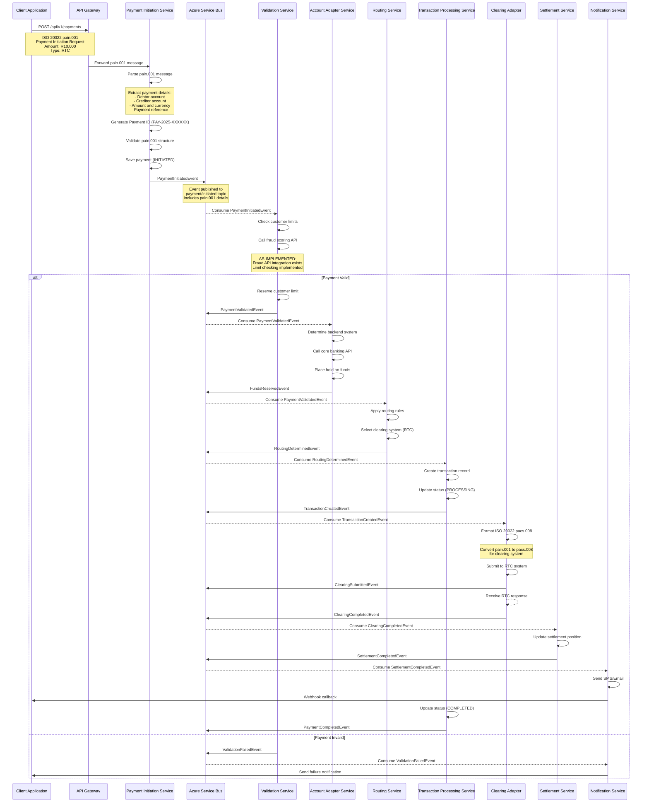
```mermaid
sequenceDiagram
    participant Client as Client Application
    participant Gateway as API Gateway
    participant PaymentInit as Payment Initiation Service
    participant EventBus as Azure Service Bus
    participant Validation as Validation Service
    participant Account as Account Adapter Service
    participant Routing as Routing Service
    participant Transaction as Transaction Processing Service
    participant Clearing as Clearing Adapter
    participant Settlement as Settlement Service
    participant Notification as Notification Service

    Client->>Gateway: POST /api/v1/payments
    Note over Client,Gateway: ISO 20022 pain.001<br/>Payment Initiation Request<br/>Amount: R10,000<br/>Type: RTC
    
    Gateway->>PaymentInit: Forward pain.001 message
    PaymentInit->>PaymentInit: Parse pain.001 message
    Note over PaymentInit: Extract payment details:<br/>- Debtor account<br/>- Creditor account<br/>- Amount and currency<br/>- Payment reference
    
    PaymentInit->>PaymentInit: Generate Payment ID (PAY-2025-XXXXXX)
    PaymentInit->>PaymentInit: Validate pain.001 structure
    PaymentInit->>PaymentInit: Save payment (INITIATED)
    
    PaymentInit->>EventBus: PaymentInitiatedEvent
    Note over EventBus: Event published to<br/>payment/initiated topic<br/>Includes pain.001 details
    
    EventBus-->>Validation: Consume PaymentInitiatedEvent
    Validation->>Validation: Check customer limits
    Validation->>Validation: Call fraud scoring API
    Note over Validation: AS-IMPLEMENTED:<br/>Fraud API integration exists<br/>Limit checking implemented
    
    alt Payment Valid
        Validation->>Validation: Reserve customer limit
        Validation->>EventBus: PaymentValidatedEvent
        EventBus-->>Account: Consume PaymentValidatedEvent
        
        Account->>Account: Determine backend system
        Account->>Account: Call core banking API
        Account->>Account: Place hold on funds
        Account->>EventBus: FundsReservedEvent
        
        EventBus-->>Routing: Consume PaymentValidatedEvent
        Routing->>Routing: Apply routing rules
        Routing->>Routing: Select clearing system (RTC)
        Routing->>EventBus: RoutingDeterminedEvent
        
        EventBus-->>Transaction: Consume RoutingDeterminedEvent
        Transaction->>Transaction: Create transaction record
        Transaction->>Transaction: Update status (PROCESSING)
        Transaction->>EventBus: TransactionCreatedEvent
        
        EventBus-->>Clearing: Consume TransactionCreatedEvent
        Clearing->>Clearing: Format ISO 20022 pacs.008
        Note over Clearing: Convert pain.001 to pacs.008<br/>for clearing system
        Clearing->>Clearing: Submit to RTC system
        Clearing->>EventBus: ClearingSubmittedEvent
        
        Clearing-->>Clearing: Receive RTC response
        Clearing->>EventBus: ClearingCompletedEvent
        
        EventBus-->>Settlement: Consume ClearingCompletedEvent
        Settlement->>Settlement: Update settlement position
        Settlement->>EventBus: SettlementCompletedEvent
        
        EventBus-->>Notification: Consume SettlementCompletedEvent
        Notification->>Notification: Send SMS/Email
        Notification->>Client: Webhook callback
        
        Transaction->>Transaction: Update status (COMPLETED)
        Transaction->>EventBus: PaymentCompletedEvent
        
    else Payment Invalid
        Validation->>EventBus: ValidationFailedEvent
        EventBus-->>Notification: Consume ValidationFailedEvent
        Notification->>Client: Send failure notification
    end
```

### 2. Validation Flow with Limit Checking

**Description**: Detailed validation process including fraud scoring, limit checking, and compliance validation.

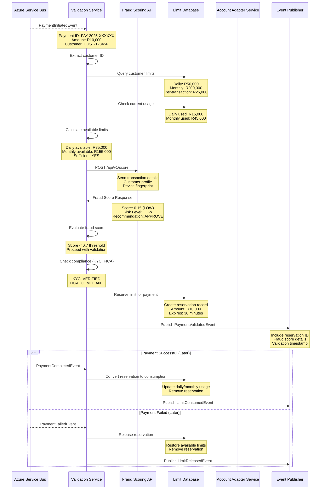
```mermaid
sequenceDiagram
    participant EventBus as Azure Service Bus
    participant Validation as Validation Service
    participant FraudAPI as Fraud Scoring API
    participant LimitDB as Limit Database
    participant Account as Account Adapter Service
    participant EventPub as Event Publisher

    EventBus-->>Validation: PaymentInitiatedEvent
    Note over Validation: Payment ID: PAY-2025-XXXXXX<br/>Amount: R10,000<br/>Customer: CUST-123456
    
    Validation->>Validation: Extract customer ID
    Validation->>LimitDB: Query customer limits
    Note over LimitDB: Daily: R50,000<br/>Monthly: R200,000<br/>Per-transaction: R25,000
    
    Validation->>LimitDB: Check current usage
    Note over LimitDB: Daily used: R15,000<br/>Monthly used: R45,000
    
    Validation->>Validation: Calculate available limits
    Note over Validation: Daily available: R35,000<br/>Monthly available: R155,000<br/>Sufficient: YES
    
    Validation->>FraudAPI: POST /api/v1/score
    Note over FraudAPI: Send transaction details<br/>Customer profile<br/>Device fingerprint
    
    FraudAPI-->>Validation: Fraud Score Response
    Note over FraudAPI: Score: 0.15 (LOW)<br/>Risk Level: LOW<br/>Recommendation: APPROVE
    
    Validation->>Validation: Evaluate fraud score
    Note over Validation: Score < 0.7 threshold<br/>Proceed with validation
    
    Validation->>Validation: Check compliance (KYC, FICA)
    Note over Validation: KYC: VERIFIED<br/>FICA: COMPLIANT
    
    Validation->>LimitDB: Reserve limit for payment
    Note over LimitDB: Create reservation record<br/>Amount: R10,000<br/>Expires: 30 minutes
    
    Validation->>EventPub: Publish PaymentValidatedEvent
    Note over EventPub: Include reservation ID<br/>Fraud score details<br/>Validation timestamp
    
    alt Payment Successful (Later)
        EventBus-->>Validation: PaymentCompletedEvent
        Validation->>LimitDB: Convert reservation to consumption
        Note over LimitDB: Update daily/monthly usage<br/>Remove reservation
        Validation->>EventPub: Publish LimitConsumedEvent
        
    else Payment Failed (Later)
        EventBus-->>Validation: PaymentFailedEvent
        Validation->>LimitDB: Release reservation
        Note over LimitDB: Restore available limits<br/>Remove reservation
        Validation->>EventPub: Publish LimitReleasedEvent
    end
```

### 3. Saga Orchestration - Success Path

**Description**: Saga orchestrator coordinating all payment steps with state machine management.

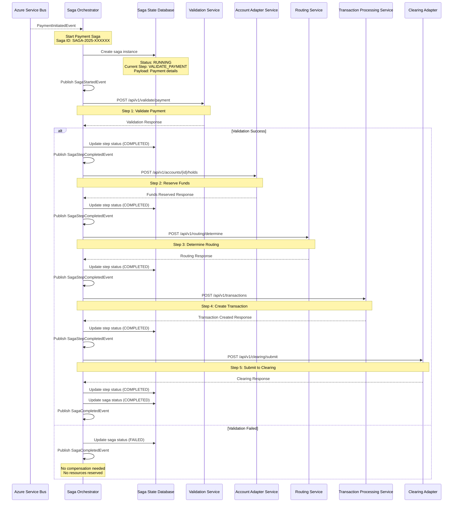
```mermaid
sequenceDiagram
    participant EventBus as Azure Service Bus
    participant Saga as Saga Orchestrator
    participant StateDB as Saga State Database
    participant Validation as Validation Service
    participant Account as Account Adapter Service
    participant Routing as Routing Service
    participant Transaction as Transaction Processing Service
    participant Clearing as Clearing Adapter

    EventBus-->>Saga: PaymentInitiatedEvent
    Note over Saga: Start Payment Saga<br/>Saga ID: SAGA-2025-XXXXXX
    
    Saga->>StateDB: Create saga instance
    Note over StateDB: Status: RUNNING<br/>Current Step: VALIDATE_PAYMENT<br/>Payload: Payment details
    
    Saga->>Saga: Publish SagaStartedEvent
    Saga->>Validation: POST /api/v1/validate/payment
    Note over Saga,Validation: Step 1: Validate Payment
    
    Validation-->>Saga: Validation Response
    alt Validation Success
        Saga->>StateDB: Update step status (COMPLETED)
        Saga->>Saga: Publish SagaStepCompletedEvent
        Saga->>Account: POST /api/v1/accounts/{id}/holds
        Note over Saga,Account: Step 2: Reserve Funds
        
        Account-->>Saga: Funds Reserved Response
        Saga->>StateDB: Update step status (COMPLETED)
        Saga->>Saga: Publish SagaStepCompletedEvent
        Saga->>Routing: POST /api/v1/routing/determine
        Note over Saga,Routing: Step 3: Determine Routing
        
        Routing-->>Saga: Routing Response
        Saga->>StateDB: Update step status (COMPLETED)
        Saga->>Saga: Publish SagaStepCompletedEvent
        Saga->>Transaction: POST /api/v1/transactions
        Note over Saga,Transaction: Step 4: Create Transaction
        
        Transaction-->>Saga: Transaction Created Response
        Saga->>StateDB: Update step status (COMPLETED)
        Saga->>Saga: Publish SagaStepCompletedEvent
        Saga->>Clearing: POST /api/v1/clearing/submit
        Note over Saga,Clearing: Step 5: Submit to Clearing
        
        Clearing-->>Saga: Clearing Response
        Saga->>StateDB: Update step status (COMPLETED)
        Saga->>StateDB: Update saga status (COMPLETED)
        Saga->>Saga: Publish SagaCompletedEvent
        
    else Validation Failed
        Saga->>StateDB: Update saga status (FAILED)
        Saga->>Saga: Publish SagaCompletedEvent
        Note over Saga: No compensation needed<br/>No resources reserved
    end
```

### 4. Saga Compensation - Failure Path

**Description**: Compensation flow when clearing fails, showing rollback of all completed steps.

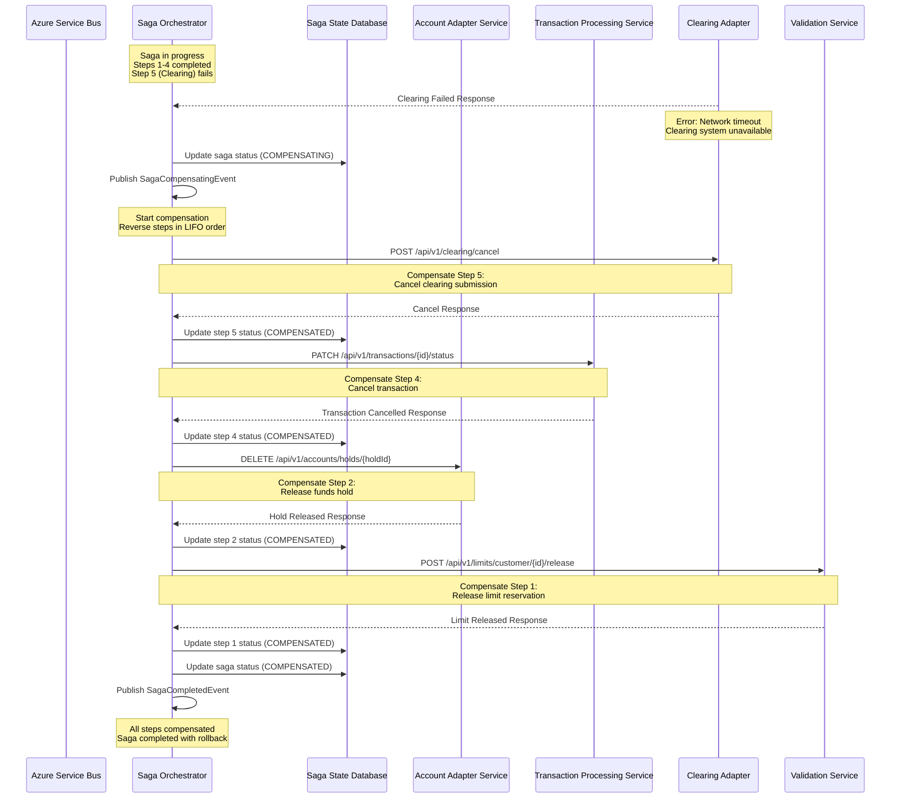
```mermaid
sequenceDiagram
    participant EventBus as Azure Service Bus
    participant Saga as Saga Orchestrator
    participant StateDB as Saga State Database
    participant Account as Account Adapter Service
    participant Transaction as Transaction Processing Service
    participant Clearing as Clearing Adapter
    participant Validation as Validation Service

    Note over Saga: Saga in progress<br/>Steps 1-4 completed<br/>Step 5 (Clearing) fails
    
    Clearing-->>Saga: Clearing Failed Response
    Note over Clearing: Error: Network timeout<br/>Clearing system unavailable
    
    Saga->>StateDB: Update saga status (COMPENSATING)
    Saga->>Saga: Publish SagaCompensatingEvent
    Note over Saga: Start compensation<br/>Reverse steps in LIFO order
    
    Saga->>Clearing: POST /api/v1/clearing/cancel
    Note over Saga,Clearing: Compensate Step 5:<br/>Cancel clearing submission
    
    Clearing-->>Saga: Cancel Response
    Saga->>StateDB: Update step 5 status (COMPENSATED)
    
    Saga->>Transaction: PATCH /api/v1/transactions/{id}/status
    Note over Saga,Transaction: Compensate Step 4:<br/>Cancel transaction
    
    Transaction-->>Saga: Transaction Cancelled Response
    Saga->>StateDB: Update step 4 status (COMPENSATED)
    
    Saga->>Account: DELETE /api/v1/accounts/holds/{holdId}
    Note over Saga,Account: Compensate Step 2:<br/>Release funds hold
    
    Account-->>Saga: Hold Released Response
    Saga->>StateDB: Update step 2 status (COMPENSATED)
    
    Saga->>Validation: POST /api/v1/limits/customer/{id}/release
    Note over Saga,Validation: Compensate Step 1:<br/>Release limit reservation
    
    Validation-->>Saga: Limit Released Response
    Saga->>StateDB: Update step 1 status (COMPENSATED)
    
    Saga->>StateDB: Update saga status (COMPENSATED)
    Saga->>Saga: Publish SagaCompletedEvent
    Note over Saga: All steps compensated<br/>Saga completed with rollback
```

### 5. Batch Payment Processing

**Description**: Spring Batch processing of bulk payment files with parallel processing and error handling.

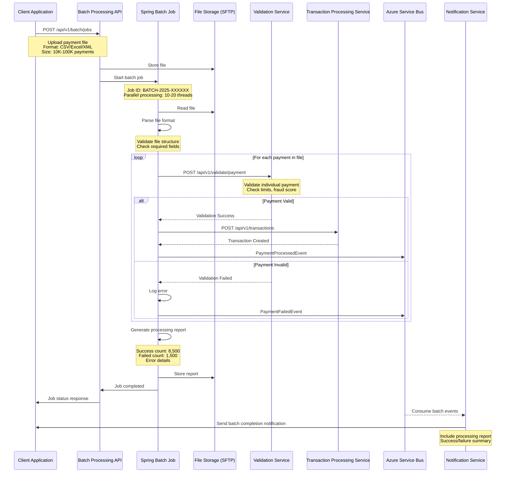
```mermaid
sequenceDiagram
    participant Client as Client Application
    participant BatchAPI as Batch Processing API
    participant BatchJob as Spring Batch Job
    participant FileStorage as File Storage (SFTP)
    participant Validation as Validation Service
    participant Transaction as Transaction Processing Service
    participant EventBus as Azure Service Bus
    participant Notification as Notification Service

    Client->>BatchAPI: POST /api/v1/batch/jobs
    Note over Client,BatchAPI: Upload payment file<br/>Format: CSV/Excel/XML<br/>Size: 10K-100K payments
    
    BatchAPI->>FileStorage: Store file
    BatchAPI->>BatchJob: Start batch job
    Note over BatchJob: Job ID: BATCH-2025-XXXXXX<br/>Parallel processing: 10-20 threads
    
    BatchJob->>FileStorage: Read file
    BatchJob->>BatchJob: Parse file format
    Note over BatchJob: Validate file structure<br/>Check required fields
    
    loop For each payment in file
        BatchJob->>Validation: POST /api/v1/validate/payment
        Note over Validation: Validate individual payment<br/>Check limits, fraud score
        
        alt Payment Valid
            Validation-->>BatchJob: Validation Success
            BatchJob->>Transaction: POST /api/v1/transactions
            Transaction-->>BatchJob: Transaction Created
            BatchJob->>EventBus: PaymentProcessedEvent
            
        else Payment Invalid
            Validation-->>BatchJob: Validation Failed
            BatchJob->>BatchJob: Log error
            BatchJob->>EventBus: PaymentFailedEvent
        end
    end
    
    BatchJob->>BatchJob: Generate processing report
    Note over BatchJob: Success count: 8,500<br/>Failed count: 1,500<br/>Error details
    
    BatchJob->>FileStorage: Store report
    BatchJob->>BatchAPI: Job completed
    BatchAPI->>Client: Job status response
    
    EventBus-->>Notification: Consume batch events
    Notification->>Client: Send batch completion notification
    Note over Notification: Include processing report<br/>Success/failure summary
```

### 6. Settlement and Reconciliation

**Description**: Daily settlement batch creation, execution, and reconciliation with exception handling.

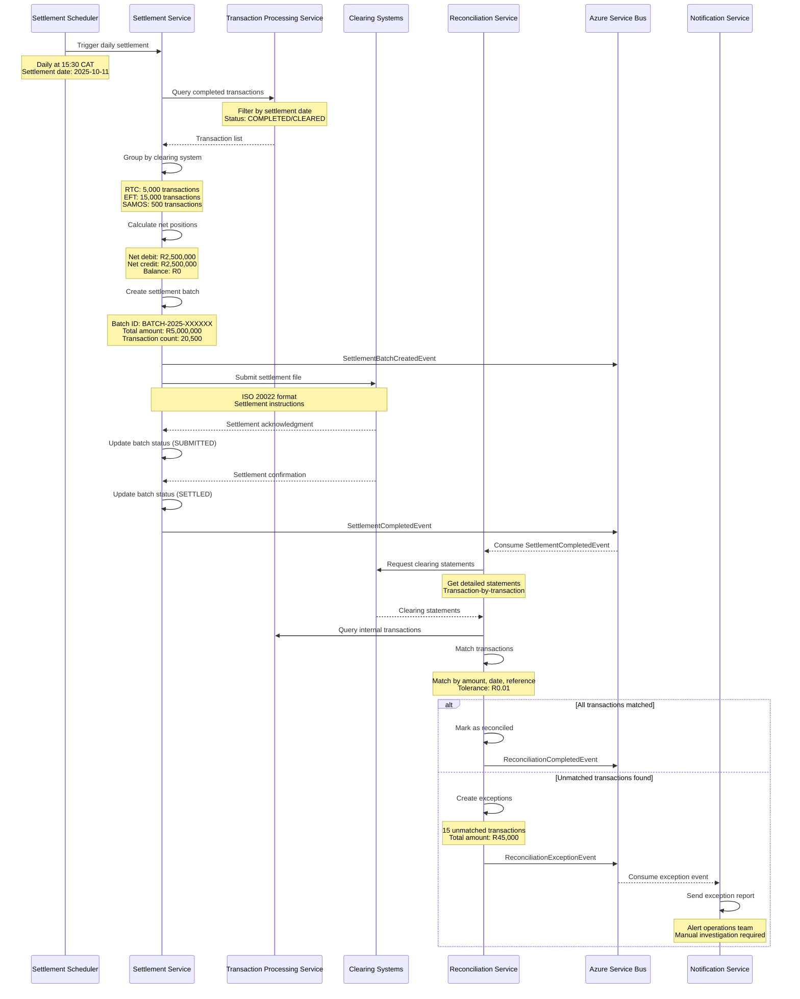
```mermaid
sequenceDiagram
    participant Scheduler as Settlement Scheduler
    participant Settlement as Settlement Service
    participant Transaction as Transaction Processing Service
    participant Clearing as Clearing Systems
    participant Reconciliation as Reconciliation Service
    participant EventBus as Azure Service Bus
    participant Notification as Notification Service

    Scheduler->>Settlement: Trigger daily settlement
    Note over Scheduler: Daily at 15:30 CAT<br/>Settlement date: 2025-10-11
    
    Settlement->>Transaction: Query completed transactions
    Note over Transaction: Filter by settlement date<br/>Status: COMPLETED/CLEARED
    
    Transaction-->>Settlement: Transaction list
    Settlement->>Settlement: Group by clearing system
    Note over Settlement: RTC: 5,000 transactions<br/>EFT: 15,000 transactions<br/>SAMOS: 500 transactions
    
    Settlement->>Settlement: Calculate net positions
    Note over Settlement: Net debit: R2,500,000<br/>Net credit: R2,500,000<br/>Balance: R0
    
    Settlement->>Settlement: Create settlement batch
    Note over Settlement: Batch ID: BATCH-2025-XXXXXX<br/>Total amount: R5,000,000<br/>Transaction count: 20,500
    
    Settlement->>EventBus: SettlementBatchCreatedEvent
    Settlement->>Clearing: Submit settlement file
    Note over Settlement,Clearing: ISO 20022 format<br/>Settlement instructions
    
    Clearing-->>Settlement: Settlement acknowledgment
    Settlement->>Settlement: Update batch status (SUBMITTED)
    
    Clearing-->>Settlement: Settlement confirmation
    Settlement->>Settlement: Update batch status (SETTLED)
    Settlement->>EventBus: SettlementCompletedEvent
    
    EventBus-->>Reconciliation: Consume SettlementCompletedEvent
    Reconciliation->>Clearing: Request clearing statements
    Note over Reconciliation: Get detailed statements<br/>Transaction-by-transaction
    
    Clearing-->>Reconciliation: Clearing statements
    Reconciliation->>Transaction: Query internal transactions
    Reconciliation->>Reconciliation: Match transactions
    Note over Reconciliation: Match by amount, date, reference<br/>Tolerance: R0.01
    
    alt All transactions matched
        Reconciliation->>Reconciliation: Mark as reconciled
        Reconciliation->>EventBus: ReconciliationCompletedEvent
        
    else Unmatched transactions found
        Reconciliation->>Reconciliation: Create exceptions
        Note over Reconciliation: 15 unmatched transactions<br/>Total amount: R45,000
        
        Reconciliation->>EventBus: ReconciliationExceptionEvent
        EventBus-->>Notification: Consume exception event
        Notification->>Notification: Send exception report
        Note over Notification: Alert operations team<br/>Manual investigation required
    end
```

---

## Clearing System Flows

### 7. SAMOS Adapter - High-Value RTGS

**Description**: High-value payment processing through SAMOS (South African Multiple Option Settlement) for amounts > R5 million.

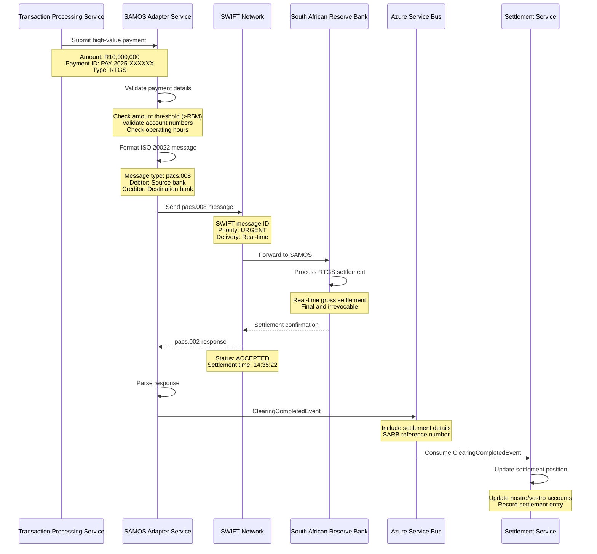
```mermaid
sequenceDiagram
    participant Transaction as Transaction Processing Service
    participant SAMOS as SAMOS Adapter Service
    participant SWIFT as SWIFT Network
    participant SARB as South African Reserve Bank
    participant EventBus as Azure Service Bus
    participant Settlement as Settlement Service

    Transaction->>SAMOS: Submit high-value payment
    Note over Transaction,SAMOS: Amount: R10,000,000<br/>Payment ID: PAY-2025-XXXXXX<br/>Type: RTGS
    
    SAMOS->>SAMOS: Validate payment details
    Note over SAMOS: Check amount threshold (>R5M)<br/>Validate account numbers<br/>Check operating hours
    
    SAMOS->>SAMOS: Format ISO 20022 message
    Note over SAMOS: Message type: pacs.008<br/>Debtor: Source bank<br/>Creditor: Destination bank
    
    SAMOS->>SWIFT: Send pacs.008 message
    Note over SWIFT: SWIFT message ID<br/>Priority: URGENT<br/>Delivery: Real-time
    
    SWIFT->>SARB: Forward to SAMOS
    SARB->>SARB: Process RTGS settlement
    Note over SARB: Real-time gross settlement<br/>Final and irrevocable
    
    SARB-->>SWIFT: Settlement confirmation
    SWIFT-->>SAMOS: pacs.002 response
    Note over SWIFT: Status: ACCEPTED<br/>Settlement time: 14:35:22
    
    SAMOS->>SAMOS: Parse response
    SAMOS->>EventBus: ClearingCompletedEvent
    Note over EventBus: Include settlement details<br/>SARB reference number
    
    EventBus-->>Settlement: Consume ClearingCompletedEvent
    Settlement->>Settlement: Update settlement position
    Note over Settlement: Update nostro/vostro accounts<br/>Record settlement entry
```

### 8. BankservAfrica - EFT Batch

**Description**: EFT batch processing through BankservAfrica with multiple daily cutoffs and batch accumulation.

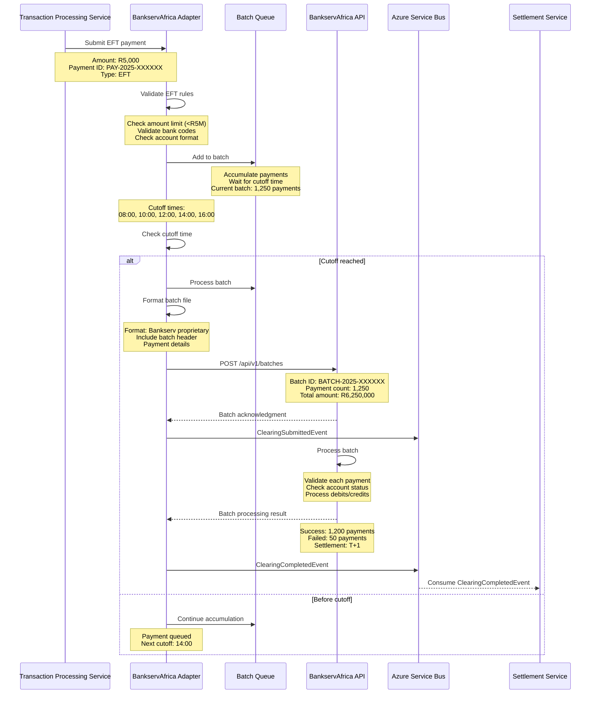
```mermaid
sequenceDiagram
    participant Transaction as Transaction Processing Service
    participant Bankserv as BankservAfrica Adapter
    participant BatchQueue as Batch Queue
    participant BankservAPI as BankservAfrica API
    participant EventBus as Azure Service Bus
    participant Settlement as Settlement Service

    Transaction->>Bankserv: Submit EFT payment
    Note over Transaction,Bankserv: Amount: R5,000<br/>Payment ID: PAY-2025-XXXXXX<br/>Type: EFT
    
    Bankserv->>Bankserv: Validate EFT rules
    Note over Bankserv: Check amount limit (<R5M)<br/>Validate bank codes<br/>Check account format
    
    Bankserv->>BatchQueue: Add to batch
    Note over BatchQueue: Accumulate payments<br/>Wait for cutoff time<br/>Current batch: 1,250 payments
    
    Note over Bankserv: Cutoff times:<br/>08:00, 10:00, 12:00, 14:00, 16:00
    
    Bankserv->>Bankserv: Check cutoff time
    alt Cutoff reached
        Bankserv->>BatchQueue: Process batch
        Bankserv->>Bankserv: Format batch file
        Note over Bankserv: Format: Bankserv proprietary<br/>Include batch header<br/>Payment details
        
        Bankserv->>BankservAPI: POST /api/v1/batches
        Note over BankservAPI: Batch ID: BATCH-2025-XXXXXX<br/>Payment count: 1,250<br/>Total amount: R6,250,000
        
        BankservAPI-->>Bankserv: Batch acknowledgment
        Bankserv->>EventBus: ClearingSubmittedEvent
        
        BankservAPI->>BankservAPI: Process batch
        Note over BankservAPI: Validate each payment<br/>Check account status<br/>Process debits/credits
        
        BankservAPI-->>Bankserv: Batch processing result
        Note over BankservAPI: Success: 1,200 payments<br/>Failed: 50 payments<br/>Settlement: T+1
        
        Bankserv->>EventBus: ClearingCompletedEvent
        EventBus-->>Settlement: Consume ClearingCompletedEvent
        
    else Before cutoff
        Bankserv->>BatchQueue: Continue accumulation
        Note over Bankserv: Payment queued<br/>Next cutoff: 14:00
    end
```

### 9. RTC Adapter - Real-Time Clearing

**Description**: Real-time clearing for instant payments with immediate settlement and 24/7 availability.

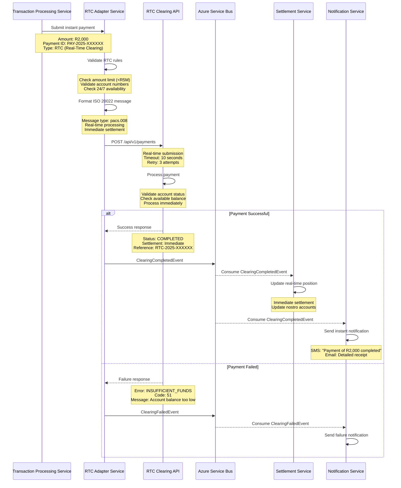
```mermaid
sequenceDiagram
    participant Transaction as Transaction Processing Service
    participant RTC as RTC Adapter Service
    participant RTCAPI as RTC Clearing API
    participant EventBus as Azure Service Bus
    participant Settlement as Settlement Service
    participant Notification as Notification Service

    Transaction->>RTC: Submit instant payment
    Note over Transaction,RTC: Amount: R2,000<br/>Payment ID: PAY-2025-XXXXXX<br/>Type: RTC (Real-Time Clearing)
    
    RTC->>RTC: Validate RTC rules
    Note over RTC: Check amount limit (<R5M)<br/>Validate account numbers<br/>Check 24/7 availability
    
    RTC->>RTC: Format ISO 20022 message
    Note over RTC: Message type: pacs.008<br/>Real-time processing<br/>Immediate settlement
    
    RTC->>RTCAPI: POST /api/v1/payments
    Note over RTCAPI: Real-time submission<br/>Timeout: 10 seconds<br/>Retry: 3 attempts
    
    RTCAPI->>RTCAPI: Process payment
    Note over RTCAPI: Validate account status<br/>Check available balance<br/>Process immediately
    
    alt Payment Successful
        RTCAPI-->>RTC: Success response
        Note over RTCAPI: Status: COMPLETED<br/>Settlement: Immediate<br/>Reference: RTC-2025-XXXXXX
        
        RTC->>EventBus: ClearingCompletedEvent
        EventBus-->>Settlement: Consume ClearingCompletedEvent
        Settlement->>Settlement: Update real-time position
        Note over Settlement: Immediate settlement<br/>Update nostro accounts
        
        EventBus-->>Notification: Consume ClearingCompletedEvent
        Notification->>Notification: Send instant notification
        Note over Notification: SMS: "Payment of R2,000 completed"<br/>Email: Detailed receipt
        
    else Payment Failed
        RTCAPI-->>RTC: Failure response
        Note over RTCAPI: Error: INSUFFICIENT_FUNDS<br/>Code: 51<br/>Message: Account balance too low
        
        RTC->>EventBus: ClearingFailedEvent
        EventBus-->>Notification: Consume ClearingFailedEvent
        Notification->>Notification: Send failure notification
    end
```

### 10. PayShap Adapter - Instant P2P

**Description**: Instant person-to-person payments through PayShap with proxy resolution and 24/7/365 availability.

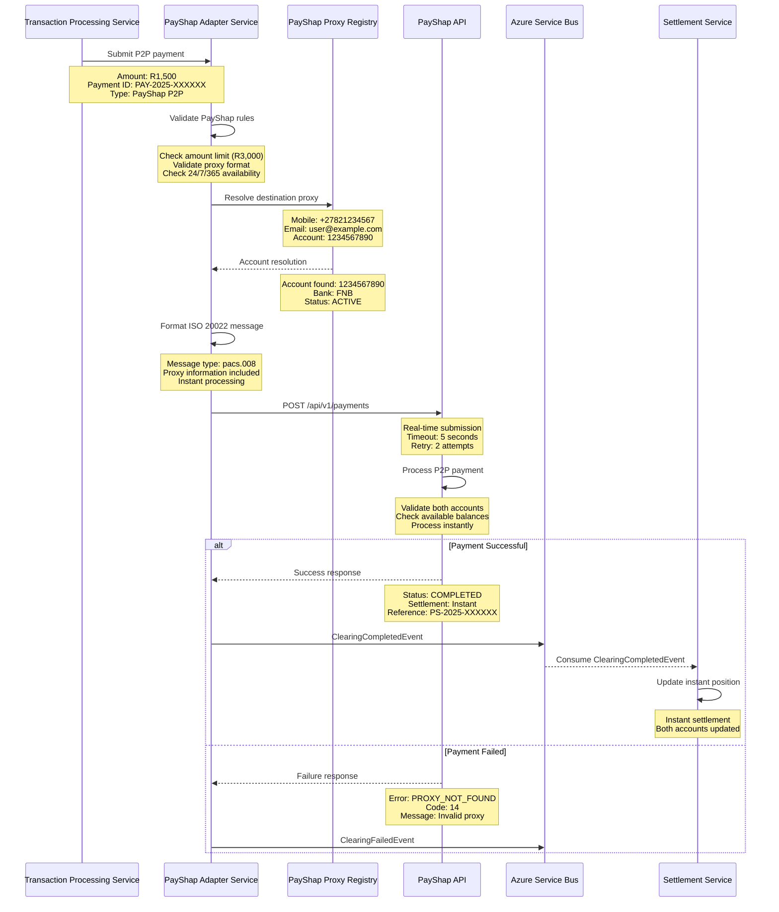
```mermaid
sequenceDiagram
    participant Transaction as Transaction Processing Service
    participant PayShap as PayShap Adapter Service
    participant Proxy as PayShap Proxy Registry
    participant PayShapAPI as PayShap API
    participant EventBus as Azure Service Bus
    participant Settlement as Settlement Service

    Transaction->>PayShap: Submit P2P payment
    Note over Transaction,PayShap: Amount: R1,500<br/>Payment ID: PAY-2025-XXXXXX<br/>Type: PayShap P2P
    
    PayShap->>PayShap: Validate PayShap rules
    Note over PayShap: Check amount limit (R3,000)<br/>Validate proxy format<br/>Check 24/7/365 availability
    
    PayShap->>Proxy: Resolve destination proxy
    Note over Proxy: Mobile: +27821234567<br/>Email: user@example.com<br/>Account: 1234567890
    
    Proxy-->>PayShap: Account resolution
    Note over Proxy: Account found: 1234567890<br/>Bank: FNB<br/>Status: ACTIVE
    
    PayShap->>PayShap: Format ISO 20022 message
    Note over PayShap: Message type: pacs.008<br/>Proxy information included<br/>Instant processing
    
    PayShap->>PayShapAPI: POST /api/v1/payments
    Note over PayShapAPI: Real-time submission<br/>Timeout: 5 seconds<br/>Retry: 2 attempts
    
    PayShapAPI->>PayShapAPI: Process P2P payment
    Note over PayShapAPI: Validate both accounts<br/>Check available balances<br/>Process instantly
    
    alt Payment Successful
        PayShapAPI-->>PayShap: Success response
        Note over PayShapAPI: Status: COMPLETED<br/>Settlement: Instant<br/>Reference: PS-2025-XXXXXX
        
        PayShap->>EventBus: ClearingCompletedEvent
        EventBus-->>Settlement: Consume ClearingCompletedEvent
        Settlement->>Settlement: Update instant position
        Note over Settlement: Instant settlement<br/>Both accounts updated
        
    else Payment Failed
        PayShapAPI-->>PayShap: Failure response
        Note over PayShapAPI: Error: PROXY_NOT_FOUND<br/>Code: 14<br/>Message: Invalid proxy
        
        PayShap->>EventBus: ClearingFailedEvent
    end
```

### 11. SWIFT Adapter - International Payments

**Description**: International cross-border payments through SWIFT with sanctions screening, FX conversion, and correspondent banking.

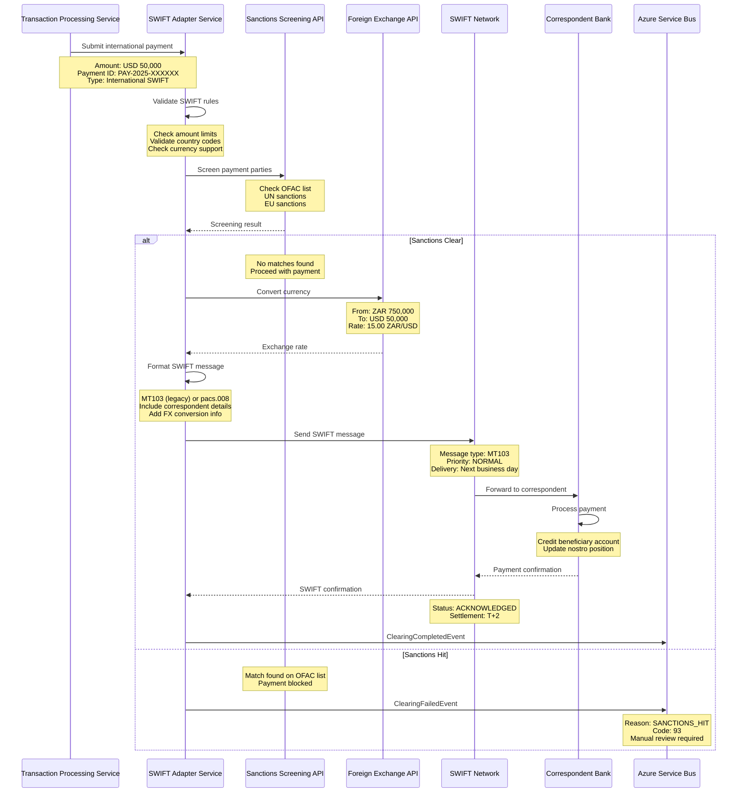
```mermaid
sequenceDiagram
    participant Transaction as Transaction Processing Service
    participant SWIFT as SWIFT Adapter Service
    participant Sanctions as Sanctions Screening API
    participant FX as Foreign Exchange API
    participant SWIFTNet as SWIFT Network
    participant Correspondent as Correspondent Bank
    participant EventBus as Azure Service Bus

    Transaction->>SWIFT: Submit international payment
    Note over Transaction,SWIFT: Amount: USD 50,000<br/>Payment ID: PAY-2025-XXXXXX<br/>Type: International SWIFT
    
    SWIFT->>SWIFT: Validate SWIFT rules
    Note over SWIFT: Check amount limits<br/>Validate country codes<br/>Check currency support
    
    SWIFT->>Sanctions: Screen payment parties
    Note over Sanctions: Check OFAC list<br/>UN sanctions<br/>EU sanctions
    
    Sanctions-->>SWIFT: Screening result
    alt Sanctions Clear
        Note over Sanctions: No matches found<br/>Proceed with payment
        
        SWIFT->>FX: Convert currency
        Note over FX: From: ZAR 750,000<br/>To: USD 50,000<br/>Rate: 15.00 ZAR/USD
        
        FX-->>SWIFT: Exchange rate
        SWIFT->>SWIFT: Format SWIFT message
        Note over SWIFT: MT103 (legacy) or pacs.008<br/>Include correspondent details<br/>Add FX conversion info
        
        SWIFT->>SWIFTNet: Send SWIFT message
        Note over SWIFTNet: Message type: MT103<br/>Priority: NORMAL<br/>Delivery: Next business day
        
        SWIFTNet->>Correspondent: Forward to correspondent
        Correspondent->>Correspondent: Process payment
        Note over Correspondent: Credit beneficiary account<br/>Update nostro position
        
        Correspondent-->>SWIFTNet: Payment confirmation
        SWIFTNet-->>SWIFT: SWIFT confirmation
        Note over SWIFTNet: Status: ACKNOWLEDGED<br/>Settlement: T+2
        
        SWIFT->>EventBus: ClearingCompletedEvent
        
    else Sanctions Hit
        Note over Sanctions: Match found on OFAC list<br/>Payment blocked
        
        SWIFT->>EventBus: ClearingFailedEvent
        Note over EventBus: Reason: SANCTIONS_HIT<br/>Code: 93<br/>Manual review required
    end
```

---

## Phase 7 Operations Flows

### 12. Operations Portal - Service Management

**Description**: Operations team managing all 22 microservices through the operations portal with health monitoring, circuit breaker control, and pod management.

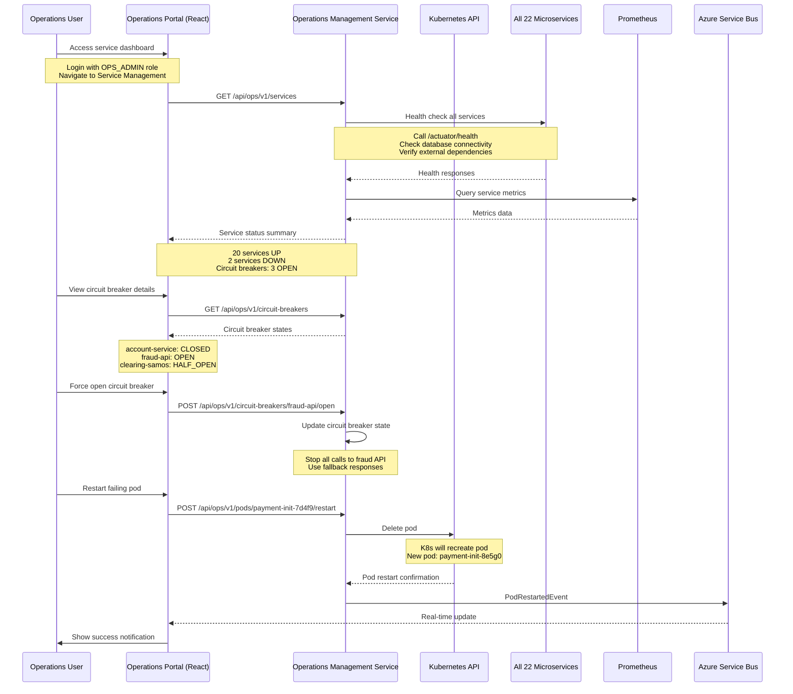
```mermaid
sequenceDiagram
    participant OpsUser as Operations User
    participant OpsPortal as Operations Portal (React)
    participant OpsAPI as Operations Management Service
    participant K8s as Kubernetes API
    participant Services as All 22 Microservices
    participant Prometheus as Prometheus
    participant EventBus as Azure Service Bus

    OpsUser->>OpsPortal: Access service dashboard
    Note over OpsUser,OpsPortal: Login with OPS_ADMIN role<br/>Navigate to Service Management
    
    OpsPortal->>OpsAPI: GET /api/ops/v1/services
    OpsAPI->>Services: Health check all services
    Note over OpsAPI,Services: Call /actuator/health<br/>Check database connectivity<br/>Verify external dependencies
    
    Services-->>OpsAPI: Health responses
    OpsAPI->>Prometheus: Query service metrics
    Prometheus-->>OpsAPI: Metrics data
    OpsAPI-->>OpsPortal: Service status summary
    Note over OpsAPI,OpsPortal: 20 services UP<br/>2 services DOWN<br/>Circuit breakers: 3 OPEN
    
    OpsUser->>OpsPortal: View circuit breaker details
    OpsPortal->>OpsAPI: GET /api/ops/v1/circuit-breakers
    OpsAPI-->>OpsPortal: Circuit breaker states
    Note over OpsPortal: account-service: CLOSED<br/>fraud-api: OPEN<br/>clearing-samos: HALF_OPEN
    
    OpsUser->>OpsPortal: Force open circuit breaker
    OpsPortal->>OpsAPI: POST /api/ops/v1/circuit-breakers/fraud-api/open
    OpsAPI->>OpsAPI: Update circuit breaker state
    Note over OpsAPI: Stop all calls to fraud API<br/>Use fallback responses
    
    OpsUser->>OpsPortal: Restart failing pod
    OpsPortal->>OpsAPI: POST /api/ops/v1/pods/payment-init-7d4f9/restart
    OpsAPI->>K8s: Delete pod
    Note over K8s: K8s will recreate pod<br/>New pod: payment-init-8e5g0
    
    K8s-->>OpsAPI: Pod restart confirmation
    OpsAPI->>EventBus: PodRestartedEvent
    EventBus-->>OpsPortal: Real-time update
    OpsPortal->>OpsUser: Show success notification
```

### 13. Operations Portal - Payment Repair

**Description**: Operations team investigating and repairing failed payments through saga state inspection and manual intervention.

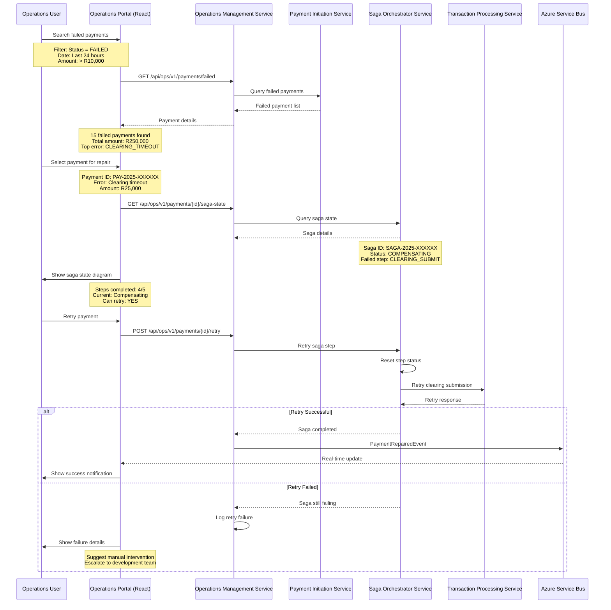
```mermaid
sequenceDiagram
    participant OpsUser as Operations User
    participant OpsPortal as Operations Portal (React)
    participant OpsAPI as Operations Management Service
    participant PaymentAPI as Payment Initiation Service
    participant SagaAPI as Saga Orchestrator Service
    participant TransactionAPI as Transaction Processing Service
    participant EventBus as Azure Service Bus

    OpsUser->>OpsPortal: Search failed payments
    Note over OpsUser,OpsPortal: Filter: Status = FAILED<br/>Date: Last 24 hours<br/>Amount: > R10,000
    
    OpsPortal->>OpsAPI: GET /api/ops/v1/payments/failed
    OpsAPI->>PaymentAPI: Query failed payments
    PaymentAPI-->>OpsAPI: Failed payment list
    OpsAPI-->>OpsPortal: Payment details
    Note over OpsPortal: 15 failed payments found<br/>Total amount: R250,000<br/>Top error: CLEARING_TIMEOUT
    
    OpsUser->>OpsPortal: Select payment for repair
    Note over OpsPortal: Payment ID: PAY-2025-XXXXXX<br/>Error: Clearing timeout<br/>Amount: R25,000
    
    OpsPortal->>OpsAPI: GET /api/ops/v1/payments/{id}/saga-state
    OpsAPI->>SagaAPI: Query saga state
    SagaAPI-->>OpsAPI: Saga details
    Note over SagaAPI: Saga ID: SAGA-2025-XXXXXX<br/>Status: COMPENSATING<br/>Failed step: CLEARING_SUBMIT
    
    OpsPortal->>OpsUser: Show saga state diagram
    Note over OpsPortal: Steps completed: 4/5<br/>Current: Compensating<br/>Can retry: YES
    
    OpsUser->>OpsPortal: Retry payment
    OpsPortal->>OpsAPI: POST /api/ops/v1/payments/{id}/retry
    OpsAPI->>SagaAPI: Retry saga step
    SagaAPI->>SagaAPI: Reset step status
    SagaAPI->>TransactionAPI: Retry clearing submission
    
    TransactionAPI-->>SagaAPI: Retry response
    alt Retry Successful
        SagaAPI-->>OpsAPI: Saga completed
        OpsAPI->>EventBus: PaymentRepairedEvent
        EventBus-->>OpsPortal: Real-time update
        OpsPortal->>OpsUser: Show success notification
        
    else Retry Failed
        SagaAPI-->>OpsAPI: Saga still failing
        OpsAPI->>OpsAPI: Log retry failure
        OpsPortal->>OpsUser: Show failure details
        Note over OpsPortal: Suggest manual intervention<br/>Escalate to development team
    end
```

### 14. Metrics Aggregation - Real-Time Dashboard

**Description**: Real-time metrics aggregation from all services with WebSocket streaming and alert management.

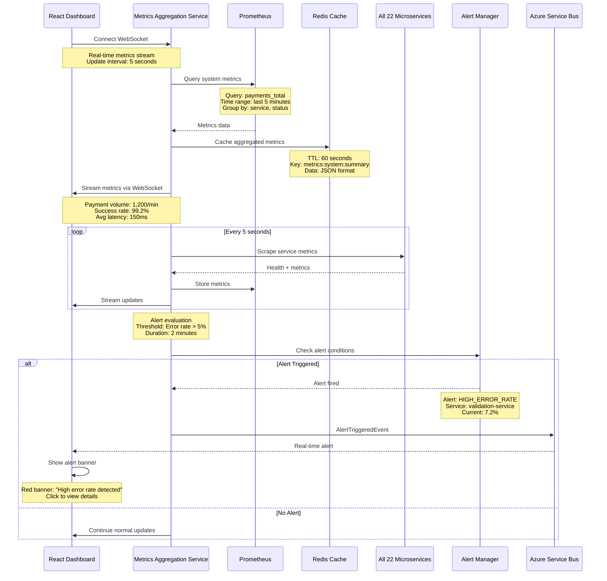
```mermaid
sequenceDiagram
    participant Dashboard as React Dashboard
    participant MetricsAPI as Metrics Aggregation Service
    participant Prometheus as Prometheus
    participant Redis as Redis Cache
    participant Services as All 22 Microservices
    participant AlertManager as Alert Manager
    participant EventBus as Azure Service Bus

    Dashboard->>MetricsAPI: Connect WebSocket
    Note over Dashboard,MetricsAPI: Real-time metrics stream<br/>Update interval: 5 seconds
    
    MetricsAPI->>Prometheus: Query system metrics
    Note over Prometheus: Query: payments_total<br/>Time range: last 5 minutes<br/>Group by: service, status
    
    Prometheus-->>MetricsAPI: Metrics data
    MetricsAPI->>Redis: Cache aggregated metrics
    Note over Redis: TTL: 60 seconds<br/>Key: metrics:system:summary<br/>Data: JSON format
    
    MetricsAPI->>Dashboard: Stream metrics via WebSocket
    Note over MetricsAPI,Dashboard: Payment volume: 1,200/min<br/>Success rate: 99.2%<br/>Avg latency: 150ms
    
    loop Every 5 seconds
        MetricsAPI->>Services: Scrape service metrics
        Services-->>MetricsAPI: Health + metrics
        MetricsAPI->>Prometheus: Store metrics
        MetricsAPI->>Dashboard: Stream updates
    end
    
    Note over MetricsAPI: Alert evaluation<br/>Threshold: Error rate > 5%<br/>Duration: 2 minutes
    
    MetricsAPI->>AlertManager: Check alert conditions
    alt Alert Triggered
        AlertManager-->>MetricsAPI: Alert fired
        Note over AlertManager: Alert: HIGH_ERROR_RATE<br/>Service: validation-service<br/>Current: 7.2%
        
        MetricsAPI->>EventBus: AlertTriggeredEvent
        EventBus-->>Dashboard: Real-time alert
        Dashboard->>Dashboard: Show alert banner
        Note over Dashboard: Red banner: "High error rate detected"<br/>Click to view details
        
    else No Alert
        MetricsAPI->>Dashboard: Continue normal updates
    end
```

### 15. Channel/Clearing Onboarding

**Description**: Self-service onboarding of new channels and clearing systems through configuration wizards.

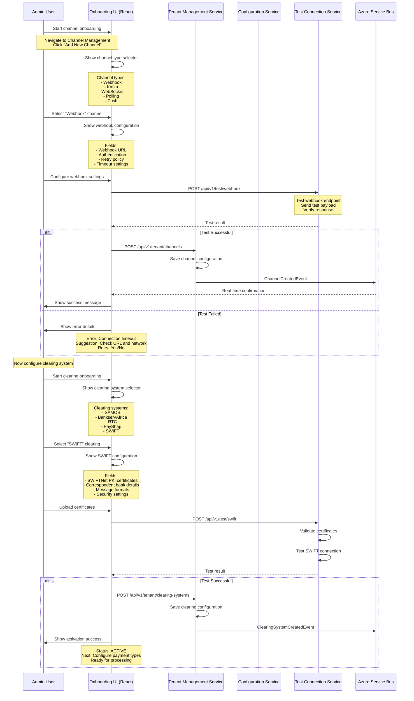
```mermaid
sequenceDiagram
    participant AdminUser as Admin User
    participant OnboardingUI as Onboarding UI (React)
    participant TenantAPI as Tenant Management Service
    participant ConfigAPI as Configuration Service
    participant TestAPI as Test Connection Service
    participant EventBus as Azure Service Bus

    AdminUser->>OnboardingUI: Start channel onboarding
    Note over AdminUser,OnboardingUI: Navigate to Channel Management<br/>Click "Add New Channel"
    
    OnboardingUI->>OnboardingUI: Show channel type selector
    Note over OnboardingUI: Channel types:<br/>- Webhook<br/>- Kafka<br/>- WebSocket<br/>- Polling<br/>- Push
    
    AdminUser->>OnboardingUI: Select "Webhook" channel
    OnboardingUI->>OnboardingUI: Show webhook configuration
    Note over OnboardingUI: Fields:<br/>- Webhook URL<br/>- Authentication<br/>- Retry policy<br/>- Timeout settings
    
    AdminUser->>OnboardingUI: Configure webhook settings
    OnboardingUI->>TestAPI: POST /api/v1/test/webhook
    Note over TestAPI: Test webhook endpoint<br/>Send test payload<br/>Verify response
    
    TestAPI-->>OnboardingUI: Test result
    alt Test Successful
        OnboardingUI->>TenantAPI: POST /api/v1/tenant/channels
        TenantAPI->>TenantAPI: Save channel configuration
        TenantAPI->>EventBus: ChannelCreatedEvent
        EventBus-->>OnboardingUI: Real-time confirmation
        OnboardingUI->>AdminUser: Show success message
        
    else Test Failed
        OnboardingUI->>AdminUser: Show error details
        Note over OnboardingUI: Error: Connection timeout<br/>Suggestion: Check URL and network<br/>Retry: Yes/No
    end
    
    Note over AdminUser: Now configure clearing system
    
    AdminUser->>OnboardingUI: Start clearing onboarding
    OnboardingUI->>OnboardingUI: Show clearing system selector
    Note over OnboardingUI: Clearing systems:<br/>- SAMOS<br/>- BankservAfrica<br/>- RTC<br/>- PayShap<br/>- SWIFT
    
    AdminUser->>OnboardingUI: Select "SWIFT" clearing
    OnboardingUI->>OnboardingUI: Show SWIFT configuration
    Note over OnboardingUI: Fields:<br/>- SWIFTNet PKI certificates<br/>- Correspondent bank details<br/>- Message formats<br/>- Security settings
    
    AdminUser->>OnboardingUI: Upload certificates
    OnboardingUI->>TestAPI: POST /api/v1/test/swift
    TestAPI->>TestAPI: Validate certificates
    TestAPI->>TestAPI: Test SWIFT connection
    TestAPI-->>OnboardingUI: Test result
    
    alt Test Successful
        OnboardingUI->>TenantAPI: POST /api/v1/tenant/clearing-systems
        TenantAPI->>TenantAPI: Save clearing configuration
        TenantAPI->>EventBus: ClearingSystemCreatedEvent
        OnboardingUI->>AdminUser: Show activation success
        Note over OnboardingUI: Status: ACTIVE<br/>Next: Configure payment types<br/>Ready for processing
    end
```

---

## Diagram Standards and Conventions

### Service Color Coding
- **🔵 Core Services**: Payment Initiation, Validation, Account Adapter, Routing, Transaction Processing, Saga Orchestrator
- **🟢 Clearing Adapters**: SAMOS, BankservAfrica, RTC, PayShap, SWIFT
- **🟠 Platform Services**: IAM, Audit, Notification, Reporting, Tenant Management
- **⚫ External Systems**: Core banking systems, clearing networks, fraud APIs, correspondent banks
- **🟣 Events**: Azure Service Bus topics and subscriptions
- **🔴 Errors**: Failure scenarios, compensation flows, exception handling

### Interaction Types
- **Solid arrows (→)**: Synchronous API calls
- **Dashed arrows (-->>)**: Asynchronous event publishing/consumption
- **Notes**: Additional context, AS-IMPLEMENTED vs AS-DOCUMENTED differences

### Event Flow Patterns
1. **Command Events**: Request-response pattern with immediate feedback
2. **Domain Events**: Fire-and-forget pattern for state changes
3. **Integration Events**: External system communication
4. **Compensation Events**: Rollback and error recovery

### Error Handling
- **Validation Errors**: Immediate rejection with detailed error messages
- **System Errors**: Circuit breaker activation with fallback responses
- **Timeout Errors**: Retry logic with exponential backoff
- **Compensation**: Automatic rollback of completed steps

---

## References

- **Architecture Overview**: [docs/00-ARCHITECTURE-OVERVIEW.md](00-ARCHITECTURE-OVERVIEW.md)
- **Microservices Breakdown**: [docs/02-MICROSERVICES-BREAKDOWN.md](02-MICROSERVICES-BREAKDOWN.md)
- **Event Schemas**: [docs/03-EVENT-SCHEMAS.md](03-EVENT-SCHEMAS.md)
- **Feature Breakdown Tree**: [docs/34-FEATURE-BREAKDOWN-TREE-ENHANCED.md](34-FEATURE-BREAKDOWN-TREE-ENHANCED.md)
- **Code Validation Report**: [docs/44-CODE-FLOW-VALIDATION-REPORT.md](44-CODE-FLOW-VALIDATION-REPORT.md)

---

**Document Version**: 1.0  
**Last Updated**: 2025-01-27  
**Total Diagrams**: 15  
**Validation Status**: Pending code review
