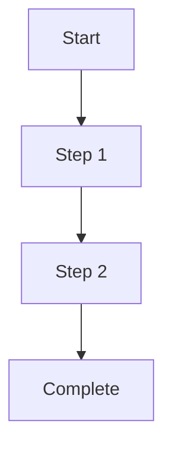
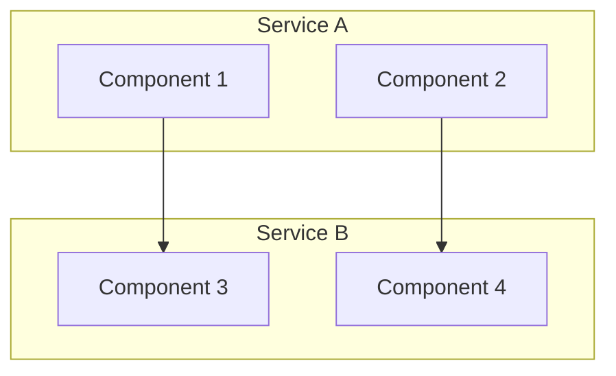
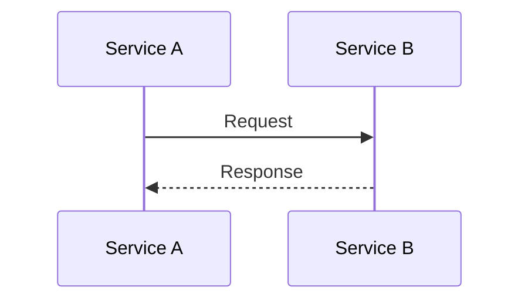
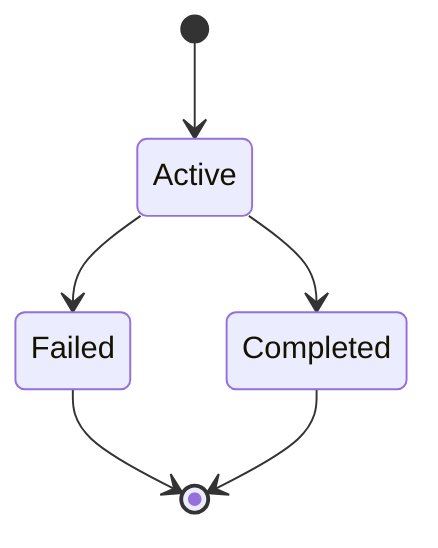
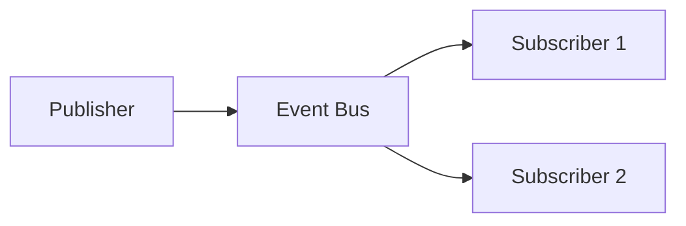

# Saga Flow Diagrams

This directory contains all Mermaid diagrams for the ISO 20022 pain.001/pain.002 saga flow implementation. These diagrams are designed to be easily editable and extensible as new payment processing features are added.

## 📁 Files Overview

### Core Diagrams
- **`pain001-pain002-saga-flow.md`** - Main saga flow diagram with step-by-step process
- **`pain001-pain002-saga-architecture.md`** - Complete architecture diagram with all components
- **`saga-diagram-editor-template.md`** - Template and guidelines for creating new diagrams

### Diagram Types
1. **Flow Diagrams** - Show the step-by-step process flow
2. **Architecture Diagrams** - Show system components and interactions
3. **Sequence Diagrams** - Show detailed interactions between components
4. **State Diagrams** - Show state transitions and lifecycle
5. **Event Flow Diagrams** - Show event-driven interactions

## 🎯 Purpose

These diagrams serve multiple purposes:

### For Developers
- **Understanding**: Visual representation of the saga flow
- **Implementation**: Guide for implementing saga steps
- **Debugging**: Help identify issues in the flow
- **Testing**: Define test scenarios and edge cases

### For Architects
- **Design Review**: Validate architectural decisions
- **Extension Planning**: Plan new features and integrations
- **Performance Analysis**: Identify bottlenecks and optimization opportunities
- **Risk Assessment**: Understand failure points and compensation needs

### For Operations
- **Monitoring**: Understand what to monitor in production
- **Troubleshooting**: Quick reference for issue resolution
- **Capacity Planning**: Understand resource requirements
- **Disaster Recovery**: Plan for failure scenarios

## 🔧 Editing Guidelines

### When to Edit
- **New Features**: Add new saga steps or services
- **Architecture Changes**: Modify system components
- **Process Changes**: Update business logic flow
- **Error Handling**: Add new error scenarios
- **Performance**: Optimize flow for better performance

### How to Edit
1. **Identify the Right Diagram**: Choose the appropriate diagram type
2. **Use the Template**: Follow the template structure
3. **Maintain Consistency**: Use consistent styling and naming
4. **Document Changes**: Update version history and related docs
5. **Test the Diagram**: Verify it renders correctly

### Best Practices
- **Keep it Simple**: Start simple, add complexity gradually
- **Use Consistent Styling**: Apply the same colors and shapes
- **Show Error Handling**: Always include compensation flows
- **Document Decisions**: Explain decision points and conditions
- **Version Control**: Keep diagrams in sync with code changes

## 📊 Diagram Types Explained

### 1. Flow Diagrams
Show the high-level process flow from start to finish.

**Use Cases:**
- Business process overview
- High-level architecture
- Process documentation

**Example:**


### 2. Architecture Diagrams
Show system components, services, and their interactions.

**Use Cases:**
- System design
- Component relationships
- Integration points

**Example:**


### 3. Sequence Diagrams
Show detailed interactions between components over time.

**Use Cases:**
- API interactions
- Event flows
- Detailed process steps

**Example:**


### 4. State Diagrams
Show state transitions and lifecycle management.

**Use Cases:**
- Entity lifecycle
- Status management
- State transitions

**Example:**


### 5. Event Flow Diagrams
Show event-driven interactions and message flows.

**Use Cases:**
- Event-driven architecture
- Message flows
- Async processing

**Example:**


## 🚀 Future Extensions

### Planned Enhancements
1. **Multi-Currency Support**
   - Currency conversion steps
   - Exchange rate validation
   - Multi-currency processing

2. **Compliance Integration**
   - AML/KYC validation
   - Regulatory compliance
   - Sanctions screening

3. **Risk Management**
   - Risk assessment
   - Fraud detection
   - Velocity checks

4. **Settlement Integration**
   - Settlement initiation
   - Settlement confirmation
   - Settlement reconciliation

5. **Notification Services**
   - Customer notifications
   - Bank notifications
   - Regulatory notifications

### Extension Points
- **New Saga Steps**: Add steps between existing ones
- **New Services**: Add new microservices
- **New Events**: Add new Kafka topics
- **New Compensation**: Add compensation logic
- **New Handlers**: Add event handlers

## 🛠️ Tools and Resources

### Online Editors
- [Mermaid Live Editor](https://mermaid.live/) - Real-time editing
- [Draw.io](https://app.diagrams.net/) - General diagramming
- [Lucidchart](https://www.lucidchart.com/) - Professional diagrams

### VS Code Extensions
- **Mermaid Preview** - Preview Mermaid diagrams
- **Mermaid Markdown Syntax Highlighting** - Syntax highlighting
- **Draw.io Integration** - Draw.io integration

### Command Line Tools
```bash
# Install Mermaid CLI
npm install -g @mermaid-js/mermaid-cli

# Generate images from Mermaid files
mmdc -i input.mmd -o output.png
mmdc -i input.mmd -o output.svg
```

### Documentation Tools
- **GitBook** - Documentation platform
- **Confluence** - Team collaboration
- **Notion** - Note-taking and docs
- **GitHub Pages** - Static site hosting

## 📚 Related Documentation

### Technical Documentation
- [Saga Pattern Implementation](../saga-pattern-implementation.md)
- [Event Schema Documentation](../event-schemas.md)
- [Database Schema](../database-schema.md)
- [API Documentation](../api-documentation.md)

### Process Documentation
- [Payment Processing Flow](../payment-processing-flow.md)
- [Error Handling Guide](../error-handling-guide.md)
- [Monitoring and Alerting](../monitoring-guide.md)
- [Deployment Guide](../deployment-guide.md)

### Business Documentation
- [Business Requirements](../business-requirements.md)
- [Compliance Requirements](../compliance-requirements.md)
- [Risk Assessment](../risk-assessment.md)
- [User Stories](../user-stories.md)

## 🔄 Maintenance

### Regular Updates
- **Monthly**: Review diagrams for accuracy
- **Quarterly**: Update for new features
- **Annually**: Major architectural review

### Change Management
- **Version Control**: All changes tracked in Git
- **Review Process**: Peer review for major changes
- **Documentation**: Update related docs with changes
- **Testing**: Verify diagrams render correctly

### Quality Assurance
- **Consistency Check**: Ensure consistent styling
- **Completeness Check**: Verify all flows are covered
- **Accuracy Check**: Ensure diagrams match implementation
- **Usability Check**: Ensure diagrams are understandable

## 📞 Support

### Getting Help
- **Documentation**: Check this README and related docs
- **Team Chat**: Ask questions in team channels
- **Code Review**: Request review for diagram changes
- **Training**: Attend diagramming workshops

### Contributing
- **Fork**: Fork the repository
- **Branch**: Create a feature branch
- **Edit**: Make your changes
- **Test**: Verify diagrams render correctly
- **Submit**: Create a pull request

### Feedback
- **Issues**: Report issues via GitHub issues
- **Suggestions**: Submit improvement suggestions
- **Reviews**: Provide feedback on diagram quality
- **Training**: Suggest training topics

---

**Last Updated**: December 2024  
**Version**: 1.0  
**Maintainer**: Payment Engineering Team
