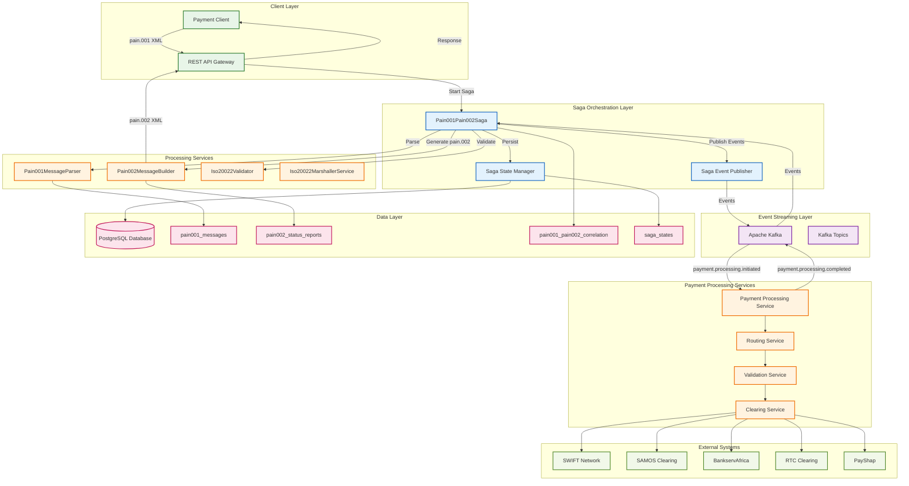
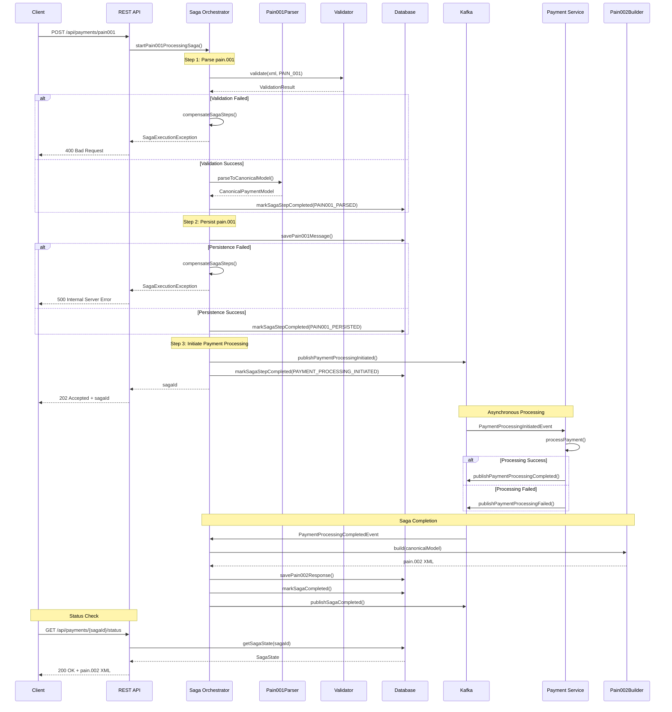
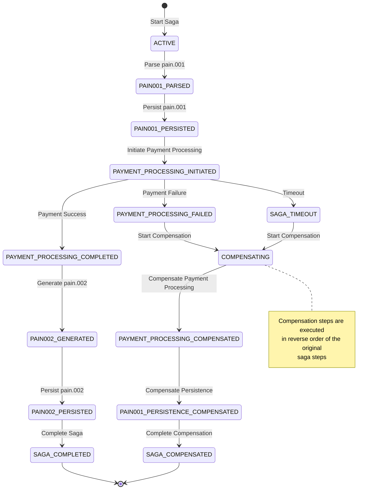
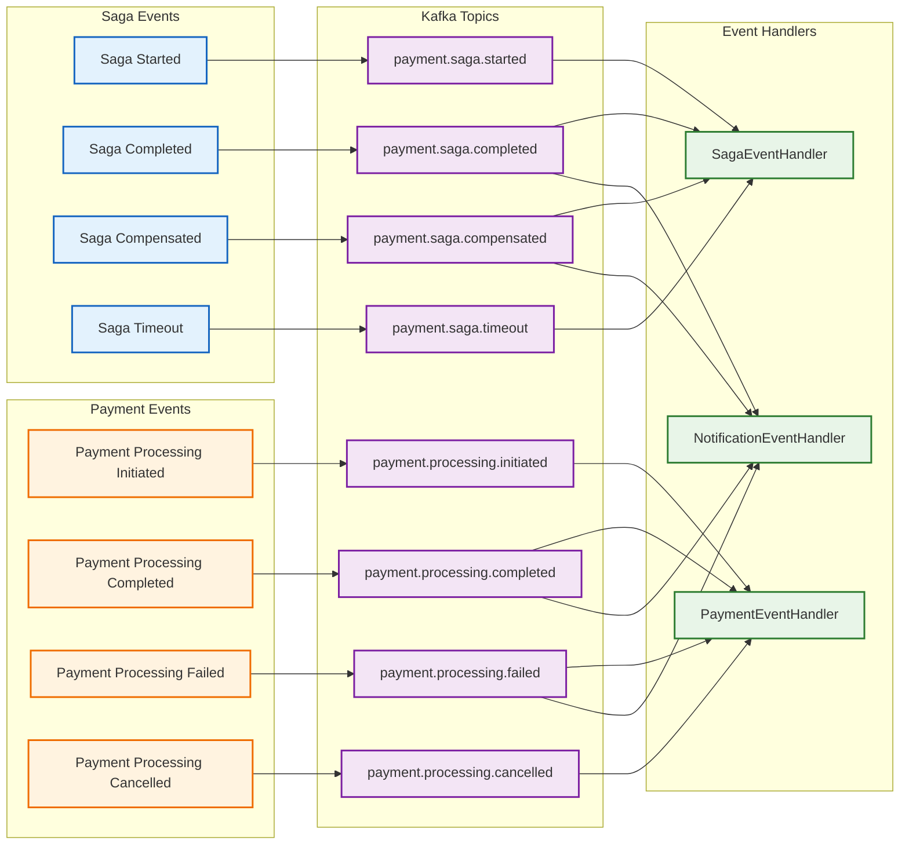
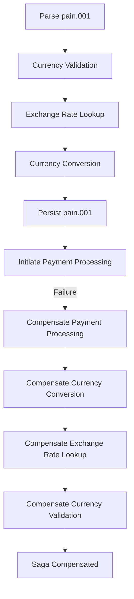
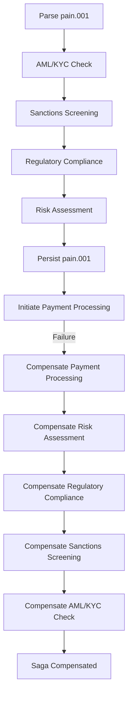
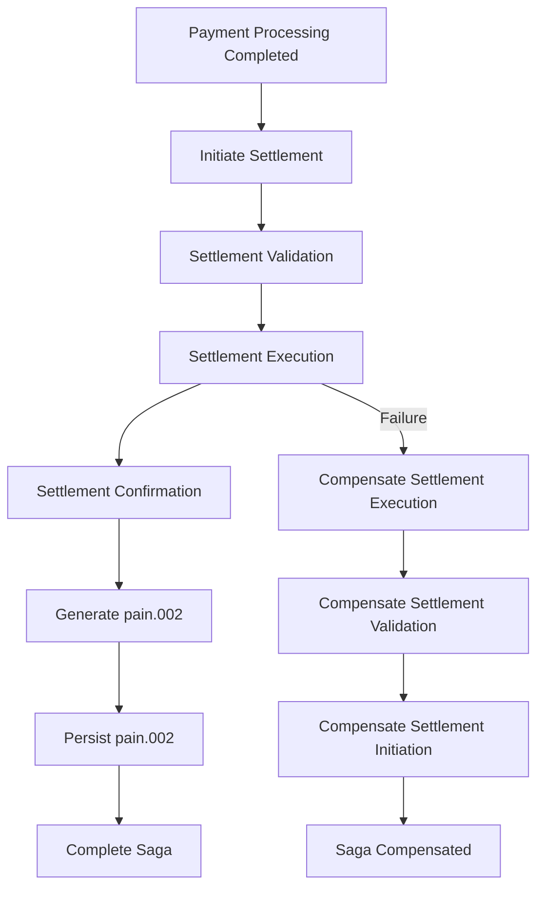

# Pain.001/Pain.002 Saga Architecture Diagram

## Overview
This document contains detailed Mermaid diagrams for the complete ISO 20022 pain.001/pain.002 saga architecture, including all components, services, and data flows.

## Complete Saga Architecture

## Detailed Saga Flow with Error Handling

## Saga State Transitions

## Event Flow Architecture

## Future Extension Points

### 1. Multi-Currency Saga

### 2. Compliance Saga

### 3. Settlement Saga

## Usage Instructions

### Editing Diagrams
1. **Main Saga Flow**: Modify the first diagram to add new steps
2. **Architecture Diagram**: Update the second diagram for new services
3. **Sequence Diagram**: Add new interactions and error handling
4. **State Diagram**: Add new states and transitions
5. **Event Flow**: Add new events and handlers

### Adding New Features
1. **Identify Extension Points**: Determine where new steps fit
2. **Update Saga Steps**: Add new steps to the saga orchestrator
3. **Add Compensation**: Implement compensation logic for new steps
4. **Create Events**: Define new Kafka topics and events
5. **Update Handlers**: Add new event handlers
6. **Update Diagrams**: Modify all relevant diagrams

### Version Control
- Keep diagrams in sync with code changes
- Document breaking changes in version history
- Tag major architectural changes
- Maintain backward compatibility where possible

## Related Documents
- [Saga Pattern Implementation](../saga-pattern-implementation.md)
- [Event Schema Documentation](../event-schemas.md)
- [Database Schema](../database-schema.md)
- [API Documentation](../api-documentation.md)
- [Deployment Guide](../deployment-guide.md)
