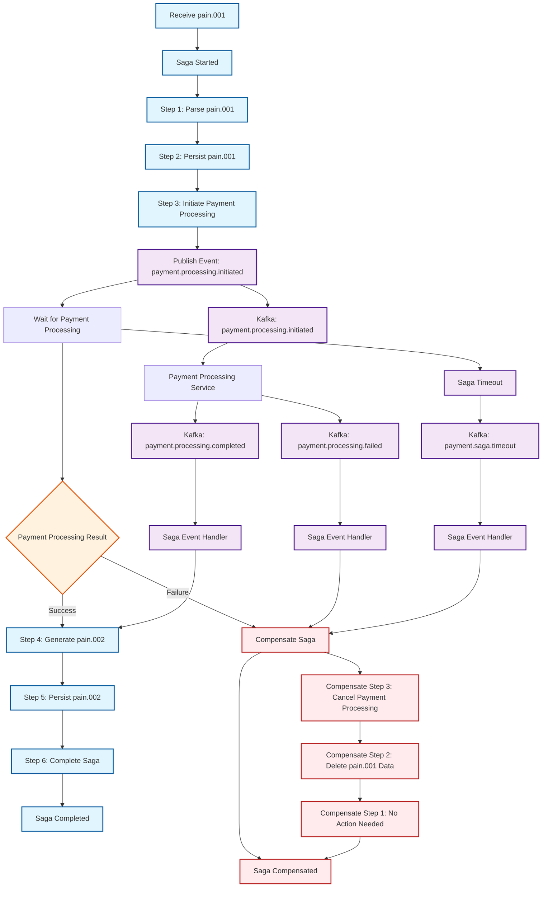

# Pain.001/Pain.002 Saga Flow Diagram

## Overview
This document contains the Mermaid diagram for the ISO 20022 pain.001/pain.002 saga flow. The diagram can be easily edited and extended as new payment processing features are added.

## Current Saga Flow

## Saga Steps Detail

### Forward Flow Steps
1. **Step 1: Parse pain.001**
   - Validate XML against XSD schema
   - Convert to canonical payment model
   - Store parsing result in saga state

2. **Step 2: Persist pain.001**
   - Save pain.001 message to database
   - Store payment information
   - Store debtor/creditor information
   - Store credit transfer transactions

3. **Step 3: Initiate Payment Processing**
   - Publish payment processing event
   - Delegate to payment processing service
   - Wait for processing completion

4. **Step 4: Generate pain.002**
   - Create pain.002 status report
   - Map payment status to ISO 20022 codes
   - Generate XML response

5. **Step 5: Persist pain.002**
   - Save pain.002 status report
   - Store transaction status
   - Create pain.001/pain.002 correlation

6. **Step 6: Complete Saga**
   - Mark saga as completed
   - Publish saga completed event
   - Clean up temporary data

### Compensation Steps
1. **Compensate Step 3: Cancel Payment Processing**
   - Publish payment processing cancelled event
   - Rollback any payment processing changes

2. **Compensate Step 2: Delete pain.001 Data**
   - Remove pain.001 message from database
   - Remove related payment information
   - Remove debtor/creditor information

3. **Compensate Step 1: No Action Needed**
   - Parsing is stateless operation
   - No compensation required

## Events

### Kafka Topics
- `payment.saga.started` - Saga initiation
- `payment.saga.completed` - Saga completion
- `payment.saga.compensated` - Saga compensation
- `payment.saga.timeout` - Saga timeout
- `payment.processing.initiated` - Payment processing start
- `payment.processing.completed` - Payment processing success
- `payment.processing.failed` - Payment processing failure
- `payment.processing.cancelled` - Payment processing cancellation

### Event Handlers
- `SagaEventHandler.handlePaymentProcessingCompleted()`
- `SagaEventHandler.handlePaymentProcessingFailed()`
- `SagaEventHandler.handleSagaTimeout()`

## Future Extensions

### Planned Enhancements
1. **Multi-Currency Support**
   - Add currency conversion steps
   - Add exchange rate validation
   - Add currency-specific processing

2. **Compliance Checks**
   - Add AML/KYC validation steps
   - Add regulatory compliance checks
   - Add sanctions screening

3. **Risk Management**
   - Add risk assessment steps
   - Add fraud detection
   - Add velocity checks

4. **Settlement Integration**
   - Add settlement initiation
   - Add settlement confirmation
   - Add settlement reconciliation

5. **Notification Services**
   - Add customer notifications
   - Add bank notifications
   - Add regulatory notifications

### Extension Points
- **New Saga Steps**: Add new steps between existing ones
- **New Events**: Add new Kafka topics for additional services
- **New Compensation**: Add compensation logic for new steps
- **New Handlers**: Add new event handlers for additional processing

## Usage Instructions

### Editing the Diagram
1. Open this file in any Markdown editor that supports Mermaid
2. Modify the Mermaid diagram syntax as needed
3. Add new nodes, edges, and styling
4. Update the documentation sections accordingly

### Adding New Steps
1. Add new nodes to the Mermaid diagram
2. Connect them with appropriate edges
3. Add corresponding compensation steps
4. Update the "Saga Steps Detail" section
5. Add new events if needed

### Adding New Events
1. Add new Kafka topic nodes
2. Connect them to appropriate saga steps
3. Update the "Events" section
4. Add new event handlers if needed

## Version History
- **v1.0** - Initial saga flow implementation
- **v1.1** - Added compensation flow details
- **v1.2** - Added event flow and error handling
- **v1.3** - Added timeout handling and styling

## Related Documents
- [Saga Pattern Implementation](../saga-pattern-implementation.md)
- [Event Schema Documentation](../event-schemas.md)
- [Database Schema](../database-schema.md)
- [API Documentation](../api-documentation.md)
