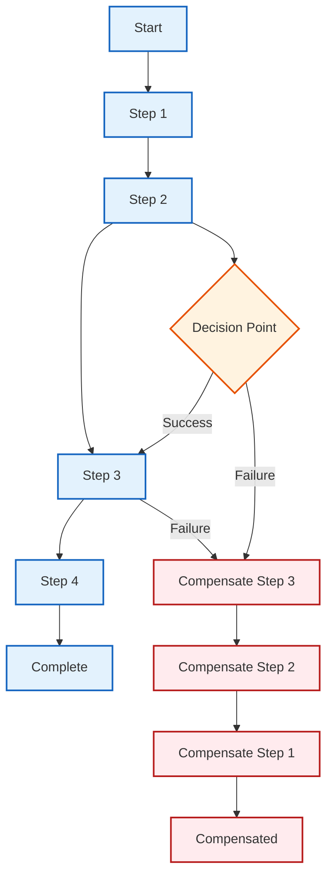
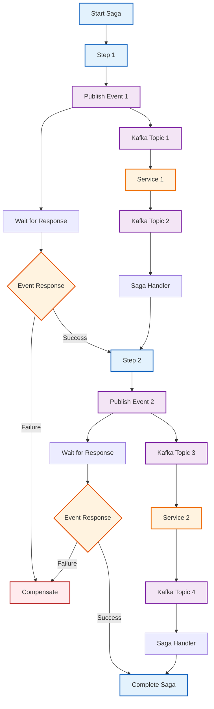
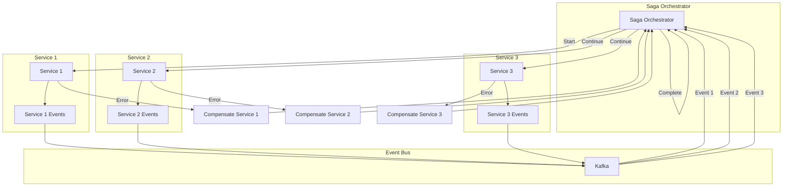
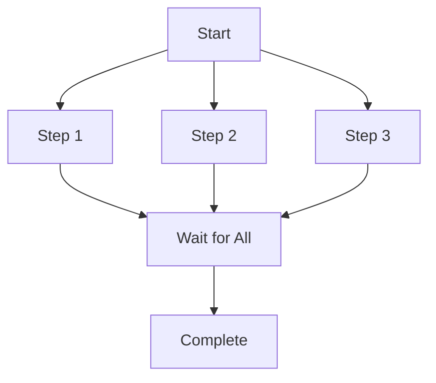
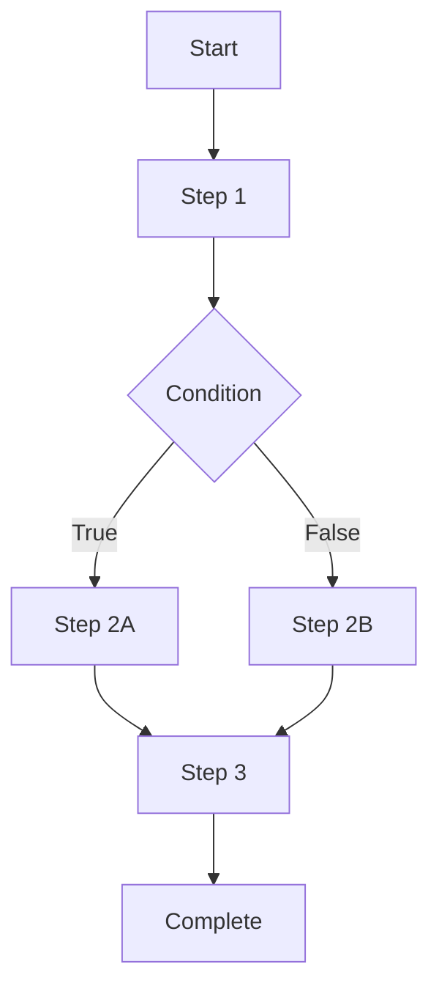
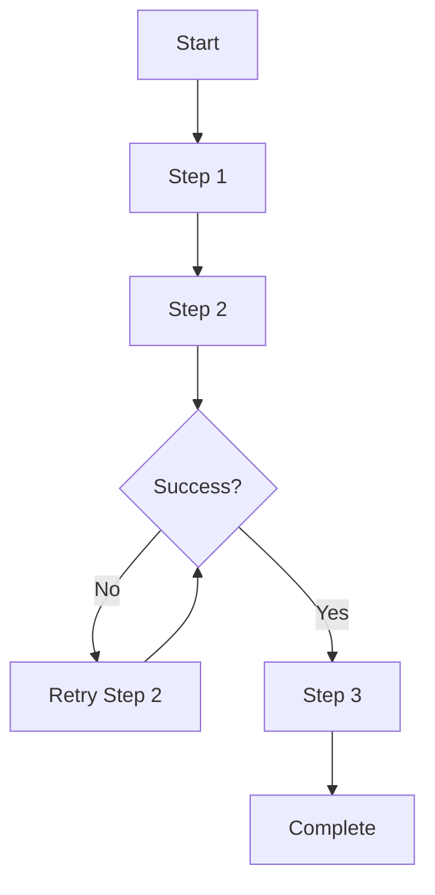
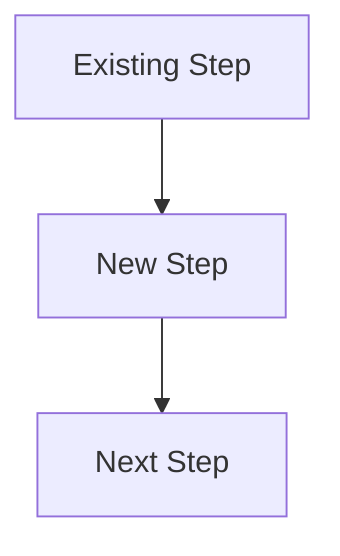
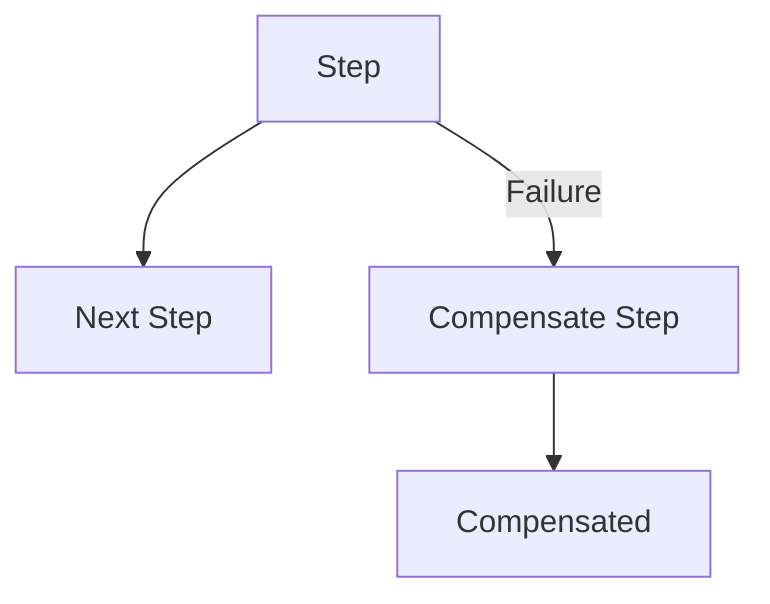
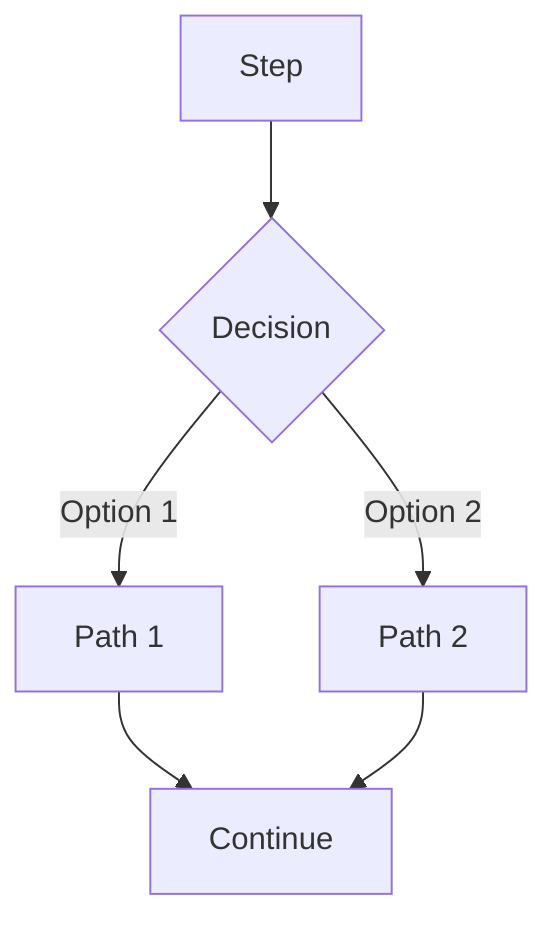
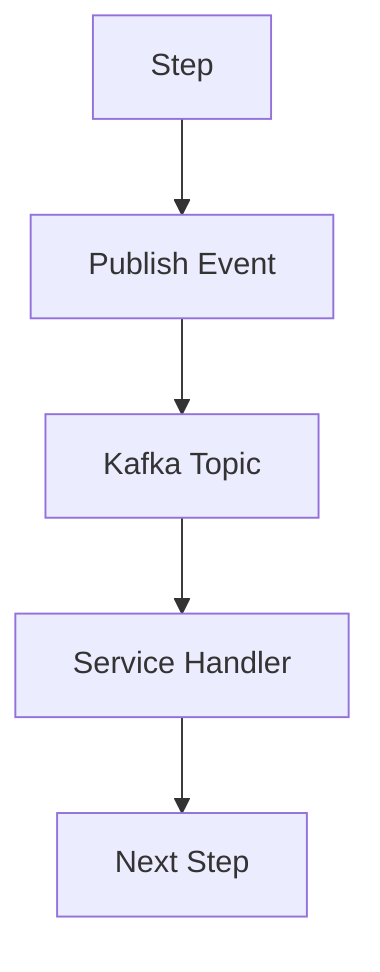

# Saga Flow Diagram Editor Template

## Quick Edit Template

Use this template to quickly create or modify saga flow diagrams.

### Basic Saga Flow Template


### Event-Driven Saga Template


### Multi-Service Saga Template


## Common Patterns

### 1. Sequential Saga


### 2. Parallel Saga


### 3. Conditional Saga


### 4. Retry Saga


## Styling Guidelines

### Color Scheme
- **Saga Steps**: `#e3f2fd` (Light Blue)
- **Events**: `#f3e5f5` (Light Purple)
- **Services**: `#fff3e0` (Light Orange)
- **Compensation**: `#ffebee` (Light Red)
- **Decisions**: `#fff3e0` (Light Orange)
- **External Systems**: `#f1f8e9` (Light Green)

### Node Shapes
- **Rectangles**: Regular steps
- **Diamonds**: Decision points
- **Circles**: Start/End points
- **Rounded Rectangles**: Subprocesses

### Edge Styles
- **Solid**: Normal flow
- **Dashed**: Error/compensation flow
- **Thick**: Critical path
- **Dotted**: Optional flow

## Quick Commands

### Add New Step


### Add Compensation


### Add Decision Point


### Add Event Flow


## Best Practices

1. **Keep it Simple**: Start with basic flow, add complexity gradually
2. **Use Consistent Styling**: Apply the same colors and shapes throughout
3. **Show Error Handling**: Always include compensation flows
4. **Document Decisions**: Explain decision points and conditions
5. **Version Control**: Keep diagrams in sync with code changes
6. **Test Scenarios**: Include both success and failure paths
7. **Performance Considerations**: Show timeouts and retry logic

## Tools for Editing

### Online Editors
- [Mermaid Live Editor](https://mermaid.live/)
- [Draw.io](https://app.diagrams.net/)
- [Lucidchart](https://www.lucidchart.com/)

### VS Code Extensions
- Mermaid Preview
- Mermaid Markdown Syntax Highlighting
- Draw.io Integration

### Command Line
```bash
# Install Mermaid CLI
npm install -g @mermaid-js/mermaid-cli

# Generate PNG from Mermaid file
mmdc -i input.mmd -o output.png

# Generate SVG from Mermaid file
mmdc -i input.mmd -o output.svg
```

## Version History
- **v1.0** - Initial template creation
- **v1.1** - Added event-driven patterns
- **v1.2** - Added multi-service patterns
- **v1.3** - Added styling guidelines
- **v1.4** - Added best practices and tools
