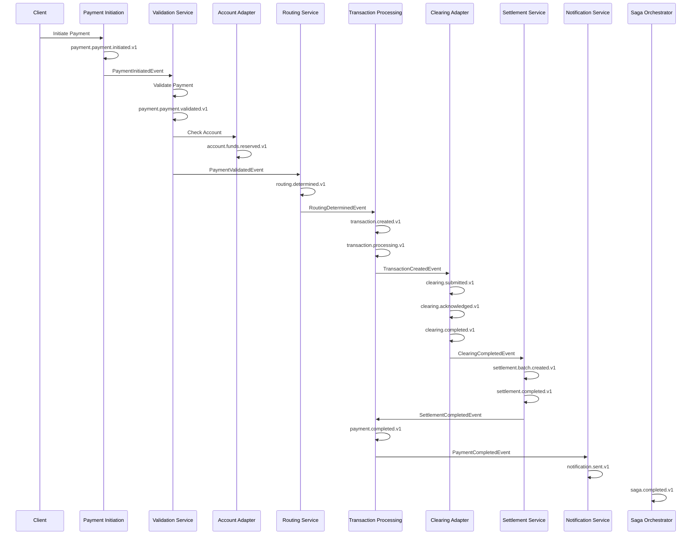
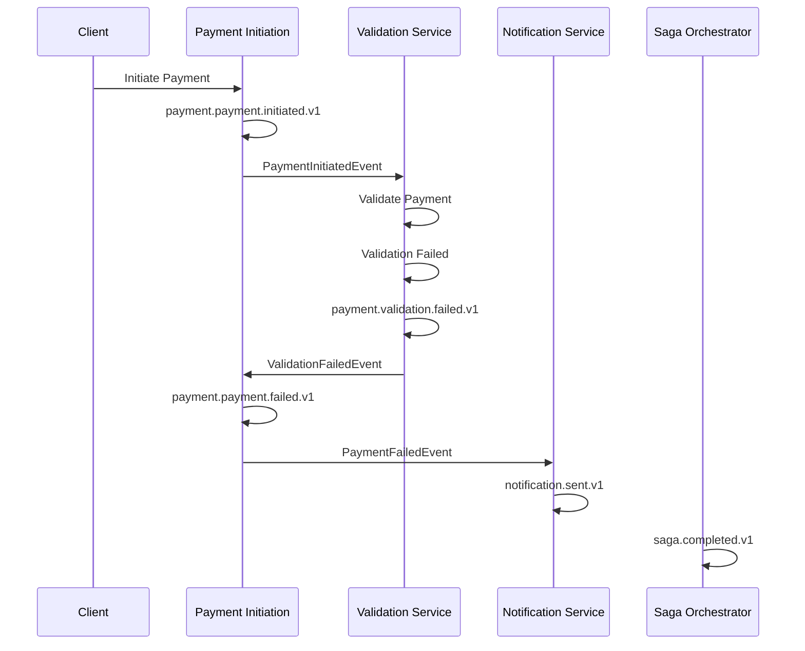
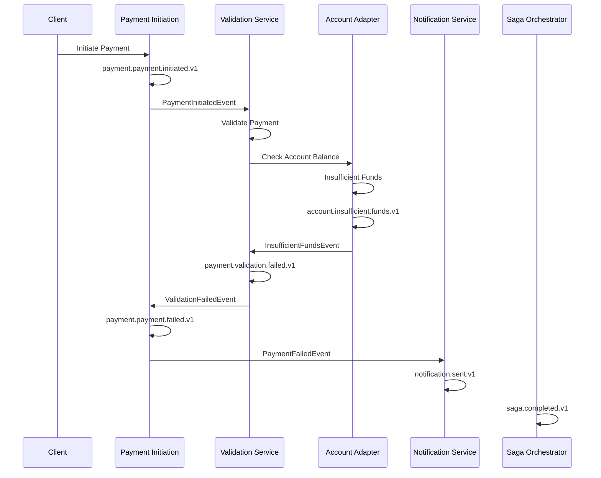
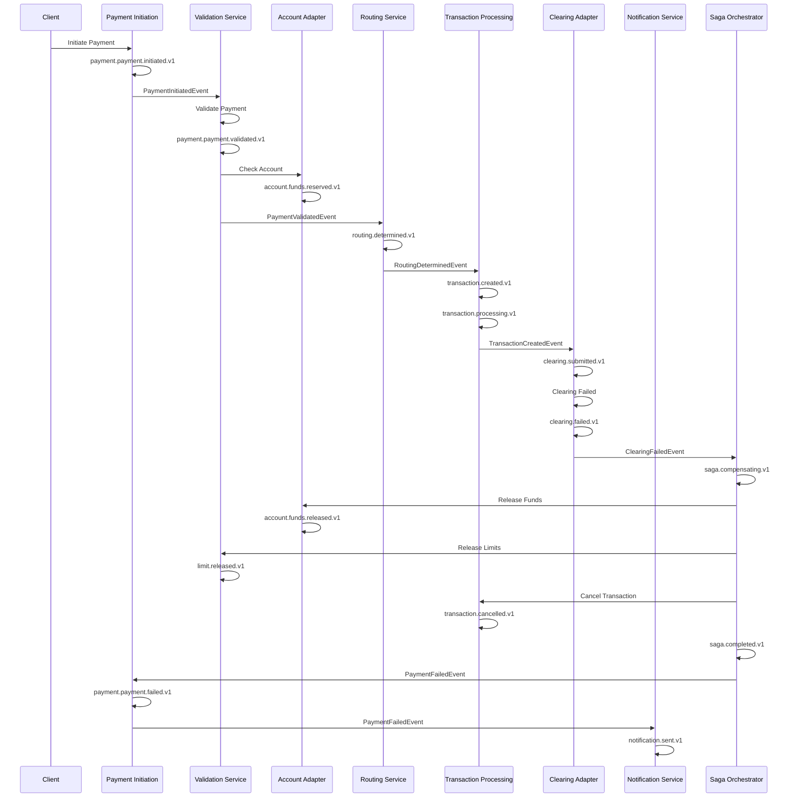

# Event Flow Documentation

## Overview

This document describes the event flows for the Payments Engine, showing how events flow between services during different payment scenarios. Each flow includes the event sequence, error handling, and compensation patterns.

## Event Flow Categories

### 1. Happy Path Flows
- Successful payment processing
- Normal business operations
- Expected event sequences

### 2. Error Path Flows
- Validation failures
- System errors
- Business rule violations

### 3. Compensation Flows
- Saga pattern compensation
- Rollback operations
- Error recovery

## Core Payment Flows

### 1. Successful Payment Flow (Happy Path)



### 2. Validation Failure Flow



### 3. Insufficient Funds Flow



### 4. Clearing Failure Flow (Compensation)



## Event Flow Patterns

### 1. Request-Response Pattern

```yaml
# Command Events (Request-Response)
payment/initiated:
  description: Payment initiation command
  pattern: request-response
  timeout: 30s
  retry: 3
  
validation/request:
  description: Validation request command
  pattern: request-response
  timeout: 10s
  retry: 2
```

### 2. Fire-and-Forget Pattern

```yaml
# Domain Events (Fire-and-Forget)
payment/validated:
  description: Payment validation result
  pattern: fire-and-forget
  retention: 7d
  
transaction/created:
  description: Transaction creation notification
  pattern: fire-and-forget
  retention: 7d
```

### 3. Saga Pattern

```yaml
# Saga Events
saga/started:
  description: Saga orchestration started
  pattern: saga
  compensation: true
  
saga/step-completed:
  description: Saga step completed
  pattern: saga
  compensation: true
  
saga/compensating:
  description: Saga compensation started
  pattern: saga
  compensation: true
```

## Event Subscription Matrix

| Service | Subscribes To | Publishes | Pattern |
|---------|---------------|-----------|---------|
| **Payment Initiation** | - | `payment.initiated.v1` | Command |
| **Validation Service** | `payment.initiated.v1` | `payment.validated.v1`, `validation.failed.v1` | Request-Response |
| **Account Adapter** | `payment.validated.v1` | `funds.reserved.v1`, `insufficient.funds.v1` | Request-Response |
| **Routing Service** | `payment.validated.v1` | `routing.determined.v1` | Request-Response |
| **Transaction Processing** | `routing.determined.v1` | `transaction.created.v1`, `transaction.processing.v1` | Fire-and-Forget |
| **Clearing Adapters** | `transaction.created.v1` | `clearing.submitted.v1`, `clearing.acknowledged.v1`, `clearing.completed.v1`, `clearing.failed.v1` | Request-Response |
| **Settlement Service** | `clearing.completed.v1` | `settlement.batch.created.v1`, `settlement.completed.v1` | Fire-and-Forget |
| **Notification Service** | `payment.completed.v1`, `payment.failed.v1` | `notification.sent.v1`, `notification.failed.v1` | Fire-and-Forget |
| **Saga Orchestrator** | All Events | `saga.started.v1`, `saga.step.completed.v1`, `saga.compensating.v1`, `saga.completed.v1` | Saga |
| **Audit Service** | All Events | - | Fire-and-Forget |

## Error Handling Patterns

### 1. Retry Pattern

```yaml
# Retry Configuration
retry:
  maxAttempts: 3
  backoffStrategy: exponential
  initialDelay: 1s
  maxDelay: 30s
  multiplier: 2
```

### 2. Circuit Breaker Pattern

```yaml
# Circuit Breaker Configuration
circuitBreaker:
  failureThreshold: 5
  timeout: 10s
  resetTimeout: 60s
  halfOpenMaxCalls: 3
```

### 3. Dead Letter Queue Pattern

```yaml
# Dead Letter Queue Configuration
deadLetterQueue:
  enabled: true
  maxDeliveryCount: 3
  timeToLive: 7d
  retention: 30d
```

## Event Monitoring

### 1. Key Metrics

```yaml
metrics:
  eventPublishingRate:
    description: "Events published per second"
    type: counter
    tags: [eventType, version, tenantId]
  
  eventProcessingLatency:
    description: "Time from publish to consume"
    type: histogram
    tags: [eventType, consumer, tenantId]
  
  deadLetterQueueSize:
    description: "Number of failed events"
    type: gauge
    tags: [eventType, reason, tenantId]
  
  eventProcessingErrors:
    description: "Error rate per consumer"
    type: counter
    tags: [consumer, errorType, tenantId]
```

### 2. Health Checks

```yaml
healthChecks:
  eventBus:
    description: "Event bus connectivity"
    type: http
    endpoint: "/health/eventbus"
  
  eventProcessing:
    description: "Event processing health"
    type: custom
    check: "EventProcessingHealthCheck"
  
  deadLetterQueue:
    description: "Dead letter queue health"
    type: custom
    check: "DeadLetterQueueHealthCheck"
```

## Testing Strategies

### 1. Unit Testing

```java
@Test
public void shouldPublishPaymentInitiatedEvent() {
    // Arrange
    PaymentRequest request = createPaymentRequest();
    
    // Act
    paymentService.initiatePayment(request);
    
    // Assert
    verify(eventPublisher).publish(argThat(event -> 
        event instanceof PaymentInitiatedEvent &&
        ((PaymentInitiatedEvent) event).getPaymentId() != null
    ));
}
```

### 2. Integration Testing

```java
@SpringBootTest
@TestPropertySource(properties = "spring.cloud.azure.servicebus.namespace=test")
public class EventIntegrationTest {
    
    @Autowired
    private EventPublisher publisher;
    
    @Autowired
    private EventConsumer consumer;
    
    @Test
    public void shouldConsumePublishedEvent() throws Exception {
        // Publish event
        PaymentInitiatedEvent event = createEvent();
        publisher.publish(event);
        
        // Wait for consumption
        await().atMost(5, SECONDS).until(() -> 
            consumer.getProcessedEvents().contains(event.getEventId())
        );
    }
}
```

### 3. End-to-End Testing

```java
@Test
public void shouldProcessCompletePaymentFlow() {
    // Start payment
    PaymentRequest request = createPaymentRequest();
    PaymentResponse response = paymentService.initiatePayment(request);
    
    // Wait for completion
    await().atMost(30, SECONDS).until(() -> 
        paymentService.getPaymentStatus(response.getPaymentId()) == PaymentStatus.COMPLETED
    );
    
    // Verify all events were published
    verify(eventPublisher).publish(any(PaymentInitiatedEvent.class));
    verify(eventPublisher).publish(any(PaymentValidatedEvent.class));
    verify(eventPublisher).publish(any(TransactionCreatedEvent.class));
    verify(eventPublisher).publish(any(PaymentCompletedEvent.class));
}
```

## Performance Considerations

### 1. Event Batching

```java
@Component
public class BatchedEventPublisher {
    
    private final List<Event> eventBatch = new ArrayList<>();
    private final ScheduledExecutorService scheduler = Executors.newScheduledThreadPool(1);
    
    @PostConstruct
    public void startBatching() {
        scheduler.scheduleAtFixedRate(this::publishBatch, 0, 100, TimeUnit.MILLISECONDS);
    }
    
    public void publish(Event event) {
        synchronized (eventBatch) {
            eventBatch.add(event);
        }
    }
    
    private void publishBatch() {
        List<Event> batch;
        synchronized (eventBatch) {
            batch = new ArrayList<>(eventBatch);
            eventBatch.clear();
        }
        
        if (!batch.isEmpty()) {
            eventBus.publishBatch(batch);
        }
    }
}
```

### 2. Event Filtering

```java
@Component
public class EventFilter {
    
    public boolean shouldProcess(Event event, String consumer) {
        // Filter by tenant
        if (!isTenantAllowed(event.getTenantId(), consumer)) {
            return false;
        }
        
        // Filter by event type
        if (!isEventTypeSupported(event.getEventType(), consumer)) {
            return false;
        }
        
        // Filter by version
        if (!isVersionSupported(event.getVersion(), consumer)) {
            return false;
        }
        
        return true;
    }
}
```

### 3. Event Compression

```java
@Component
public class CompressedEventPublisher {
    
    public void publish(Event event) {
        byte[] compressed = compress(event);
        eventBus.publish(event.getEventType(), compressed);
    }
    
    private byte[] compress(Event event) {
        try {
            ByteArrayOutputStream baos = new ByteArrayOutputStream();
            GZIPOutputStream gzos = new GZIPOutputStream(baos);
            ObjectOutputStream oos = new ObjectOutputStream(gzos);
            oos.writeObject(event);
            oos.close();
            return baos.toByteArray();
        } catch (IOException e) {
            throw new RuntimeException("Failed to compress event", e);
        }
    }
}
```

## Security Considerations

### 1. Event Encryption

```java
@Component
public class EncryptedEventPublisher {
    
    @Autowired
    private EncryptionService encryptionService;
    
    public void publish(Event event) {
        String encryptedPayload = encryptionService.encrypt(event);
        eventBus.publish(event.getEventType(), encryptedPayload);
    }
}
```

### 2. Event Authentication

```java
@Component
public class AuthenticatedEventPublisher {
    
    public void publish(Event event) {
        // Add authentication token
        event.setAuthToken(generateAuthToken(event));
        eventBus.publish(event);
    }
    
    private String generateAuthToken(Event event) {
        // Generate JWT token for event
        return jwtService.generateToken(event);
    }
}
```

### 3. Event Authorization

```java
@Component
public class AuthorizedEventConsumer {
    
    public void consume(Event event) {
        // Verify authorization
        if (!isAuthorized(event)) {
            log.warn("Unauthorized event consumption: {}", event.getEventId());
            return;
        }
        
        // Process event
        processEvent(event);
    }
    
    private boolean isAuthorized(Event event) {
        // Check if consumer is authorized to process this event
        return authorizationService.isAuthorized(event, getCurrentUser());
    }
}
```

## Conclusion

This event flow documentation provides a comprehensive guide for understanding and implementing the event-driven architecture of the Payments Engine. The flows ensure reliable, scalable, and maintainable payment processing while providing clear patterns for error handling, compensation, and monitoring.

---

**Last Updated**: 2025-10-11  
**Version**: 1.0  
**Author**: AI Agent Orchestrator  
**Review Status**: Ready for Implementation
